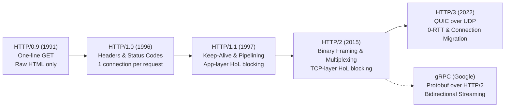
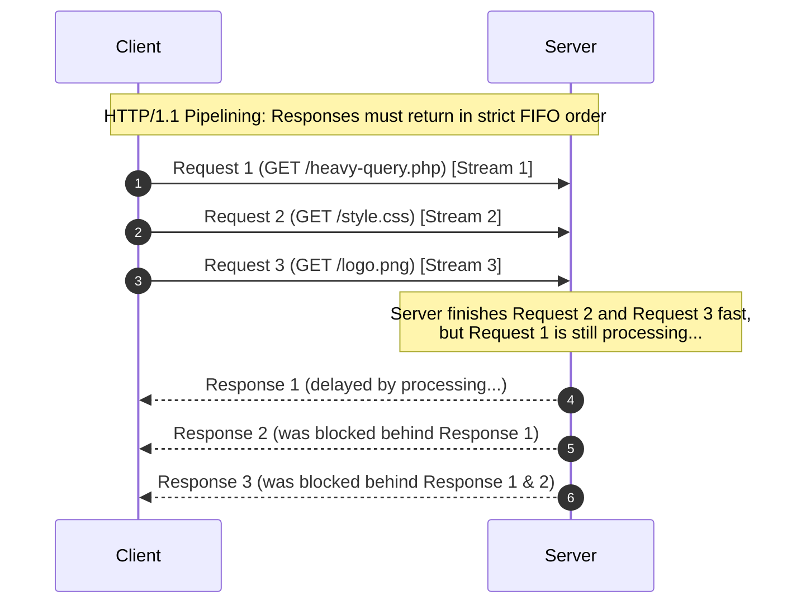
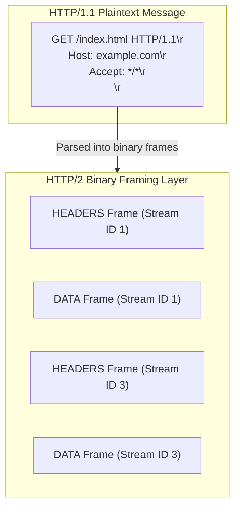
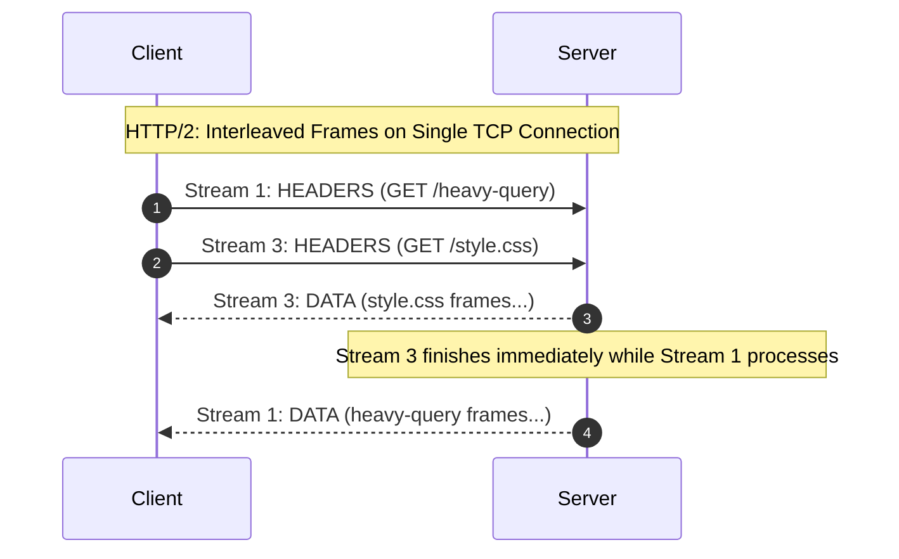
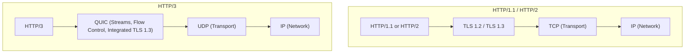
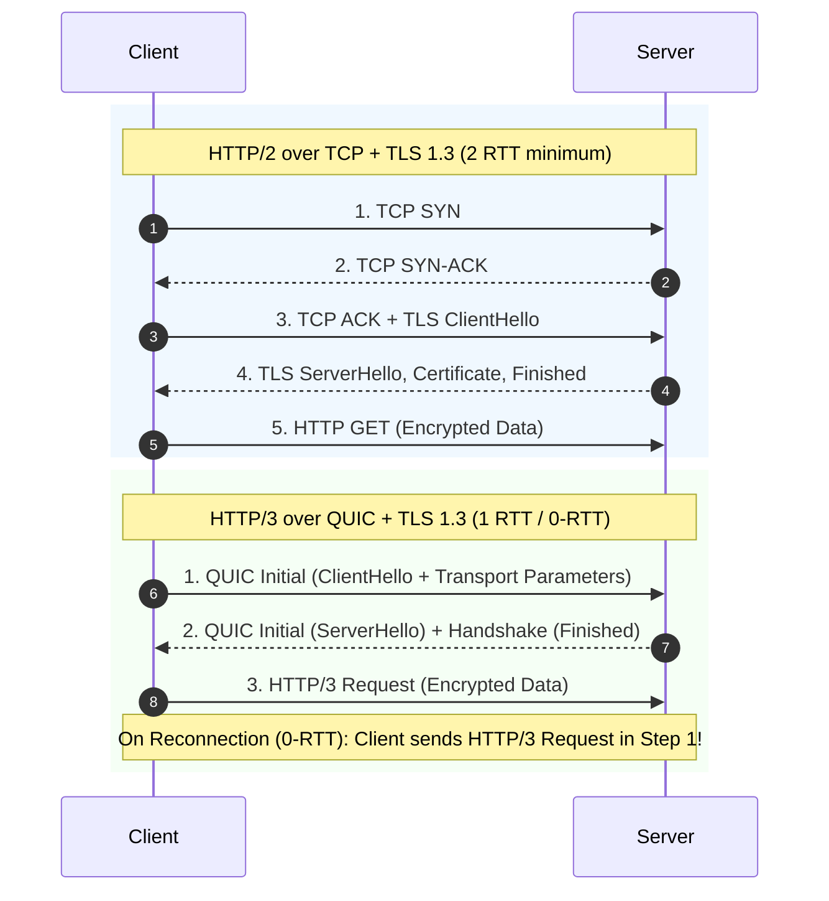
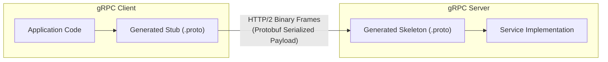

# HTTP/1.1 vs HTTP/2 vs HTTP/3 vs gRPC

Understanding the evolution of HTTP and modern RPC protocols is fundamental to designing high-performance, resilient web architectures and distributed microservices. 

This guide breaks down the architectural progression from **HTTP/1.0** to **HTTP/1.1**, **HTTP/2**, **HTTP/3 (QUIC)**, and explores how **gRPC** builds on these foundations.

---

## 1. Protocol Evolution Timeline

 

---

## 2. Early HTTP: HTTP/0.9 & HTTP/1.0

### HTTP/0.9 (1991) - The One-Line Protocol

* **Simplicity**: Supported only the `GET` method.
* **No Metadata**: No headers, no status codes, no version numbers.
* **Payload**: Could only transfer plain HTML text files.

### HTTP/1.0 (1996) - Browser Expansion

As the web grew to support rich media (images, stylesheets, scripts), HTTP/1.0 added:

* **Headers**: Metadata for requests and responses (`Content-Type`, `User-Agent`).
* **Status Codes**: Standardized response status (`200 OK`, `404 Not Found`, `500 Internal Server Error`).
* **New Methods**: Introduced `POST` and `HEAD`.

### The Core Bottleneck of HTTP/1.0: Short-Lived Connections

In HTTP/1.0, **every single resource request required its own dedicated TCP connection**:

1. Client establishes a 3-way TCP handshake (`SYN` &rarr; `SYN-ACK` &rarr; `ACK`).
2. If using HTTPS, client and server execute a multi-round-trip TLS handshake.
3. Client requests a single resource (e.g., `logo.png`).
4. **Server responds with the resource and immediately closes the TCP connection (`FIN` / `ACK`).**

If a webpage contained 50 images, CSS stylesheets, and scripts, the client had to repeat 50 separate TCP and TLS handshakes, introducing immense round-trip time (RTT) latency and kernel socket churn.

 

---

## 3. HTTP/1.1 (1997) - Persistence & Pipelining

HTTP/1.1 was standardized in 1997 (RFC 2061 / RFC 2616) to tackle the connection overhead of HTTP/1.0. Even after 25+ years, it remains widely used across the web.

### Key Innovations in HTTP/1.1

1. **Persistent Connections (`Keep-Alive`)**:
    * Connections stay open by default (`Connection: keep-alive`).
    * Multiple consecutive HTTP requests can reuse the same established TCP connection, eliminating repeated 3-way handshakes and TLS negotiations.

2. **HTTP Pipelining**:
    * Allowed clients to send multiple requests sequentially over a single TCP connection **without waiting for the previous response** before issuing the next request.
    * Example: A browser could dispatch `GET /style.css` followed immediately by `GET /script.js`.

3. **Chunked Transfer Encoding (`Transfer-Encoding: chunked`)**:
    * Allowed servers to stream dynamically generated responses in chunks without having to know or calculate the total `Content-Length` up front.
    * Dramatically improved Time to First Byte (TTFB) and initial page rendering for large or dynamically generated responses.

4. **Enhanced Caching & Conditional Headers**:
    * Added fine-grained caching controls via `Cache-Control`, `ETag`, and conditional request headers (`If-Modified-Since`, `If-None-Match`).
    * Reduced unnecessary data retransmission over the wire.

### The Fatal Flaw: Application-Layer Head-of-Line (HoL) Blocking
* Even though pipelining allowed sending multiple requests at once, the HTTP/1.1 specification **strictly required responses to be returned in the exact order they were requested (First-In, First-Out / FIFO)**.
* If the first request in the pipeline was delayed (e.g., executing a slow database query), **all subsequent responses behind it were completely blocked**, even if they were ready to send immediately.
* Because of Head-of-Line blocking and fragile proxy implementations on the internet, most modern browsers **disabled pipelining by default**.

### Web Developer Workarounds for HTTP/1.1 Limits
To work around the single-request-per-connection bottleneck, web developers invented clever hacks:

* **Domain Sharding**: Browsers cap concurrent TCP connections to a single host (typically 6 connections). Developers hosted assets across multiple subdomains (`static1.cdn.com`, `static2.cdn.com`) to open 6 TCP connections per subdomain.
* **Asset Bundling & Concatenation**: Combining hundreds of JavaScript and CSS files into monolithic bundles (e.g., `bundle.js`, `app.min.css`) to minimize request counts.
* **Image Sprites**: Merging dozens of small UI icons into a single large image file and using CSS background coordinates to display individual icons.
* **Asset Inlining**: Inlining small images and icons directly into HTML or CSS files using base64 data URIs.

 

---

## 4. HTTP/2 (2015) - Binary Framing & Multiplexing

Standardized in 2015 (RFC 7540) and based heavily on Google's experimental **SPDY** protocol, HTTP/2 was designed to eliminate HTTP/1.1's application-layer bottlenecks without requiring changes to HTTP methods, status codes, or semantics.

### Key Innovations in HTTP/2

1. **Binary Framing Layer**:
    * Instead of parsing textual newline-delimited strings (`\r\n`), HTTP/2 encodes messages into compact, typed **binary frames** (`HEADERS`, `DATA`, `SETTINGS`, `RST_STREAM`, `PING`, etc.).
    * Binary parsing is significantly faster, less ambiguous, and less prone to parsing vulnerabilities.

2. **Full Request/Response Multiplexing**:
    * Multiple logical, bidirectional **streams** are multiplexed concurrently over a single underlying TCP connection.
    * Frames from different streams can be freely interleaved during transmission and reassembled at the receiving endpoint using their embedded **Stream ID**.
    * **Completely resolves Application-Layer Head-of-Line blocking**: A slow response on Stream 1 does not delay or block frames belonging to Stream 3 or Stream 5.

3. **Stream Prioritization & Dependency Trees**:
    * Clients can assign priority weights and dependency trees to streams.
    * Critical render-blocking assets (such as above-the-fold CSS and scripts) receive higher priority and more bandwidth/frames from the server than background images.

4. **Header Compression (HPACK - RFC 7541)**:
    * In HTTP/1.1, verbose plain-text headers (cookies, user-agents, tokens) were retransmitted with every single request, wasting bandwidth.
    * HPACK compresses headers using:
        * **Static Table**: Predefined table of 61 common header keys and values.
        * **Dynamic Table**: Tracks previously transmitted headers across the connection session; subsequent requests only send an index diff.
        * **Huffman Coding**: Huffman-encoded strings for unseen values.

5. **Server Push**:
    * Allows the server to preemptively send resources (e.g., `style.css`) to the client cache alongside the requested HTML page before the client even parses the HTML and requests them.

### The New Bottleneck: TCP-Level Head-of-Line Blocking
While HTTP/2 solved application-layer HoL blocking, it introduced a new vulnerability at the transport layer:

* **Shared TCP Connection**: All multiplexed streams in HTTP/2 share one single TCP connection.
* **TCP In-Order Delivery**: TCP guarantees a reliable, strictly ordered byte stream. The OS kernel's TCP stack will not deliver bytes to the application layer if an earlier sequence number is missing.
* **Packet Loss Penalty**: If a single TCP packet is dropped on a lossy or congested network (common on mobile, cellular 4G/5G, or unstable Wi-Fi), **the entire TCP connection is stalled**.
* All multiplexed HTTP/2 streams on that connection freeze waiting for the dropped packet to be retransmitted and acknowledged, even if the dropped packet belonged to an irrelevant background image.
* Under 2%–5% packet loss conditions, HTTP/2 can actually perform **worse** than multiple parallel HTTP/1.1 connections!

 

---

## 5. HTTP/3 & QUIC (2022) - The UDP Revolution

To solve TCP-level Head-of-Line blocking once and for all, the IETF standardized **HTTP/3** in 2022 (RFC 9114). HTTP/3 replaces TCP entirely with **QUIC** (Quick UDP Internet Connections, RFC 9000), originally developed by Google and implemented on top of **UDP**.

### Key Innovations in HTTP/3

1. **Independent Multiplexed Streams (No Transport HoL Blocking)**:
    * Stream multiplexing is moved down into the **QUIC transport layer**.
    * UDP datagrams carry stream-specific frames. If a packet carrying data for Stream 1 is lost:
        * **Only Stream 1 is paused** awaiting retransmission.
        * Streams 2, 3, and 4 continue delivering packets to the application layer without any delay.

2. **Ultra-Fast Handshakes (Integrated TLS 1.3 & 0-RTT)**:
    * In HTTP/1.1 and HTTP/2, establishing a secure connection requires:
        * TCP 3-way handshake = 1 RTT
        * TLS handshake = 1–2 RTTs
        * Total = **2 to 3 RTTs** before sending application data.
    * In HTTP/3, QUIC integrates the TLS 1.3 handshake into its initial connection setup:
        * **1-RTT Cold Connection**: Encryption keys and transport parameters negotiate simultaneously.
        * **0-RTT Connection Resumption**: If the client and server previously communicated, the client can transmit encrypted application requests in its very first packet (`0-RTT`), achieving near-zero latency connection establishment.

3. **Connection Migration (Mobile Resilience)**:
    * Traditional TCP connections are strictly identified by a **4-tuple**:
        $$\text{Connection} = (\text{Source IP}, \text{Source Port}, \text{Destination IP}, \text{Destination Port})$$
    * When a user walks out of their house and transitions from **Wi-Fi to Cellular (4G/5G)**, their device's IP address changes immediately.
    * Under TCP, this invalidates the socket; all active connections terminate and must undergo a complete re-handshake cycle.
    * QUIC identifies connections using a random **64-bit Connection ID (CID)** that is independent of IP addresses and ports.
    * When the device's IP changes, the client simply sends UDP packets with the existing CID from the new IP, enabling **seamless, zero-drop connection migration**.

4. **QPACK Header Compression (RFC 9204)**:
    * HTTP/2's HPACK required strict in-order frame processing. If frames arrive out of order, HPACK would introduce its own Head-of-Line blocking.
    * HTTP/3 uses **QPACK**, which separates header compression table updates from individual stream data by using dedicated bidirectional encoder/decoder streams, permitting out-of-order delivery while retaining compression efficiency.

 

---

## 6. Where gRPC Fits In

While HTTP/1.1, HTTP/2, and HTTP/3 are transport/application protocols predominantly designed for browser-to-server communication, **gRPC** is an open-source, high-performance **Remote Procedure Call (RPC)** framework developed by Google for distributed microservices.

### Why gRPC Uses HTTP/2 as Its Foundation

1. **Protocol Buffers (Protobuf) Serialization**:
    * REST over HTTP/1.1 typically transmits verbose, human-readable JSON strings.
    * gRPC serializes strongly typed data structures into compact binary using Protocol Buffers (`.proto`), drastically shrinking payload sizes and speeding up CPU serialization/deserialization by 5x–10x.

2. **Native HTTP/2 Multiplexing**:
    * Microservices maintain a single long-lived connection between nodes and multiplex thousands of RPC calls concurrently without connection churn or application HoL blocking.

3. **Four Streaming Paradigms**:
    * **Unary RPC**: Traditional request &rarr; response.
    * **Server Streaming**: Client sends one request, server responds with a stream of messages (e.g., live stock ticker or real-time log ingestion).
    * **Client Streaming**: Client sends a stream of messages, server returns a single summary response (e.g., chunked file upload).
    * **Bidirectional Streaming**: Both client and server read and write independent streams over the same multiplexed channel (e.g., chat applications, distributed coordination).

4. **HTTP/2 Trailers for Status Codes**:
    * gRPC leverages HTTP/2 trailing headers (`grpc-status`, `grpc-message`) sent *after* the payload stream completes, delivering execution status without embedding error wrappers inside application payloads.

5. **HTTP/3 Evolution for gRPC**:
    * Community and enterprise efforts (such as gRPC-over-QUIC / HTTP/3) are actively being deployed to bring gRPC's RPC semantics over QUIC to eliminate TCP tail-latency spikes across inter-datacenter and mobile client-to-gateway links.

 

---

## 7. Deep-Dive Comparison Matrix

| Feature | HTTP/1.1 | HTTP/2 | HTTP/3 | gRPC |
| :--- | :--- | :--- | :--- | :--- |
| **Release Year** | 1997 (RFC 2616) | 2015 (RFC 7540) | 2022 (RFC 9114) | 2015 (Google) |
| **Transport Protocol** | TCP | TCP | **QUIC (UDP)** | HTTP/2 (TCP) *(HTTP/3 experimental)* |
| **Message Framing** | Plain Text (`\r\n`) | Binary Framing Layer | Binary Framing Layer | Binary (Protobuf inside HTTP/2) |
| **Multiplexing** | ❌ No (Pipelining FIFO) | ✅ Yes (Streams over 1 TCP) | ✅ Yes (Streams over QUIC) | ✅ Yes (Multiplexed RPC streams) |
| **Head-of-Line Blocking** | 🔴 At Application Layer | 🟡 At TCP Transport Layer | 🟢 Completely Eliminated | 🟡 At TCP Layer (inherits HTTP/2) |
| **Connection Handshake** | 1 RTT (TCP) + 1-2 RTT (TLS) | 1 RTT (TCP) + 1-2 RTT (TLS) | **1 RTT** (Combined) / **0-RTT** | Same as HTTP/2 (reused channel) |
| **Header Compression** | ❌ None (Plain text) | ✅ HPACK | ✅ QPACK | ✅ HPACK |
| **Connection Migration** | ❌ Broken upon IP change | ❌ Broken upon IP change | ✅ Seamless via Connection ID | ❌ Handled by re-dialing |
| **Data Contract / Format** | JSON, XML, HTML | JSON, XML, HTML | JSON, XML, HTML | **Strongly-typed Protobuf (`.proto`)** |
| **Streaming Capabilities** | Request-Response only | Server Push | Server Push | **Unary, Server, Client, Bidirectional** |
| **Typical Use Cases** | Legacy web, simple APIs | Modern public web traffic | Mobile apps, CDNs, lossy networks | Internal microservices, IoT, real-time |

 

---

## 8. Summary of Key Takeaways

!!! Note "Key Takeaways"

    * **HTTP/1.1** solved the "one connection per request" penalty of HTTP/1.0 via **persistent connections (`keep-alive`)**, but suffered from **application-level Head-of-Line blocking** because responses had to arrive in strict request order.
    * **HTTP/2** introduced a **binary framing layer** and **multiplexing**, allowing concurrent interleaved streams over a single TCP connection, accompanied by **HPACK** header compression.
    * However, HTTP/2 shifted the bottleneck to the transport layer: **TCP-level Head-of-Line blocking**, where a single dropped packet stalls all streams on the connection.
    * **HTTP/3** solves transport blocking by replacing TCP with **QUIC over UDP**, treating streams independently, reducing connection latency with **0-RTT/1-RTT handshakes**, and surviving network transitions through **Connection IDs**.
    * **gRPC** leverages **HTTP/2's binary framing and multiplexing** combined with **Protocol Buffers** to deliver a high-throughput, low-latency RPC engine with native bidirectional streaming for microservices.

---

## References

<iframe width="560" height="315" src="https://www.youtube.com/embed/UMwQjFzTQXw?si=7caEwDu0kxw3RrhX" title="YouTube video player" frameborder="0" allow="accelerometer; autoplay; clipboard-write; encrypted-media; gyroscope; picture-in-picture; web-share" referrerpolicy="strict-origin-when-cross-origin" allowfullscreen></iframe>

<iframe width="560" height="315" src="https://www.youtube.com/embed/ocGtt0IX0Js?si=wuJCAWXEjhH8BT9A" title="YouTube video player" frameborder="0" allow="accelerometer; autoplay; clipboard-write; encrypted-media; gyroscope; picture-in-picture; web-share" referrerpolicy="strict-origin-when-cross-origin" allowfullscreen></iframe>