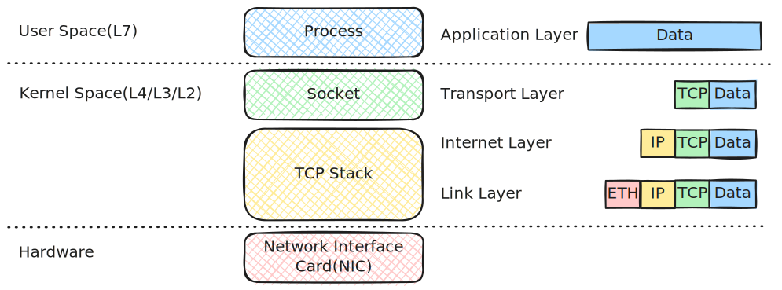

# Networking Stack Architecture

This is a four-layer architecture, with data moving from top to bottom when you send a message, and bottom to top when you receive one.

---

## 1. Application Layer

Where everything starts for a user. Applications like web browsers and email clients generate data here. This layer includes all the user-facing protocols.

- **Function**: Formatting data, application control.
- **Data Unit**: **Data** / **Message**
- **Key Protocols**: HTTP, HTTPS (web), FTP (file transfer), SMTP (email), DNS.

## 2. Transport Layer

Responsible for logical communication between processes running on different hosts. It can ensure data is delivered reliably and in the correct order.

- **Function**: End-to-end communication, error correction, flow control, port management.
- **Data Unit**: **Segment** (TCP) or **Datagram** (UDP)
- **Key Protocols**: **TCP** (reliable connection-oriented), **UDP** (fast connectionless datagram).

!!! Tip 

    Please visit [Kubernetes > Networking > 1. Networking Introduction > TCP section](../../kubernetes/networking/01-networking-introduction.md/#tcp) to better understand the TCP header.

## 3. Internet Layer

Also known as the Network layer, this layer handles the actual routing and addressing of data packets across network boundaries (the internet).

- **Function**: Logical addressing (IP addresses), packet routing, fragmentation.
- **Data Unit**: **Packet**
- **Key Protocols**: **IP** (Internet Protocol - including IPv4 and IPv6), ICMP (for error reporting).

!!! Tip 

    Please visit [Kubernetes > Networking > 1. Networking Introduction > Internet Protocol section](../../kubernetes/networking/01-networking-introduction.md/#internet-protocol) to better understand the IP header.

## 4. Link Layer

The lowest layer, handling the physical connection. It defines how data gets onto the media (e.g., Ethernet cable, Wi-Fi).

- **Function**: Accessing local networks, error detection at the frame level, defining hardware specifics.
- **Data Unit**: **Frame** -> **Bits** (as they become electrical/radio signals).
- **Key Protocols**: Ethernet, Wi-Fi.

!!! Tip 

    Please visit [Kubernetes > Networking > 1. Networking Introduction > Link Layer section](../../kubernetes/networking/01-networking-introduction.md/#link-layer) for details about the link layer.