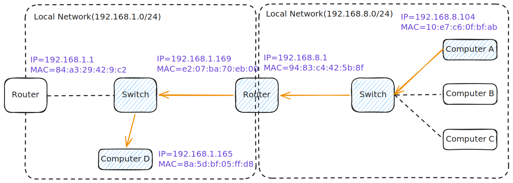
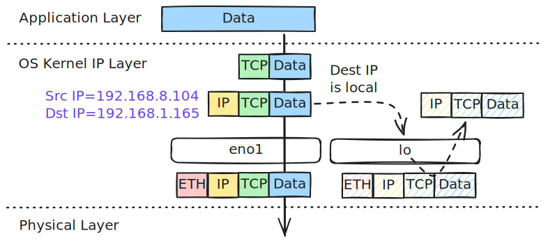
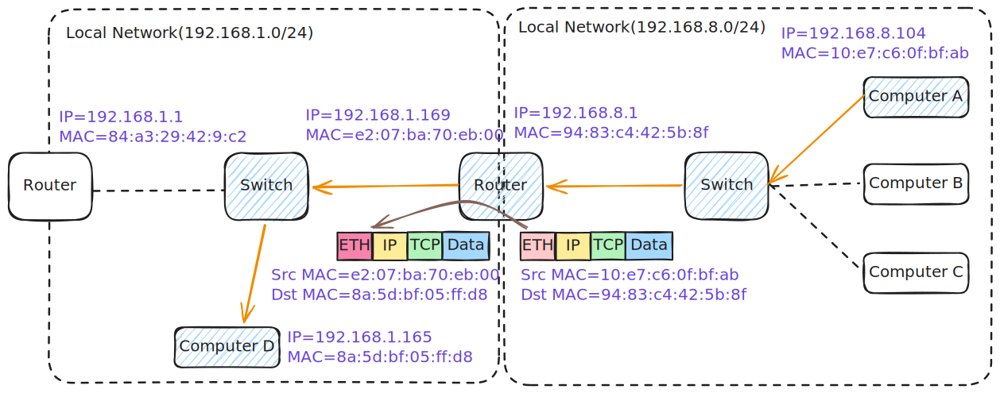

# Packet Delivery Across Networks



When the destination computer is located in a completely different network, computers can no longer talk directly using just a Layer 2 switch. They need a Router (Default Gateway) to bridge the gap between the two networks.

Here is the basic assumption:

- **Computer A (Network 1):** 
    - IP `192.168.8.104`
    - MAC `10:e7:c6:0f:bf:ab`
- **Router / Default Gateway:** 
    - Network 1 IP `192.168.8.1`
    - Network 1 MAC `94:83:c4:42:5b:8f`
- **Computer D (Network 2):** 
    - IP `192.168.1.165`
    - MAC `8a:5d:bf:05:ff:d8`

---

## Part 1: Encapsulation (Inside Computer A)

*Data travels **down** the network layers on Computer A. Because the destination is on a different network, Computer A targets the Router.*


### Step 1: The Transport Layer (Data $\rightarrow$ Segment)

* **Action:** The operating system takes raw application **Data** and wraps a **TCP Header** around it.
* **Key Info Added:** Source Port (e.g., `45322`) and Destination Port (e.g., `80`).

### Step 2: The Network Layer (Segment $\rightarrow$ Packet)

* **Action:** The segment moves down to Layer 3, where the OS adds an **IP Header**.
* **Addressing Labels:** The logical end-to-end addresses **never change** during the journey:
       * **Source IP:** `192.168.8.104` (Computer A)
       * **Destination IP:** `192.168.1.165` (Computer D)


### Step 3: The Data Link Layer (Packet $\rightarrow$ Frame)


* **The Crucial Decision:** Computer A checks its routing table and realizes `192.168.1.165` is **not** on its local network (`192.168.8.0/24`). It decides it must send the packet to its **Default Gateway (Router)**.

??? info "Packet Flow Decisions based on Destination IP"

    

    Depending on the destination IP specified in the packet, the kernel evaluates 

    - the **local routing table** first to determine if the packet is destined for the host itself(and should be processed in RAM)
    - and then falls back to the **main routing table** if the packet needs to be transmitted out of a physical interface to the network.

    === "Local Routing Table"

        ``` bash hl_lines="2 3 5 9" title="local routing table example"
        $ ip route show table local
        local 127.0.0.0/8 dev lo proto kernel scope host src 127.0.0.1 # (1)!
        local 127.0.0.1 dev lo proto kernel scope host src 127.0.0.1
        broadcast 127.255.255.255 dev lo proto kernel scope link src 127.0.0.1 # (2)!
        local 192.168.8.104 dev eno1 proto kernel scope host src 192.168.8.104 # (3)!
        local 192.168.8.149 dev wlp1s0 proto kernel scope host src 192.168.8.149 # (4)!
        broadcast 192.168.8.255 dev eno1 proto kernel scope link src 192.168.8.104
        broadcast 192.168.8.255 dev wlp1s0 proto kernel scope link src 192.168.8.149
        local 192.168.56.1 dev vboxnet0 proto kernel scope host src 192.168.56.1 # (5)!
        ```

        1.  - `local 127.0.0.0/8 dev lo`: Any packet destined for this range is routed to the virtual loopback device `lo`.
            - `scope host`: This scope tells the kernel that these IP addresses exist only inside this host. Packets matching this route can never be transmitted out of a physical interface.
            - `src 127.0.0.1`: If a local application initiates a connection to a `127.x.x.x` address without explicitly binding to a source IP, the kernel automatically assigns `127.0.0.1` as the source IP.
        2.  - `broadcast 127.255.255.255`: Captures loopback broadcasts to prevent them from reaching physical network drivers.
        3.  - `local 192.168.8.104 dev eno1`: This is the IP assigned to your wired Ethernet card (`eno1`).
        4.  - `local 192.168.8.149 dev wlp1s0`: This is the IP assigned to your wireless Wi-Fi card (`wlp1s0`).
        5.  - `local 192.168.56.1 dev vboxnet0`: This is the IP assigned to your VirtualBox host-only virtual network adapter.

    === "Main Routing Table"

        ``` bash hl_lines="2 4" title="main routing table example"
        $ ip route
        default via 192.168.8.1 dev eno1 proto dhcp src 192.168.8.104 metric 100 # (1)!
        default via 192.168.8.1 dev wlp1s0 proto dhcp src 192.168.8.149 metric 600 # (2)!
        192.168.8.0/24 dev eno1 proto kernel scope link src 192.168.8.104 metric 100 # (3)!
        192.168.8.0/24 dev wlp1s0 proto kernel scope link src 192.168.8.149 metric 600
        ```

        1.  - `eno1` is my physical onboard wired Ethernet card(`metric 100` for Ethernet).
            - My Ethernet card got the IP `192.168.8.104`. 
            - This line tells my computer: "If you want to send traffic to the internet (e.g., `google.com` or `8.8.8.8`), send it to the router at `192.168.8.1`."
        2.  - `wlp1s0` is my physical wireless Wi-Fi card(`metric 600` for Ethernet).
            - My Wi-Fi card got the IP `192.168.8.149`.
            - This line is also used to send traffic to the internet.
        3.  - This line tells my computer: "If you want to talk to another device on the same home network (any IP starting with `192.168.8.X`), it is directly connected to this link." 
            - `scope link` tells the kernel: "You do not need to send this traffic to the router (`192.168.8.1`). These computers are plugged into the same switch. Just use ARP to find their MAC address and deliver it directly on the wire."


    *   **To `127.0.0.1` (or any `127.0.0.0/8` Loopback IP):**
        *   **Decision:** Matches `local 127.0.0.0/8 dev lo` in the **Local Routing Table**.
        *   **Flow:** The packet is routed internally inside RAM to the virtual loopback interface `lo`. It never reaches physical network adapters or physical mediums.
    *   **To `192.168.8.104` or `192.168.8.149` (Host's own Interface IPs):**
        *   **Decision:** Matches `local 192.168.8.104 dev eno1` or `local 192.168.8.149 dev wlp1s0` in the **Local Routing Table**.
        *   **Flow:** The kernel recognizes these as its own IP addresses. It intercepts the traffic in RAM, looping it back internally.{==It never goes out onto the physical wire or Wi-Fi radio==}.
    *   **To `192.168.8.x` (Another machine on the same local subnet):**
        *   **Decision:** Misses the local table, matches `192.168.8.0/24 dev eno1` in the **Main Routing Table**.
        *   **Flow:** The kernel sees `scope link`, meaning the destination is on the same local network segment. It skips the default gateway, uses ARP to resolve the target MAC address, and sends the frame directly out of the physical Ethernet interface `eno1` (preferred over `wlp1s0` due to a lower metric of `100` vs `600`).
    *   **To External IP (e.g., `8.8.8.8` or `google.com`):**
        *   **Decision:** Misses all specific entries, falls back to the default route `default via 192.168.8.1 dev eno1` in the **Main Routing Table**.
        *   **Flow:** The kernel routes the packet to the default gateway router (`192.168.8.1`) via physical Ethernet interface `eno1` (`metric 100`) to be forwarded to the Internet.

* **Action:** It attaches an **Ethernet Header** targeting the Router's physical address on Network 1.
* **Addressing Labels:**
       * **Source MAC:** `10:e7:c6:0f:bf:ab` (Computer A's NIC)
       * **Destination MAC:** `94:83:c4:42:5b:8f` (**The Router's Local MAC**, found via ARP)

``` bash title="ARP table example(IP -> MAC)" hl_lines="5"
$ arp -a
ubuntu-xenial.lan (192.168.8.179) at 08:00:27:4c:6d:dd [ether] on eno1
console.gl-inet.com (192.168.8.1) at 94:83:c4:42:5b:8f [ether] on wlp1s0
MacBookPro.lan (192.168.8.107) at fe:d0:b0:80:c3:d8 [ether] on eno1
console.gl-inet.com (192.168.8.1) at 94:83:c4:42:5b:8f [ether] on eno1
```

??? Note "ubuntu-xenial.lan"

    The entry `ubuntu-xenial.lan` (`192.168.8.179`) represents another active host sharing the same local network segment (`192.168.8.0/24`). My system dynamically discovered and cached their corresponding hardware MAC addresses by sending out Layer 2 ARP broadcast requests when it previously needed to communicate with them directly.

### Step 4: The Physical Layer (Frame $\rightarrow$ Electrical Bits)

* **Action:** Computer A's network interface card (NIC) translates the binary frame into raw physical **Bits** and transmits them down the cable toward the router.

---

## Part 2: Routing & Re-Encapsulation (At the Router)

*The Router acts as a bridge between Network 1 and Network 2. It strips the old Layer 2 header and writes a new one.*



### Step 5: Decapsulation & Inspection at the Router

* The router receives the bits, reassembles the frame, and checks the **Destination MAC** (`94:83:c4:42:5b:8f`). Seeing it matches its own interface, it strips the Ethernet header away.
* The router's CPU looks at the **Destination IP** (`192.168.1.165`). It realizes this belongs to Network 2, which is directly connected to its other interface.

### Step 6: Re-Encapsulation for the New Network

* The router keeps the internal IP Packet perfectly intact, but it must build a **brand new Ethernet Header** so the packet can survive on Network 2.
* **The New Addressing Labels:**
       * **Source MAC:** `e2:07:ba:70:eb:00` (The Router's outgoing (WAN / Network 2) port physical MAC)
       * **Destination MAC:** `8a:5d:bf:05:ff:d8` (Computer D's physical MAC).

* The router converts this new frame into bits and shoots them down the wire into Network 2.

---

## Part 3: Decapsulation (Inside Computer D)

*The signal arrives at Computer D's network card on Network 2, traveling **up** the layers.*


### Step 7: Layer 1 & 2 Verification (Bits $\rightarrow$ Frame)

* **Action:** Computer D's network card receives the bits, builds the frame, and verifies the **Destination MAC** (`8a:5d:bf:05:ff:d8`). Finding a match, it strips the Ethernet header and passes the packet up.

### Step 8: Layer 3 Verification (Frame $\rightarrow$ Packet)

* **Action:** The operating system reads the **Destination IP** (`192.168.1.165`). It matches perfectly, so it strips the **IP Header** away.

### Step 9: Layer 4 Verification & Delivery

* **Action:** The OS processes the **TCP Segment**, verifies the **Destination Port**, strips the **TCP Header**, and delivers the original **Data** straight to the waiting application on Computer D.
