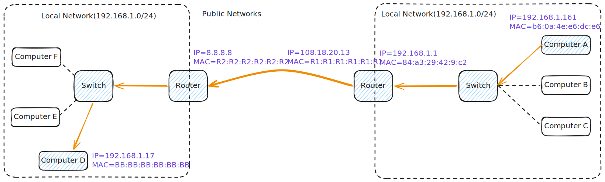
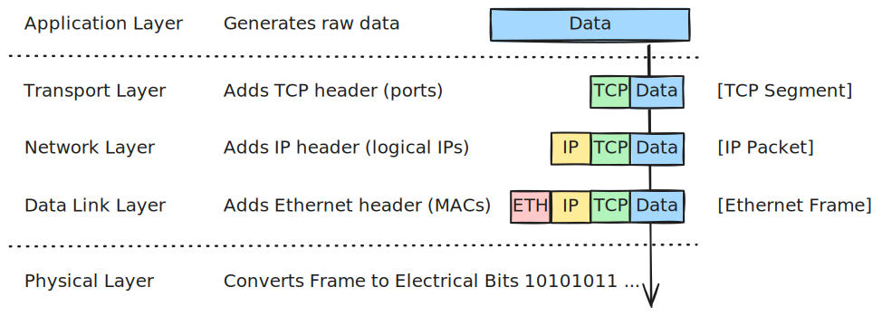
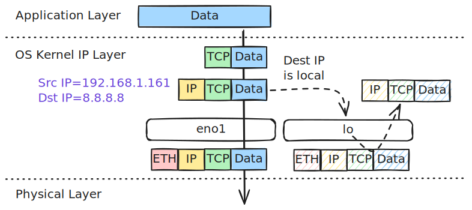
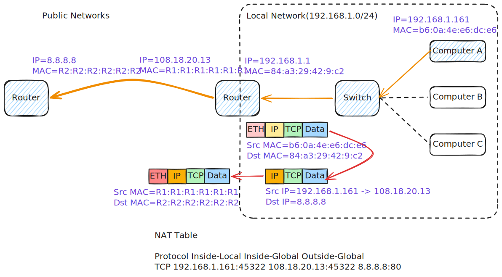
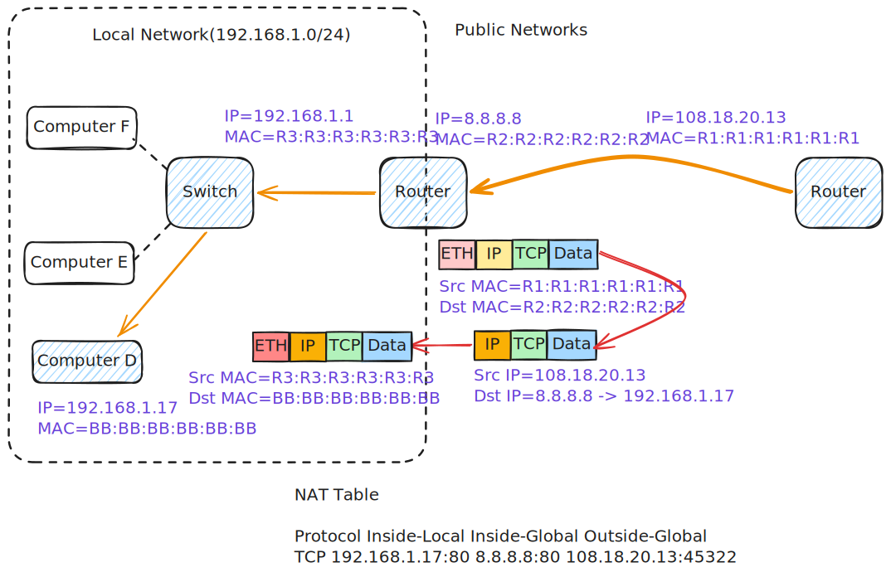
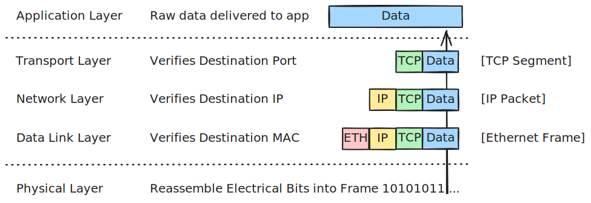

# Packet Delivery Across Multiple Networks



When a router performs **NAT (Network Address Translation)**, it doesn't just swap the Layer 2 Ethernet headers—it actually modifies the **Layer 3 IP Header** as well.

Let's look at how the packet travels when the Router translates Computer A's private IP into a public IP so it can reach Computer D across the internet.

### Scenario Details

*   **Computer A (Source Private Network):** 
    *   IP `192.168.1.161` | MAC `b6:0a:4e:e6:dc:e6`
*   **Source NAT Router (LAN side):** 
    *   Private IP `192.168.1.1` | Private MAC `84:a3:29:42:9:c2`
*   **Source NAT Router (WAN side):** 
    *   Public IP `108.18.20.13` | Public MAC `R1:R1:R1:R1:R1:R1`
*   **Destination Router (WAN side):** 
    *   Public IP `8.8.8.8` | Public MAC `R2:R2:R2:R2:R2:R2`
*   **Destination Router (LAN side):** 
    *   Private IP `192.168.1.1` | Private MAC `84:a3:29:42:9:c2`
*   **Computer D (Destination Private Network):** 
    *   Private IP `192.168.1.17` | MAC `BB:BB:BB:BB:BB:BB`
---

## Part 1: Encapsulation (Inside Computer A)

*Data travels **down** the network layers on Computer A. Computer A uses its private IP and targets the local router.*



### Step 1: The Transport Layer (Data $\rightarrow$ Segment)

* **Action:** The OS wraps the raw **Data** in a **TCP Header**.
* **Key Info Added:** Source Port `45322` and Destination Port `80`.

### Step 2: The Network Layer (Segment $\rightarrow$ Packet)

* **Action:** The OS adds the original private **IP Header**.
    * **Source IP:** `192.168.1.161` (Computer A's private IP)
    * **Destination IP:** `8.8.8.8` (Computer B's public IP)


### Step 3: The Data Link Layer & Physical Layer (Packet $\rightarrow$ Bits)

* **Action:** Computer A realizes `8.8.8.8` is external, so it creates an **Ethernet Header** targeting the gateway.
    * **Source MAC:** `b6:0a:4e:e6:dc:e6` (Computer A)
    * **Destination MAC:** `84:a3:29:42:9:c2` (Router's Private Port MAC)

??? info "Packet Flow Decisions based on Destination IP"

    

    Depending on the destination IP specified in the packet, the kernel evaluates 

    - the **local routing table** first to determine if the packet is destined for the host itself(and should be processed in RAM)
    - and then falls back to the **main routing table** if the packet needs to be transmitted out of a physical interface to the network.

    ``` bash title="Routing Table in MacOS" hl_lines="6"
    netstat -nr
    Routing tables
    
    Internet:
    Destination        Gateway            Flags               Netif Expire
    default            192.168.1.1        UGScg                 en0
    127                127.0.0.1          UCS                   lo0
    127.0.0.1          127.0.0.1          UH                    lo0
    169.254            link#11            UCS                   en0      !
    192.168.1          link#11            UCS                   en0      !
    192.168.1.1/32     link#11            UCS                   en0      !
    192.168.1.1        84:a3:29:42:9:c2   UHLWIir               en0   1199
    192.168.1.161/32   link#11            UCS                   en0      !
    192.168.1.163      3e:e7:65:fe:f:c6   UHLWIi                en0   1165
    192.168.1.255      ff:ff:ff:ff:ff:ff  UHLWbI                en0      !
    224.0.0/4          link#11            UmCS                  en0      !
    224.0.0.251        1:0:5e:0:0:fb      UHmLWI                en0
    255.255.255.255/32 link#11            UCS                   en0      !
    ```


    *   **To `127.0.0.1` (or any `127.0.0.0/8` Loopback IP):**
        *   **Decision:** Matches `127` in the **macOS Routing Table**.
        *   **Flow:** The packet is routed internally inside RAM to the virtual loopback interface `lo0`. It never reaches physical network adapters or physical mediums.
    *   **To `192.168.1.161` (Host's own Interface IP):**
        *   **Decision:** Matches `192.168.1.161/32` (with flags `UCS` / local host route).
        *   **Flow:** The kernel recognizes this as its own IP address. It intercepts the traffic in RAM, looping it back internally. It never goes out onto the physical wire or Wi-Fi radio.
    *   **To `192.168.1.x` (Another machine on the same local subnet, e.g., `192.168.1.163`):**
        *   **Decision:** Matches the subnet route `192.168.1` (with gateway `link#11` / directly connected link route).
        *   **Flow:** The kernel sees the destination is on the same local network segment. It skips the default gateway, uses ARP to resolve the target MAC address (e.g., `3e:e7:65:fe:f:c6`), and sends the frame directly out of the physical interface `en0`.
    *   **To External IP (e.g., `8.8.8.8` or `google.com`):**
        *   **Decision:** Misses all local and subnet entries, falls back to the default route `default via 192.168.1.1` on interface `en0`.
        *   **Flow:** The kernel routes the packet to the default gateway router (`192.168.1.1`) via physical interface `en0` to be forwarded to the Internet.


``` bash title="ARP table example(IP -> MAC)" hl_lines="2"
$ arp -a
cr1000b.mynetworksettings.com (192.168.1.1) at 84:a3:29:42:9:c2 on en0 ifscope [ethernet]
iphone (192.168.1.163) at 3e:e7:65:fe:f:c6 on en0 ifscope [ethernet]
mac (192.168.1.165) at 8a:5d:bf:5:ff:d8 on en0 ifscope [ethernet]
? (192.168.1.255) at ff:ff:ff:ff:ff:ff on en0 ifscope [ethernet]
mdns.mcast.net (224.0.0.251) at 1:0:5e:0:0:fb on en0 ifscope permanent [ethernet]
```

* The frame is converted into electrical bits and sent down the cable.

---

## Part 2: NAT & Routing (At the Router on the Source side)

*The Router strips the Layer 2 header, **rewrites the Layer 3 IP source address**, records the change in a translation table, and builds a new Layer 2 header.*



### Step 4: Decapsulation and NAT Table Lookup

* The router receives the bits, verifies the Destination MAC, and strips the Ethernet header.
* It reads the IP header and notes that a private IP (`192.168.1.161`) wants to talk to the public internet.

### Step 5: Modifying the IP Packet (The NAT Magic)

* Because private IPs are not allowed on the public internet, the router modifies the **IP Header itself**:
* It overwrites **Source IP:** `192.168.1.161` $\rightarrow$ **`108.18.20.13`** (The Router's Public IP).
* The Destination IP stays exactly the same (`8.8.8.8`).


* **The NAT Table Entry:** The router saves a temporary note in its memory tracking this exact connection:

| Private Internal IP & Port | Public External IP & Port | Destination IP |
| --- | --- | --- |
| `192.168.1.161:45322` | `108.18.20.13:45322` | `8.8.8.8:80` |


### Step 6: Re-Encapsulation for the Public Internet

* The router attaches a **brand new Ethernet Header** for the public internet space.
    * **Source MAC:** `R1:R1:R1:R1:R1:R1` (The MAC of the Router's public-facing port).
    * **Destination MAC:** `R2:R2:R2:R2:R2:R2` (The next hop router's MAC).


* The router transmits the modified packet out to the internet.

---

## Part 3: NAT & Routing (At the Router on the Destination Side)

*The Destination Router acts as the public gatekeeper (`8.8.8.8`) for the private server network. It receives the packet from the public internet, performs **Destination NAT (D-NAT)** to map the public request to a private host, and re-encapsulates it for the final local hop.*



### Step 7: Decapsulation & D-NAT Table Lookup at the Destination Router

* The destination router receives the bits from the public internet backbone, reassembles the frame, and verifies the **Destination MAC** (`R2:R2:R2:R2:R2:R2`). 
* Finding a match, it strips the internet-facing Ethernet header away.
* **The Destination NAT Magic:** The router's CPU reads the **Destination IP** (`8.8.8.8`) and the target port (Port `80`) and performs the following step-by-step D-NAT lookup and translation:
    1. **Preconfigured Table Check:** It checks its preconfigured **Port Forwarding (D-NAT) Table**:
       
         | External Public Port | Internal Private IP & Port |
         | --- | --- |
         | `8.8.8.8:80` | `192.168.1.17:80` |
         
    2. **Finding the Rule Match:** It finds a match showing that traffic to `8.8.8.8:80` should be forwarded to the private IP **`192.168.1.17:80`**.
    3. **IP Header Rewrite:** The router modifies the **IP Header itself**, rewriting the **Destination IP:** `8.8.8.8` $\rightarrow$ **`192.168.1.17`** (while the **Source IP** remains completely untouched as `108.18.20.13`).
    4. **Register Connection State:** It registers a dynamic **active connection state entry** in its RAM to track this live conversation so that return packets can be mapped back to the client.

### Step 8: Re-Encapsulation for the Destination Local Network

* The router builds a **brand new Ethernet Header** so the translated packet can survive on the destination local subnet:
       * **Source MAC:** `R3:R3:R3:R3:R3:R3` (The Destination Router's local LAN port MAC).
       * **Destination MAC:** `BB:BB:BB:BB:BB:BB` (Computer D's physical MAC).
* The router converts this local frame into bits and transmits them down the cable to Computer D.

---

## Part 4: Decapsulation (Inside Computer D)

*The packet arrives at Computer D. To Computer D, it looks like a client at public IP `108.18.20.13` connected directly to its private IP.*



### Step 9: Layer 1 & 2 Verification (Bits $\rightarrow$ Frame)

* Computer D's network card receives the bits, builds the frame, verifies its Destination MAC (`BB:BB:BB:BB:BB:BB`), and strips the Ethernet header away.

### Step 10: Layer 3 Verification (The Translated View)

* Computer D reads the **IP Header**:
    * **Source IP:** `108.18.20.13` (The Source Router's Public IP).
    * **Destination IP:** `192.168.1.17` (Matches Computer D's own private IP!).
* Computer D accepts the packet, strips the IP Header, and passes the TCP segment up.

### Step 11: Layer 4 Verification & Delivery

* The OS processes the **TCP Segment**, verifies the **Destination Port** (Port `80`), strips the **TCP Header**, and delivers the original **Data** straight to the waiting web server application on Computer D.

---

### What happens when Computer D replies?

When Computer D sends a response back, the process runs in reverse, utilizing both S-NAT and D-NAT tables:

1. **Outbound Response:** Computer D addresses the return packet with **Source IP:** `192.168.1.17` and **Destination IP:** `108.18.20.13` (the Source Router's public WAN IP). It targets the Destination Router's LAN MAC (`84:a3:29:42:9:c2`) and sends the frame.
2. **Destination Router (Reverse D-NAT):** The Destination Router receives the frame, strips the L2 header, and inspects its NAT table. It realizes this is the response to the port-forwarded connection. It rewrites the **Source IP:** `192.168.1.17` $\rightarrow$ **`8.8.8.8`** (so it matches the public IP the client expects). It then encapsulates the packet in a public WAN frame and routes it over the internet.
3. **Source Router (Inbound S-NAT):** The Source Router receives the reply packet on its WAN interface. It inspects the Destination Port (`45322`) and consults its **NAT Table**.
4. **Local Delivery:** The Source Router finds the matching entry (`108.18.20.13:45322` $\rightarrow$ `192.168.1.161:45322`). It overwrites the Destination IP/Port with Computer A's private IP (`192.168.1.161:45322`), rebuilds the LAN Ethernet header, and delivers the packet safely back to Computer A!