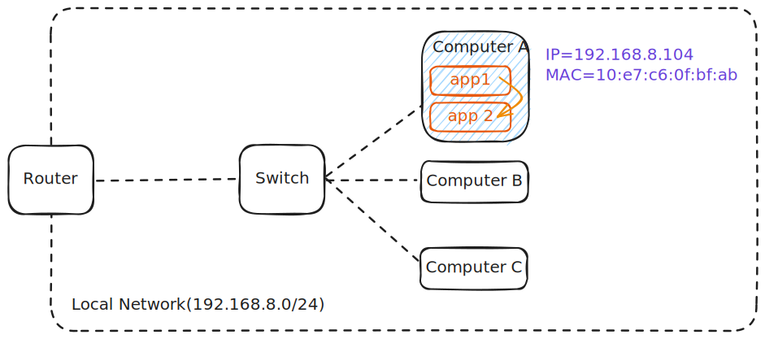
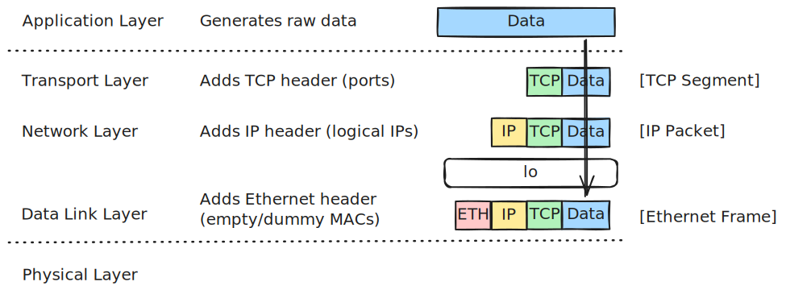
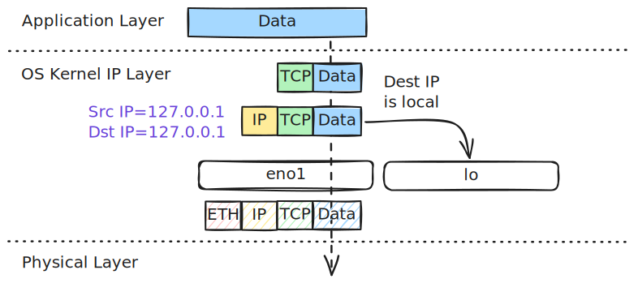
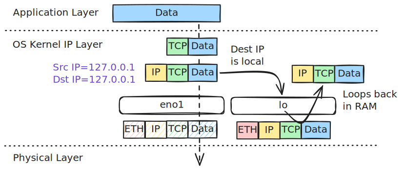
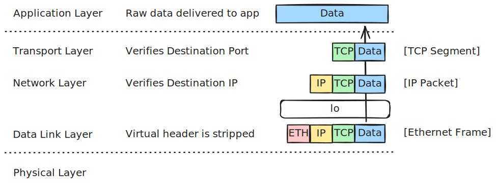

# Packet Delivery in the Same Host



Let's explore how the data is transferred between two processes running on the exact same computer (e.g., from a web client/browser to a local web server running on the same host).

---

## Part 1: Encapsulation (Inside the Host)

*Data travels **down** the network layers on the host system to prepare the payload, but the kernel intercept redirects it before it ever reaches physical hardware.*



### Step 1: The Transport Layer (Data $\rightarrow$ Segment)

* **Action:** The operating system takes raw application **Data** and wraps a **TCP Header** around it.
* **Key Info Added:** Source Port (e.g., `45322`) and Destination Port (e.g., `80`).

### Step 2: The Network Layer (Segment $\rightarrow$ Packet) & The Routing Decision

* **Action:** The segment moves down to Layer 3, where the OS adds an **IP Header**.
* **Addressing Labels:**
    * **Source IP:** `127.0.0.1` (or your local interface IP `192.168.8.104`)
    * **Destination IP:** `127.0.0.1` (or your local interface IP `192.168.8.104`)

#### The Routing Decision:

Before passing the packet down, the kernel must decide where to send it. It evaluates the **Local** routing table first:



=== "Local Routing Table"

    ``` bash hl_lines="2 5 9" title="local routing table example"
    $ ip route show table local
    local 127.0.0.0/8 dev lo proto kernel scope host src 127.0.0.1 # (1)!
    local 127.0.0.1 dev lo proto kernel scope host src 127.0.0.1
    broadcast 127.255.255.255 dev lo proto kernel scope link src 127.0.0.1 # (2)!
    local 192.168.8.104 dev eno1 proto kernel scope host src 192.168.8.104 # (3)!
    local 192.168.8.149 dev wlp1s0 proto kernel scope host src 192.168.8.149 # (4)!
    broadcast 192.168.8.255 dev eno1 proto kernel scope link src 192.168.8.104
    broadcast 192.168.8.255 dev wlp1s0 proto kernel scope link src 192.168.8.149
    local 192.168.56.1 dev vboxnet0 proto kernel scope host src 192.168.56.1 # (5)!
    ```

    1.  - `local 127.0.0.0/8 dev lo`: Any packet destined for this range is routed to the virtual loopback device `lo`.
        - `scope host`: This scope tells the kernel that these IP addresses exist only inside this host. Packets matching this route can never be transmitted out of a physical interface.
        - `src 127.0.0.1`: If a local application initiates a connection to a `127.x.x.x` address without explicitly binding to a source IP, the kernel automatically assigns `127.0.0.1` as the source IP.
    2.  - `broadcast 127.255.255.255`: Captures loopback broadcasts to prevent them from reaching physical network drivers.
    3.  - `local 192.168.8.104 dev eno1`: This is the IP assigned to your wired Ethernet card (`eno1`). Even though `dev eno1` is specified, because the type is `local`, the kernel intercepts it and loops it back internally.
    4.  - `local 192.168.8.149 dev wlp1s0`: This is the IP assigned to your wireless Wi-Fi card (`wlp1s0`). Same local loopback behavior applies.
    5.  - `local 192.168.56.1 dev vboxnet0`: This is the IP assigned to your VirtualBox host-only virtual network adapter.

* **The Decision:** Because the destination IP matches a `local` type route with `scope host` (either loopback `127.0.0.1` or the local interface IP `192.168.8.104`), the kernel flags the packet for **local delivery**.

### Step 3: The Data Link Layer (Bypassed / Virtualized)

* **Action:** The packet moves to Layer 2 to prepare for transmission.
* **Bypassing the Hardware:** Because the destination is local, the kernel realizes the packet does not need to leave the host.
    * It **does not** perform an ARP lookup to find a hardware MAC address on the wire.
    * It **does not** format a physical Ethernet frame.
* **Loopback Hand-off:** The IP layer hands the packet directly over to the virtual **loopback device driver (`lo`)**. The driver encapsulates the packet into a virtual Layer 2 frame (using empty/dummy MAC addresses or bypassing framing altogether in memory) and loops it directly into the system's input queue.

### Step 4: The Physical Layer (Entirely Bypassed)

* **Action:** The physical network interface card (NIC), the copper network cables, the Wi-Fi radio waves, and external switches are **completely bypassed**.
* The packet is never translated into electrical voltages or wireless signals. The entire flow occurs purely within the host system's CPU and RAM.

---

## Part 2: Transmitting (Across the Virtual Loopback)

*Instead of traveling across copper or air, the packet is moved through a fast memory buffer inside the operating system kernel.*



### Step 5: The Loopback Receive Queue

* The virtual loopback device (`lo`) places the packet directly into the kernel's network receive backlog (a allocated buffer in system RAM).
* **The Kernel's Job:** Instead of a physical switch routing a frame, the kernel triggers a **software interrupt (SoftIRQ)**, notifying the operating system's networking stack that a new packet is waiting in the input queue to be parsed.

---

## Part 3: Decapsulation (Inside the Same Host)

*The operating system reads the packet from the memory queue and processes it back up the networking stack to the target application.*



### Step 6: Layer 2 Verification (Bypassed)

* **Action:** The kernel retrieves the virtual frame from the loopback interface buffer.
* **Bypassed Verification:** Hardware-level collision detection, Frame Check Sequence (FCS/CRC) error checks, and physical MAC filters are skipped because the data never left the CPU's memory boundary. The virtual header is stripped, and the payload is passed up.

### Step 7: Layer 3 Verification (Frame $\rightarrow$ Packet)

* **Action:** The operating system processes the **IP Packet**.
* **Verification:** The kernel reads the **Destination IP** (`127.0.0.1` or `192.168.8.104`). It confirms that this IP is owned by the local host, strips the **IP Header** away, and passes the segment up.

### Step 8: Layer 4 Verification (Packet $\rightarrow$ Segment)

* **Action:** The operating system processes the **TCP Segment**.
* **Verification:** The TCP stack reads the **Destination Port** (e.g., Port `80`) to identify which local socket/application is listening for this connection. It strips the **TCP Header** away.

### Step 9: The Destination

* **Result:** The original, untouched **Data** is copied directly from kernel space into the user-space memory buffer of the server application process running on the same computer.
