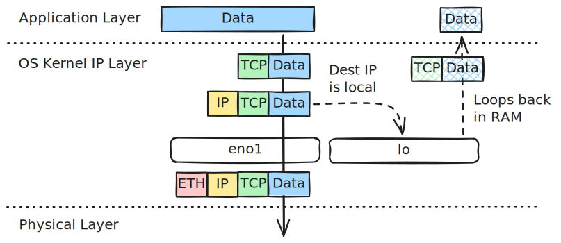

# Packet Delivery in the Same Network

Let's explore how the data is transferred from Computer A to Computer B in the same network.

---

## Part 1: Encapsulation (Inside Computer A)

*Data travels **down** the network layers on Computer A to turn abstract information into physical signals.*


### Step 1: The Transport Layer (Data $\rightarrow$ Segment)

* **Action:** The operating system takes raw application **Data** and wraps a **TCP Header** around it.
* **Key Info Added:** Source Port (e.g., `45322`) and Destination Port (e.g., `80`).

### Step 2: The Network Layer (Segment $\rightarrow$ Packet)

* **Action:** The segment moves down to Layer 3, where the OS adds an **IP Header**.
* **Addressing Labels:**
    * **Source IP:** `192.168.1.10` (Computer A)
    * **Destination IP:** `192.168.1.20` (Computer B)


#### Packet Flow Decisions based on Destination IP




Depending on the destination IP specified in the packet, the kernel evaluates the **Local** and **Main** routing tables to decide the path:

=== "Main Routing Table"

    ``` bash hl_lines="1 3"
    $ ip route
    default via 192.168.8.1 dev eno1 proto dhcp src 192.168.8.104 metric 100 # (1)!
    default via 192.168.8.1 dev wlp1s0 proto dhcp src 192.168.8.149 metric 600 # (2)!
    192.168.8.0/24 dev eno1 proto kernel scope link src 192.168.8.104 metric 100 # (3)!
    192.168.8.0/24 dev wlp1s0 proto kernel scope link src 192.168.8.149 metric 600
    ```

    1.  - `eno1` is my physical onboard wired Ethernet card(`metric 100` for Ethernet).
        - My Ethernet card got the IP `192.168.8.104`. 
        - This line tells my computer: "If you want to send traffic to the internet (e.g., `google.com` or `8.8.8.8`), send it to the router at `192.168.8.1`."
    2.  - `wlp1s0` is my physical wireless Wi-Fi card(`metric 600` for Ethernet).
        - My Wi-Fi card got the IP `192.168.8.149`.
        - This line is also used to send traffic to the internet.
    3.  - This line tells my computer: "If you want to talk to another device on the same home network (any IP starting with `192.168.8.X`), it is directly connected to this link." 
        - `scope link` tells the kernel: "You do not need to send this traffic to the router (`192.168.8.1`). These computers are plugged into the same switch. Just use ARP to find their MAC address and deliver it directly on the wire."

=== "Local Routing Table"

    ``` bash hl_lines="2 5 9"
    $ ip route show table local
    local 127.0.0.0/8 dev lo proto kernel scope host src 127.0.0.1 # (1)!
    local 127.0.0.1 dev lo proto kernel scope host src 127.0.0.1
    broadcast 127.255.255.255 dev lo proto kernel scope link src 127.0.0.1 # (2)!
    local 192.168.8.104 dev eno1 proto kernel scope host src 192.168.8.104 # (3)!
    local 192.168.8.149 dev wlp1s0 proto kernel scope host src 192.168.8.149 # (4)!
    broadcast 192.168.8.255 dev eno1 proto kernel scope link src 192.168.8.104
    broadcast 192.168.8.255 dev wlp1s0 proto kernel scope link src 192.168.8.149
    local 192.168.56.1 dev vboxnet0 proto kernel scope host src 192.168.56.1 # (5)!
    ```

    1.  - `local 127.0.0.0/8 dev lo`: Any packet destined for this range is routed to the virtual loopback device `lo`.
        - `scope host`: This scope tells the kernel that these IP addresses exist only inside this host. Packets matching this route can never be transmitted out of a physical interface.
        - `src 127.0.0.1`: If a local application initiates a connection to a `127.x.x.x` address without explicitly binding to a source IP, the kernel automatically assigns `127.0.0.1` as the source IP.
    2.  - `broadcast 127.255.255.255`: Captures loopback broadcasts to prevent them from reaching physical network drivers.
    3.  - `local 192.168.8.104 dev eno1`: This is the IP assigned to your wired Ethernet card (`eno1`).
    4.  - `local 192.168.8.149 dev wlp1s0`: This is the IP assigned to your wireless Wi-Fi card (`wlp1s0`).
    5.  - `local 192.168.56.1 dev vboxnet0`: This is the IP assigned to your VirtualBox host-only virtual network adapter.

*   **To `127.0.0.1` (or any `127.0.0.0/8` Loopback IP):**
    *   **Decision:** Matches `local 127.0.0.0/8 dev lo` in the **Local Routing Table**.
    *   **Flow:** The packet is routed internally inside RAM to the virtual loopback interface `lo`. It never reaches physical network adapters or physical mediums.
*   **To `192.168.8.104` or `192.168.8.149` (Host's own Interface IPs):**
    *   **Decision:** Matches `local 192.168.8.104 dev eno1` or `local 192.168.8.149 dev wlp1s0` in the **Local Routing Table**.
    *   **Flow:** The kernel recognizes these as its own IP addresses. It intercepts the traffic in RAM, looping it back internally. It never goes out onto the physical wire or Wi-Fi radio.
*   **To `192.168.8.x` (Another machine on the same local subnet):**
    *   **Decision:** Misses the local table, matches `192.168.8.0/24 dev eno1` in the **Main Routing Table**.
    *   **Flow:** The kernel sees `scope link`, meaning the destination is on the same local network segment. It skips the default gateway, uses ARP to resolve the target MAC address, and sends the frame directly out of the physical Ethernet interface `eno1` (preferred over `wlp1s0` due to a lower metric of `100` vs `600`).
*   **To External IP (e.g., `8.8.8.8` or `google.com`):**
    *   **Decision:** Misses all specific entries, falls back to the default route `default via 192.168.8.1 dev eno1` in the **Main Routing Table**.
    *   **Flow:** The kernel routes the packet to the default gateway router (`192.168.8.1`) via physical Ethernet interface `eno1` (`metric 100`) to be forwarded to the Internet.


### Step 3: The Data Link Layer (Packet $\rightarrow$ Frame)

* **Action:** The packet moves to Layer 2 to be prepared for the physical wire by adding an **Ethernet Header**.
* **The MAC Lookup (ARP):** Computer A checks its internal ARP table to find the hardware address for Computer B's IP. If missing, it broadcasts a quick network request to find it.
* **Addressing Labels:**
    * **Source MAC:** `AA:AA:AA:AA:AA:AA` (Computer A's NIC)
    * **Destination MAC:** `BB:BB:BB:BB:BB:BB` (Computer B's NIC)

``` bash title="ARP table example"
$ arp -a
ubuntu-xenial.lan (192.168.8.179) at 08:00:27:4c:6d:dd [ether] on eno1
console.gl-inet.com (192.168.8.1) at 94:83:c4:42:5b:8f [ether] on wlp1s0
MacBookPro.lan (192.168.8.107) at fe:d0:b0:80:c3:d8 [ether] on eno1
console.gl-inet.com (192.168.8.1) at 94:83:c4:42:5b:8f [ether] on eno1
```


### Step 4: The Physical Layer (Frame $\rightarrow$ Electrical Bits)

* **Action:** Computer A's network interface card (NIC) translates the binary frame into raw physical **Bits** ($1$s and $0$s) by rapidly shifting voltage levels down the copper cable.

---

## Part 2: Transmitting (Across the Network)


### Step 5: The Physical Network Switch

* The electrical signals travel along the cable and hit a port on the physical hardware switch.
* **The Switch's Job:** It acts like a smart traffic cop. It does **not** read the IP addresses or the inner data. {++It only reads the first few bytes to find the **Destination MAC Address** (`BB:BB:BB:BB:BB:BB`)++}.
* {++It looks at its internal MAC table, finds the exact physical port where Computer B is plugged in++}, and repeats the electrical signal directly down that cable.

---

## Part 3: Decapsulation (Inside Computer B)

*The signal arrives at Computer B's network card, traveling **up** the layers while stripping away headers.*


### Step 6: Layer 1 & 2 Verification (Bits $\rightarrow$ Frame)

* **Action:** Computer B's network card receives the electrical voltages, translates them back into binary **Bits**, and reassembles the **Ethernet Frame**.
* **The Security Check:** It reads the **Destination MAC**. Because it matches `BB:BB:BB:BB:BB:BB`, it accepts the frame, strips the **Ethernet Header** away, and passes the payload up.

### Step 7: Layer 3 Verification (Frame $\rightarrow$ Packet)

* **Action:** The operating system processes the inner **IP Packet**.
* **The Security Check:** It reads the **Destination IP** (`192.168.1.20`). It matches its own IP, so it accepts the packet, strips the **IP Header** away, and passes the segment up.

### Step 8: Layer 4 Verification (Packet $\rightarrow$ Segment)

* **Action:** The operating system processes the **TCP Segment**.
* **The Security Check:** It reads the **Destination Port** (e.g., Port `80`) to find which application is waiting for this traffic, then strips the **TCP Header** away.

### Step 9: The Destination

* **Result:** The original, untouched **Data** is delivered cleanly straight to the application process running on Computer B.
