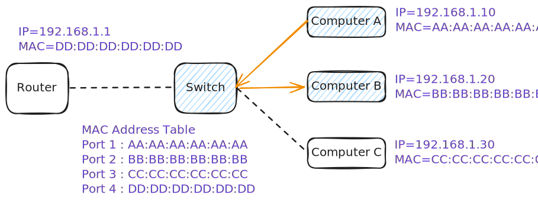

# Packet Delivery in the Same Network

Let's explore how the data is transferred from Computer A to Computer B in the same network.

---

## Part 1: Encapsulation (Inside Computer A)

*Data travels **down** the network layers on Computer A to turn abstract information into physical signals.*

### Step 1: The Transport Layer (Data $\rightarrow$ Segment)

* **Action:** The operating system takes raw application **Data** and wraps a **TCP Header** around it.
* **Key Info Added:** Source Port (e.g., `45322`) and Destination Port (e.g., `80`).

### Step 2: The Network Layer (Segment $\rightarrow$ Packet)

* **Action:** The segment moves down to Layer 3, where the OS adds an **IP Header**.
* **Addressing Labels:**
    * **Source IP:** `192.168.1.10` (Computer A)
    * **Destination IP:** `192.168.1.20` (Computer B)

### Step 3: The Data Link Layer (Packet $\rightarrow$ Frame)

* **Action:** The packet moves to Layer 2 to be prepared for the physical wire by adding an **Ethernet Header**.
* **The MAC Lookup (ARP):** Computer A checks its internal ARP table to find the hardware address for Computer B's IP. If missing, it broadcasts a quick network request to find it.
* **Addressing Labels:**
    * **Source MAC:** `AA:AA:AA:AA:AA:AA` (Computer A's NIC)
    * **Destination MAC:** `BB:BB:BB:BB:BB:BB` (Computer B's NIC)

### Step 4: The Physical Layer (Frame $\rightarrow$ Electrical Bits)

* **Action:** Computer A's network interface card (NIC) translates the binary frame into raw physical **Bits** ($1$s and $0$s) by rapidly shifting voltage levels down the copper cable.

---

## Part 2: Transmitting (Across the Network)

### Step 5: The Physical Network Switch

* The electrical signals travel along the cable and hit a port on the physical hardware switch.
* **The Switch's Job:** It acts like a smart traffic cop. It does **not** read the IP addresses or the inner data. {++It only reads the first few bytes to find the **Destination MAC Address** (`BB:BB:BB:BB:BB:BB`)++}.
* {++It looks at its internal MAC table, finds the exact physical port where Computer B is plugged in++}, and repeats the electrical signal directly down that cable.

---

## Part 3: Decapsulation (Inside Computer B)

*The signal arrives at Computer B's network card, traveling **up** the layers while stripping away headers.*

### Step 6: Layer 1 & 2 Verification (Bits $\rightarrow$ Frame)

* **Action:** Computer B's network card receives the electrical voltages, translates them back into binary **Bits**, and reassembles the **Ethernet Frame**.
* **The Security Check:** It reads the **Destination MAC**. Because it matches `BB:BB:BB:BB:BB:BB`, it accepts the frame, strips the **Ethernet Header** away, and passes the payload up.

### Step 7: Layer 3 Verification (Frame $\rightarrow$ Packet)

* **Action:** The operating system processes the inner **IP Packet**.
* **The Security Check:** It reads the **Destination IP** (`192.168.1.20`). It matches its own IP, so it accepts the packet, strips the **IP Header** away, and passes the segment up.

### Step 8: Layer 4 Verification (Packet $\rightarrow$ Segment)

* **Action:** The operating system processes the **TCP Segment**.
* **The Security Check:** It reads the **Destination Port** (e.g., Port `80`) to find which application is waiting for this traffic, then strips the **TCP Header** away.

### Step 9: The Destination

* **Result:** The original, untouched **Data** is delivered cleanly straight to the application process running on Computer B.
