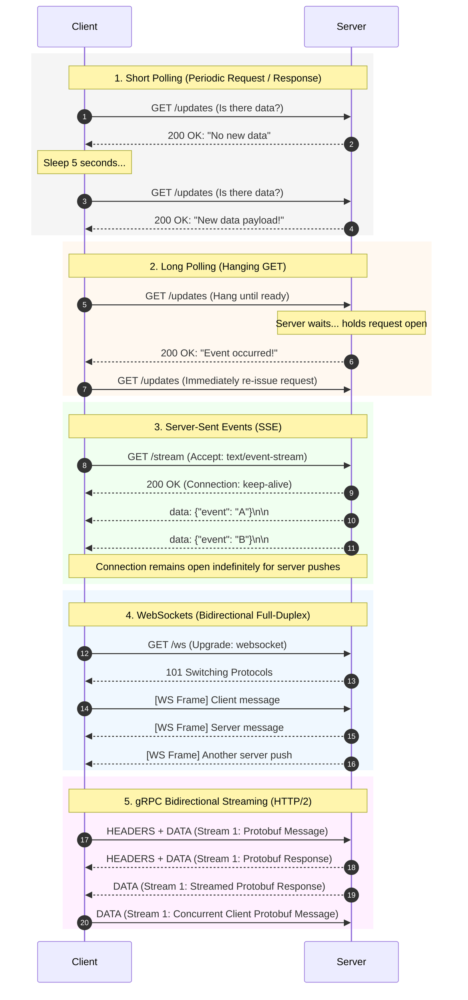
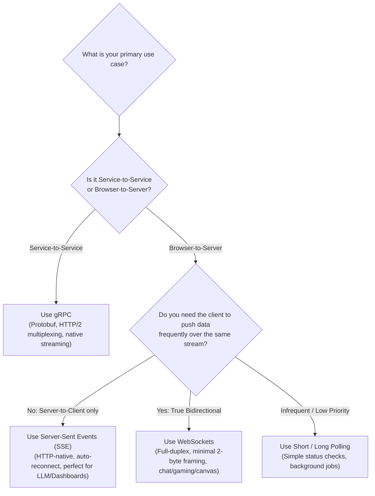

# Polling vs SSE vs WebSockets vs gRPC

When designing real-time, event-driven, or streaming communication between clients and servers, choosing the right protocol is critical for latency, server resource utilization, and architectural complexity.

This guide provides an architectural comparison of **Short Polling**, **Long Polling**, **Server-Sent Events (SSE)**, **WebSockets**, and **gRPC Streaming**.

---

## 1. At-a-Glance Comparison Matrix

| Feature | Short Polling | Long Polling | Server-Sent Events (SSE) | WebSockets (WS) | gRPC Streaming |
| :--- | :--- | :--- | :--- | :--- | :--- |
| **Communication Flow** | Unidirectional (Client &rarr; Server pull) | Unidirectional (Client &rarr; Server pull with hold) | **Unidirectional (Server &rarr; Client push)** | **Full-Duplex (Bidirectional)** | **Full-Duplex (Bidirectional)** |
| **Transport Layer** | HTTP/1.1 or HTTP/2 | HTTP/1.1 or HTTP/2 | HTTP/1.1 or HTTP/2 (`text/event-stream`) | Raw TCP (after HTTP/1.1 Upgrade) | HTTP/2 (Binary Frames) |
| **Connection Lifecycle** | Frequent connect / disconnect cycles | Persistent request held until event or timeout | Single persistent, long-lived HTTP connection | Single persistent, long-lived TCP connection | Single persistent, multiplexed TCP connection |
| **Message Framing Overhead** | 🔴 Extremely High (Full HTTP headers every poll) | 🔴 High (Full HTTP headers per message) | 🟢 Very Low (Small text prefix: `data: ...\n\n`) | 🟢 Minimal (2–10 bytes framing header) | 🟢 Ultra-Low (5-byte prefix + binary Protobuf) |
| **Payload Format** | Any (JSON, XML) | Any (JSON, XML) | **UTF-8 Text only** (typically JSON) | Text or Binary (Blob, ArrayBuffer) | **Binary Protocol Buffers (`.proto`)** |
| **Browser Native API** | `fetch()` / `setInterval` | `fetch()` recursive | `EventSource` (Built-in) | `WebSocket` (Built-in) | Needs `grpc-web` proxy |
| **Auto-Reconnection** | Manual (application loop) | Manual (application loop) | ✅ **Built-in (`EventSource`)** + `Last-Event-ID` | ❌ Manual (app-level heartbeats & backoff) | ✅ Built-in channel subchannel backoff |
| **Proxy & Firewall Friendly** | ✅ 100% Native HTTP | ✅ 100% Native HTTP | 🟡 Native HTTP (requires proxy unbuffering) | 🔴 Requires explicit WebSocket proxy upgrade | 🟡 Requires HTTP/2 end-to-end proxy support |
| **Load Balancing** | Standard L7 Round-Robin / Least-Conn | Standard L7 Round-Robin | Sticky sessions or connection-aware L7 | Stateful connections (requires Pub/Sub backplane) | Requires L7 HTTP/2 stream load balancer (e.g. Envoy) |
| **Best For** | Infrequent, low-priority status checks | Simple fallback when WS/SSE not viable | LLM token streaming, notifications, live tickers | Real-time chat, multiplayer gaming, collaborative canvases | High-throughput internal microservice streaming |

<br>

---

## 2. Visual Sequence Comparison

The diagram below illustrates how each protocol delivers an update from the server to the client:



<br>

---

## 3. Deep-Dive on Each Protocol

### 1. Short Polling
The client repeatedly sends standard HTTP requests at fixed intervals (e.g., every 5 seconds) asking the server for new data.

* **Under the Hood**:
    * Each poll is an independent HTTP request/response cycle.
    * If no data has changed, the server still responds with an empty payload or `304 Not Modified`.
* **Pros**:
    * Extremely simple to implement (`setInterval` + `fetch`).
    * Completely stateless; works seamlessly across all load balancers, firewalls, and CDNs.
* **Cons**:
    * **Massive Header Overhead**: Sending full HTTP headers (cookies, auth headers, ~1–2 KB) for every request, even when 95%+ of polls return empty.
    * **High Latency / Inefficient**: Updates are delayed by up to the polling interval. Decreasing the interval to reduce latency multiplies server CPU and database load exponentially.
* **When to use**: Infrequent status checks where a delay of 30–60+ seconds is acceptable (e.g., checking the progress of a long-running batch export job).

---

### 2. Long Polling (Comet)
The client sends an HTTP request, but instead of returning immediately with empty data, the server **holds the request open** until new data is available or a timeout occurs.

* **Under the Hood**:
    1. Client opens request `GET /notifications`.
    2. Server pauses the response and watches an event queue (e.g., Redis pub/sub).
    3. As soon as an event occurs (or 30s timeout expires), server returns the response.
    4. Client processes the data and **immediately opens a new request**.
* **Pros**:
    * Much lower perceived latency than short polling (server pushes as soon as the event occurs).
    * No empty responses during idle periods.
    * Works on standard HTTP without requiring WebSocket protocol support.
* **Cons**:
    * **Connection Churn**: Every message requires tearing down the HTTP transaction and issuing a new request, creating continuous header overhead.
    * **Server Concurrency Strain**: On thread-per-connection web servers (e.g., classic Apache/Tomcat), holding thousands of idle requests exhausts worker threads unless using an asynchronous event-driven server (Node.js, Go, Netty).
* **When to use**: Fallback mechanism for real-time applications operating in environments where WebSockets or SSE are blocked by corporate proxies.

---

### 3. Server-Sent Events (SSE)
Standardized in HTML5, SSE defines a mechanism where the client opens a single long-lived HTTP connection, and the server continuously streams text data downward to the client over time.

* **Under the Hood**:
    * Initiated with standard HTTP: `GET /feed` with `Accept: text/event-stream`.
    * Server responds with `Content-Type: text/event-stream` and `Cache-Control: no-cache`.
    * Data is sent as simple text lines separated by double newlines (`\n\n`):
      ```http
      id: 101
      event: price_update
      data: {"ticker": "GOOG", "price": 182.50}

      ```
* **Key Strengths**:
    * **Native Browser Support (`EventSource`)**: Built into every modern browser with standard event listeners (`source.onmessage`, `source.addEventListener('event_name', ...)`).
    * **Automatic Reconnection & Resumption**: If the connection drops, the browser automatically reconnects and sends the header `Last-Event-ID: 101`. The server can replay any missed events from that ID!
    * **Standard HTTP**: Runs over normal HTTP/1.1 or HTTP/2 without requiring custom protocols or port upgrades.
* **Limitations**:
    * **Strictly Unidirectional**: Only Server &rarr; Client. Client cannot send messages back over the same stream; client actions require separate HTTP `POST` requests.
    * **Text-Only**: Payloads must be UTF-8 text (binary data requires Base64 encoding).
    * **Proxy Buffering Caveat**: Reverse proxies (like Nginx) will buffer SSE streams by default, preventing live pushes until the buffer fills unless you configure `proxy_buffering off;` or send the response header `X-Accel-Buffering: no`.
* **When to use**:
    * **LLM Output Streaming**: Real-time generative AI token streaming (ChatGPT-style responses).
    * **Live Dashboards & Stock Tickers**: Continuous read-only financial data and telemetry.
    * **System Notifications**: Server-driven alerts, build status updates, and activity feeds.

---

### 4. WebSockets (WS / WSS)
Standardized in RFC 6455, WebSockets establish an interactive, **bidirectional, full-duplex communication channel over a single, persistent TCP connection**.

* **The Upgrade Handshake**:
    1. Client initiates a standard HTTP/1.1 request:
       ```http
       GET /chat HTTP/1.1
       Host: server.example.com
       Upgrade: websocket
       Connection: Upgrade
       Sec-WebSocket-Key: dGhlIHNhbXBsZSBub25jZQ==
       Sec-WebSocket-Version: 13
       ```
    2. Server accepts and responds with `HTTP/1.1 101 Switching Protocols`.
    3. The connection transitions from HTTP to the WebSocket framing protocol over the same underlying TCP socket.
* **The Framing Protocol**:
    * After the handshake, HTTP headers are gone completely.
    * Messages are packaged in minimal binary frames with only **2 to 10 bytes of framing overhead** (opcode, payload length, masking key).
* **Key Strengths**:
    * **True Full-Duplex**: Both client and server can transmit data simultaneously without waiting for request/response synchronization.
    * **Ultra-Low Latency**: Lowest latency for rapid message exchange over the web.
    * **Binary and Text Support**: Natively transmits both UTF-8 strings and raw binary buffers (ArrayBuffer, Blob).
* **Limitations & Architectural Challenges**:
    * **No Built-in Reconnection**: Unlike SSE, WebSockets provide zero native reconnection or message replay mechanisms. Applications must implement custom reconnect loops, exponential backoff, and heartbeat ping/pong messages.
    * **Stateful Scaling & Load Balancing**: Standard stateless load balancing doesn't work. To broadcast a message to users connected to different WebSocket server instances, you must implement a central **Pub/Sub backplane** (such as Redis Pub/Sub, Kafka, or RabbitMQ).
    * **Proxy & Firewall Sensitivity**: Corporate proxies and firewalls may terminate idle TCP connections or block the WebSocket upgrade handshake.
* **When to use**:
    * Collaborative real-time apps (e.g., Google Docs, Figma).
    * Real-time multi-user chat applications (e.g., Slack, Discord).
    * Low-latency multiplayer gaming.
    * Real-time financial trading platforms where clients continuously send buy/sell orders and receive streaming quotes.

---

### 5. gRPC Streaming
Built on top of **HTTP/2**, gRPC provides high-performance Remote Procedure Call (RPC) capabilities with native streaming primitives and strongly typed contracts.

* **Four Communication Modes**:
    1. **Unary RPC**: Traditional Request &rarr; Response.
    2. **Server Streaming**: Client sends 1 request &rarr; Server sends a stream of messages (similar to SSE, but binary and typed).
    3. **Client Streaming**: Client sends a stream of messages &rarr; Server returns 1 summary response (e.g., chunked file ingestion).
    4. **Bidirectional Streaming**: Both sides independently read and write messages over an interleaved HTTP/2 stream.
* **Key Strengths**:
    * **Protocol Buffers (Protobuf)**: Strongly typed schema contracts (`.proto`). Binary serialization is 5x–10x faster and significantly smaller than JSON.
    * **HTTP/2 Multiplexing**: Multiple concurrent RPC streams share a single TCP connection without Head-of-Line blocking at the HTTP layer.
    * **Production Resilience**: Built-in deadline management, client-side load balancing, channel keepalives, and cancellation propagation.
* **Limitations**:
    * **Limited Direct Browser Support**: Browsers cannot access raw HTTP/2 frames directly from JavaScript. Browser clients must use **`grpc-web`**, which requires an intermediary proxy (e.g., Envoy) to translate HTTP/1.1 or browser HTTP/2 into standard gRPC.
    * **Non-Human Readable**: Binary wire format requires Protobuf tools to inspect or debug.
* **When to use**:
    * **Inter-Service Microservice Communication**: High-throughput, low-latency communication inside Kubernetes clusters and service meshes.
    * **IoT and Mobile Gateways**: Mobile apps or embedded edge devices communicating with backend servers where bandwidth and CPU efficiency are paramount.
    * **Large-Scale Data Ingestion / Telemetry Pipelines**: Continuous streaming of telemetry, metrics, or sensor data.

<br>

---

## 4. Decision Framework: When to Choose What



### Quick Rule of Thumb

1. **Use Server-Sent Events (SSE)** if your updates flow predominantly from **Server &rarr; Client** (e.g., LLM token streams, live market prices, system notifications). It is significantly simpler, more reliable, and has native automatic reconnection over standard HTTP.
2. **Use WebSockets** if you need **true bidirectional, high-frequency, low-latency messaging** between browser and server (e.g., live multiplayer games, chat apps, collaborative whiteboards).
3. **Use gRPC** for **internal backend-to-backend microservices** where type safety, serialization performance, and streaming contracts dominate.
4. **Use Short/Long Polling** only for **infrequent checks** (polling every 30s+) or legacy fallback environments where streaming connections cannot be held open.