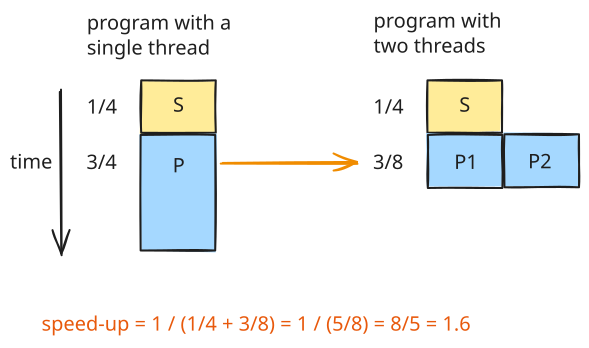
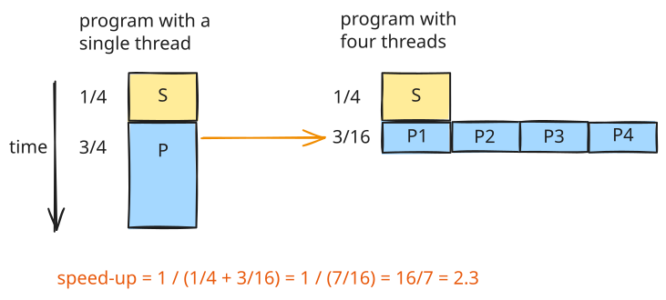

# Thread - Amdahl's Law

Amdahl's Law defines the theoretical limit of speedup that can be achieved by executing a program in parallel (using multiple threads or processors), given a specific sequential fraction of the workload.

---

## The Core Concept: Sequential vs. Parallel Workloads

A program's execution time consists of two components:

1. **Sequential Portion ($S$):** Code that must be executed serially because of data dependencies, I/O operations, or synchronization locks.
2. **Parallelizable Portion ($P$):** Code that can be divided into independent tasks and distributed across multiple threads.

### Scenario A: Executing on Two Threads

Consider a program where:

*   **$25\%$** of the workload is sequential ($S = 0.25$).
*   **$75\%$** of the workload is parallelizable ($P = 0.75$).

If we distribute the parallelizable portion ($75\%$) across **two threads**:

*   The execution time of the parallel portion is cut in half ($0.75 / 2 = 0.375$).
*   The total execution time becomes $0.25 + 0.375 = 0.625$.
*   The resulting speedup is $\frac{1}{0.625} = 1.6\times$ faster than a single-threaded execution.

!!! warning "Idealized Conditions"

    This theoretical calculation assumes ideal conditions, ignoring real-world bottlenecks:

    *   **System Overhead:** Thread creation, scheduling, and context-switching overhead.
    *   **Communication & Synchronization:** Latency introduced by lock contention, mutexes, or Inter-Process Communication (IPC).
    *   **Load Imbalance:** Unequal distribution of work among threads, causing some threads to wait idle.

---

## Amdahl's Law Formula

The mathematical formula for Amdahl's Law is defined as:

$$\text{Speedup} = \frac{1}{S + \frac{1 - S}{N}}$$

Where:

*   $S$ is the sequential fraction of the program ($S = 1 - P$).
*   $N$ is the number of processing cores or threads.

---

## Scaling Limits and Diminishing Returns

### Scenario B: Scaling to Four Threads ($N = 4$)
Using the same program ($S = 0.25$, $P = 0.75$) with four threads:

*   The parallel portion takes $0.75 / 4 = 0.1875$ of the original time.
*   The total time is $0.25 + 0.1875 = 0.4375$.
*   The theoretical speedup is $\frac{1}{0.4375} \approx 2.3\times$ faster.

### The Limits of Infinite Parallelism ($N \to \infty$)

Even if we scale the number of threads infinitely ($N \to \infty$), the parallel component $\frac{1 - S}{N}$ approaches zero. The speedup limit is determined entirely by the sequential component:

$$\text{Limit}_{\,N \to \infty} \, \text{Speedup} = \frac{1}{S} = \frac{1}{0.25} = 4\times$$

This demonstrates **diminishing returns**: adding more cores or threads cannot push the speedup beyond the limit imposed by the sequential portion of the code.

---

## Reference

<iframe width="560" height="315" src="https://www.youtube.com/embed/j6RqUqaLCLg?si=YKzINhk8OVUivXiN" title="YouTube video player" frameborder="0" allow="accelerometer; autoplay; clipboard-write; encrypted-media; gyroscope; picture-in-picture; web-share" referrerpolicy="strict-origin-when-cross-origin" allowfullscreen></iframe>
