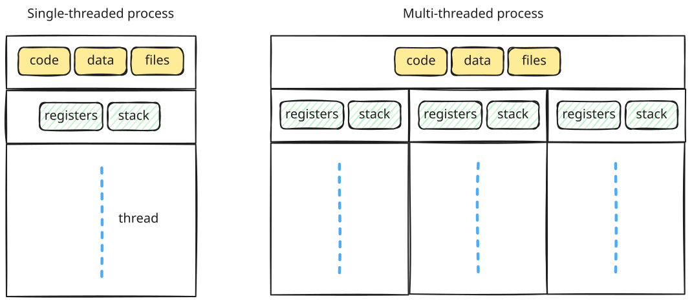
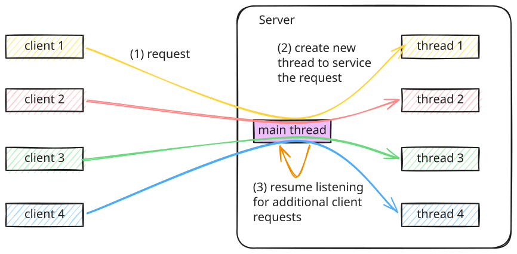
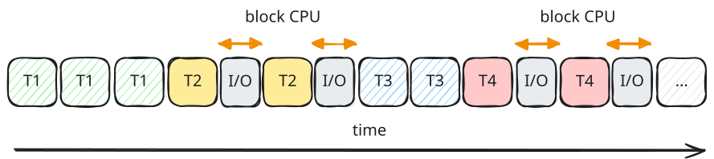
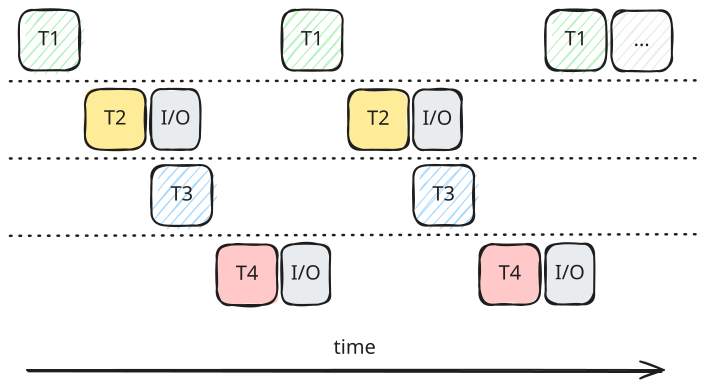
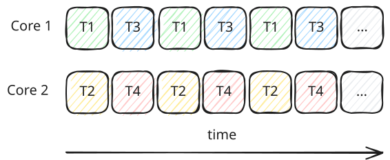

# Thread - Basic Concepts

## What is a Thread?

A thread is a lightweight unit of execution, often referred to as a lightweight process (LWP) or a sub-process.

*   **Processes:** An application can be divided into multiple independent processes.
*   **Threads:** Each process can contain multiple threads that run concurrently.

??? note "Example - Chrome"

      Google Chrome uses a **multi-process architecture** where different parts of the browser are separated into distinct processes, and each of those processes uses **multiple threads** to handle concurrent operations:

      1. **Processes (Tab Isolation):**
         - Chrome runs a **Browser Process** (for the browser window UI and coordinating other processes) and spawns a separate **Renderer Process** for each tab.
         - **Process boundary:** Each tab has its own completely isolated memory space. If one tab crashes (e.g., due to an infinite loop), only that tab's process dies. The main browser and other tabs remain unaffected and stable.

      2. **Threads (Concurrency within a Tab):**
         Within each tab's **Renderer Process**, multiple threads run concurrently and share the process's memory space:
         - **Main Thread:** Parses HTML/CSS, builds the DOM, and executes **JavaScript** code.
         - **Compositor Thread:** Handles page scrolling and CSS animations. Because it runs on a separate thread, animations stay smooth even if the Main Thread is blocked by heavy JavaScript execution.
         - **Worker Threads:** Background threads (Web Workers) spawned to execute heavy computations without freezing the main user interface thread.

---

## Multi-processing vs. Multi-threading

Processes and threads differ primarily in how they manage memory and system resources:

*   **Process Creation:** Spawning a new process requires allocating a completely separate address space, duplicating code segments, and setting up independent data segments. This is a {==relatively heavy and resource-intensive operation==}.
*   **Thread Creation:** Threads are created within an existing process's address space. Spawning a thread is {==faster and requires significantly fewer system resources==}.
*   **Shared Resources:** While multiple processes run in isolated memory spaces, multiple threads running within the same process share the process's code segment, data segment, and open system resources (like files).

*   **Independent Execution State:** Each thread maintains its own Program Counter (PC), CPU registers, and execution stack.
*   **Shared Memory Space:** Global variables, heap memory, and code segments are shared among all threads in the same process.
*   **Efficient Communication:** Because they share memory, threads can communicate quickly and with very low overhead, without needing formal Inter-Process Communication (IPC) mechanisms like shared memory segments or message queues.
*   **Synchronization Requirement:** Since threads concurrently access shared global variables, access must be carefully synchronized (e.g., using mutexes or locks) to prevent race conditions and data corruption.

---

### Multithreaded Application Architecture

In a standard multithreaded application:

*   **Main Thread (UI Thread):** Handles user interactions, events, and UI rendering.
*   **Worker Threads:** Perform background tasks (like disk I/O, network requests, or heavy computations) to keep the main thread responsive.

### Multithreaded Server Architecture

Multithreading is widely used in **client-server architectures** to handle high volumes of concurrent connections:

Multithreading works exceptionally well in client-server setups:

1. The server runs a **listener thread** that accepts incoming client requests.
2. When a request is received, instead of blocking the listener thread to process it, the server spawns a **worker thread** to handle that specific client's request.
3. This allows the listener thread to immediately resume listening for subsequent incoming connections.

---

## Advantages of Multithreading

Both multi-processing and multi-threading offer high-level benefits:

*   **Responsiveness:** Enables an application to remain responsive to user inputs even if a background task (like a network call) is blocked or running a heavy calculation.
*   **Scalability:** Allows the application to run across multiple CPU cores, increasing throughput and performance.

Compared to multi-processing, multi-threading offers distinct advantages:

*   **Resource Sharing:** Sharing global variables and memory space enables fast, low-overhead communication without complex IPC.
*   **Efficiency:** Thread creation and context switching are much faster and consume far less CPU overhead than process creation and process context switching.

---

### Programming for Multi-core Architectures

Having a multi-core CPU does not automatically make an application run faster. **The operating system does not automatically partition a single-threaded application into multiple processes or threads.**

*   **Single-threaded Limitation:** If an application is written with only a single thread of execution, the OS can only run it on a single CPU core, leaving the other cores idle.
*   **Developer Responsibility:** To take advantage of multi-core systems, the software developer must explicitly design the application to use multiple processes or threads.

---

## Concurrency vs. Parallelism

### Concurrency

Concurrent execution on **a single-core system** switches execution between threads in order.

!!! note "Why don't we just complete the entire thread job and move over to the next?"

      If a single CPU without concurrency (timesharing) can complete a task in 10 seconds, then a single CPU with concurrency (timesharing) can finish the job in less total time if some threads are blocked. For example, let's assume that threads 2 and 4 perform disk I/O. Without concurrency, the I/O task blocks the CPU from doing any work.

      

      With concurrency, the CPU doesn't need to wait until the I/O task is completed to start another job on a different thread.

      

### Parallelism

Parallelism happens on a **multi-core system**, where each core handles execution threads in parallel.

---

## Reference

<iframe width="560" height="315" src="https://www.youtube.com/embed/QZPzJr6o44o?si=O-lwBNiEB3VBveNQ" title="YouTube video player" frameborder="0" allow="accelerometer; autoplay; clipboard-write; encrypted-media; gyroscope; picture-in-picture; web-share" referrerpolicy="strict-origin-when-cross-origin" allowfullscreen></iframe>
