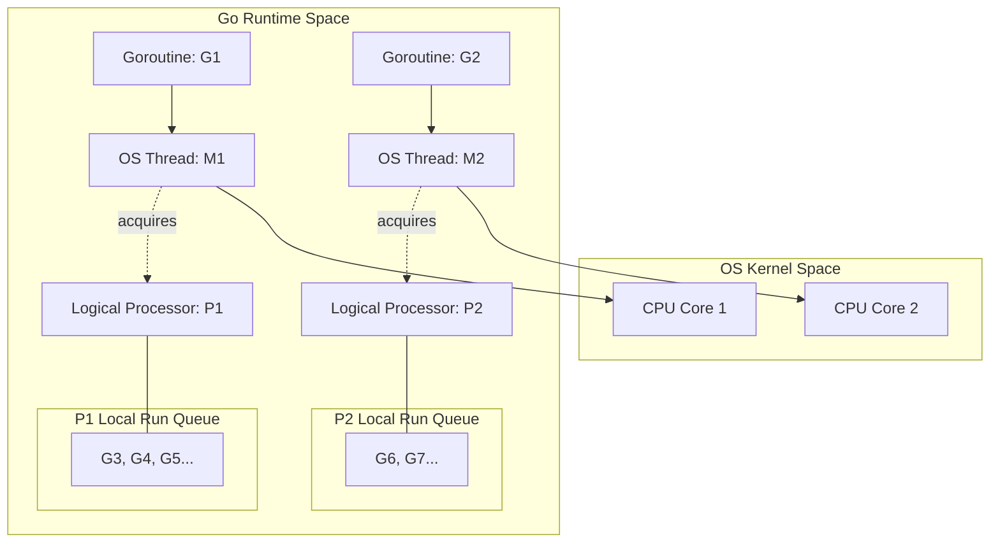
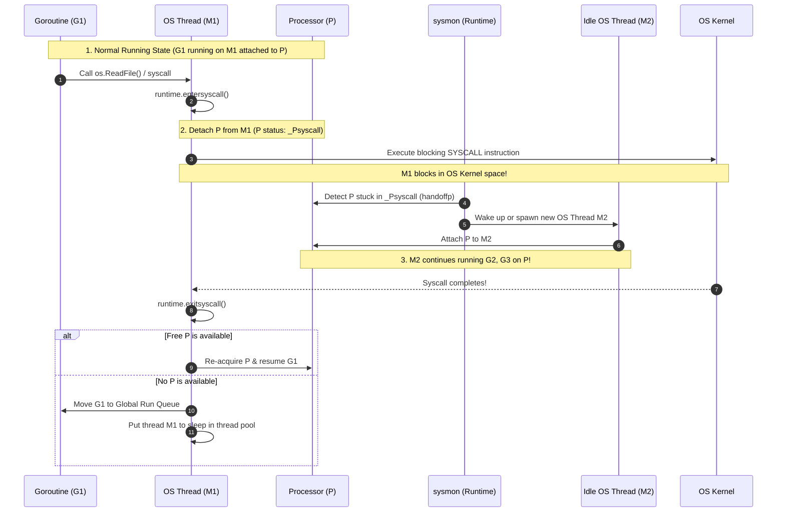

# Go Scheduler (GMP Model)

Go's runtime manages concurrency using a custom $M:N$ scheduler, multiplexing $M$ Goroutines onto $N$ OS Kernel Threads. This system is known as the **GMP model**. By managing scheduling in user space, Go avoids the high cost of operating system context switches for standard concurrency operations.

---

## 1. The Core Entities: G, M, and P

The Go scheduler relies on the interaction of three main structures:

!!! note

    In the diagram above, **`G1`** and **`G2`** are actively executing on threads **`M1`** and **`M2`** respectively (state: `_Grunning`). Once a Goroutine is popped from the Local Run Queue to be executed, it is **removed** from the queue. The queues only hold runnable Goroutines (state: `_Grunnable`, like `G3` through `G7`) that are waiting for their turn.

### G (Goroutine)
*   **Definition**: A lightweight, user-space thread representing a execution path.
*   **Memory Overhead**: Starts with a very small stack size of **2KB** (which grows and shrinks dynamically in heap memory), compared to the **1MB–8MB** stack size of a standard OS thread.
*   **Context Switch Cost**: Extremely cheap (~tens of nanoseconds) because it occurs entirely in user space without transitioning to kernel mode.

### M (Machine / OS Thread)
*   **Definition**: A standard OS kernel thread created and managed by the operating system.
*   **Behavior**: An `M` is responsible for executing Go code. It must be bound to a logical processor `P` to run Goroutines.
*   **Quantity**: The number of `M`s is dynamic, but the runtime limits it to a maximum of 10,000 threads by default to prevent thread thrashing.

### P (Processor)
*   **Definition**: A logical processor representing the resources and context required to run Go code.
*   **Quantity**: The number of `P`s is fixed and defaults to the number of physical CPU cores (configurable via `GOMAXPROCS`).
*   **Queue Ownership**: Each `P` owns a **Local Run Queue** (LRQ) containing Goroutines that are ready to run.

### Active Execution vs. Passive Resource Context (M vs. P)

A common point of confusion is which entity actively schedules and runs the Goroutines:

*   **The OS Thread (`M`) is the Active Worker**: The `M` is the actual OS thread running on the physical CPU core. It executes the scheduler loop, pops Goroutines (`G`s) from `P`'s queue, loads their registers/stack context, and executes their instructions.
*   **The Logical Processor (`P`) is a Passive Resource Container**: `P` does not execute any instructions itself. Instead, it represents a **license to execute** Go code (preventing context thrashing by limiting active threads to `GOMAXPROCS`) and contains thread-local resources (the lock-free Local Run Queue and a thread-local memory cache `mcache`).
*   **Decoupling Advantage**: Because Goroutines are queued on `P` (not on `M`), if the active thread `M` blocks on a system call and goes to sleep, the runtime can detach `P` from the blocked thread and hand it off to a different thread `M` to keep executing the Goroutines in its local queue.

---

## 2. The Queue System

To schedule Goroutines efficiently and reduce lock contention, Go splits ready-to-run Goroutines into two queues:

1.  **Local Run Queue (LRQ)**:
    *   Associated with each logical processor `P`.
    *   Holds up to **256** runnable Goroutines.
    *   **Lock-Free**: Because only a single thread `M` (associated with the owning `P`) accesses this queue, operations do not require locks, making scheduling extremely fast.
2.  **Global Run Queue (GRQ)**:
    *   A shared queue containing Goroutines that have been displaced (e.g., when an LRQ overflows or a syscall completes).
    *   **Requires Locking**: Because multiple threads can access the GRQ simultaneously, it is protected by a mutex. To avoid lock contention, `P` checks the GRQ only once every **61 scheduler ticks**.

---

## 3. Scheduler Strategies

Go's scheduler uses several techniques to keep CPU cores busy:

### Work Stealing
If a logical processor `P` completes all Goroutines in its Local Run Queue, it will try to find work elsewhere in the following order:

1.  **Check GRQ**: Once every 61 steps, it checks the Global Run Queue.
2.  **Steal from other `P`s**: It randomly selects another logical processor `P` and attempts to **steal half** of its Local Run Queue.
3.  **Check Netpoller**: It checks the network poller for any ready network I/O Goroutines.

### Network Poller (Netpoller)
Unlike file I/O, {++network I/O (sockets) can be made non-blocking++} using OS-native multiplexing (e.g., `epoll` on Linux, `kqueue` on macOS, or `IOCP` on Windows).

*   **Detaching and Parking**: When a Goroutine blocks on a network read/write operation:
    1. The Go runtime intercepts the block and transitions the Goroutine's state to **`_Gwaiting`** (specifically with the wait reason `waitReasonIOPoll`).
    2. The Goroutine is detached from its logical processor `P` (which releases the thread `M`).
    3. The socket's file descriptor (FD) and the Goroutine's state are registered inside the **Netpoller's internal data structures**. The Goroutine is parked in memory.
*   **Thread Concurrency**: The underlying OS thread `M` **does not block**; it continues running other ready Goroutines from its `P`'s Local Run Queue.
*   **Waking Up**: The runtime scheduler periodically polls the Netpoller (by executing the `netpoll()` function). Once the OS kernel signals that the socket is ready for I/O:
    1. The Netpoller wakes the parked Goroutine.
    2. Transitions its state back to **`_Grunnable`**.
    3. Places it back into a Local Run Queue (or the Global Run Queue).

### Asynchronous Preemption (Go 1.14+)
Historically, the Go scheduler was entirely **cooperative** (Goroutines only yielded at defined checkpoints like function calls, allocations, or channels). A tight loop without function calls could hog a thread indefinitely.

*   **Signal-Based Preemption**: Go 1.14 introduced asynchronous preemption. The runtime periodically sends an OS signal (`SIGURG` on Unix-like systems) to threads. 
*   The receiving thread suspends the running Goroutine, saves its state, and schedules another Goroutine, preventing single tasks from starving others.

---

## 4. Handling Blocking System Calls (Processor Handoff)

Unlike network sockets, {++file system operations (e.g., reading/writing to SSDs) cannot be made non-blocking++}. When a Goroutine makes a blocking system call, the underlying OS thread `M` is forced to go to sleep. Go prevents this from blocking the entire processor using **Processor Handoff**.

### Step-by-Step Sequence

### 1. runtime.entersyscall()
Before executing the raw OS system call, the Go compiler wraps the call with `entersyscall()`:

*   The Goroutine's state changes to `_Gsyscall`.
*   The thread $M_1$ releases its association with the logical Processor `P`. The state of `P` becomes `_Psyscall`.
*   The execution context (registers, stack pointer) of the Goroutine is saved.

### 2. Syscall Blocks

$M_1$ executes the blocking system call. The OS Kernel suspends thread $M_1$. The thread is now sleeping in kernel space.

### 3. Handing Off (sysmon)
To prevent the remaining Goroutines in `P`'s Local Run Queue from starving, Go's background monitor thread (**sysmon**) scans the processors.

*   If `sysmon` detects a `P` stuck in `_Psyscall` for more than **20 microseconds**, it detaches `P` from the blocked thread $M_1$.
*   `sysmon` wakes up or spawns a new OS Thread ($M_2$) and attaches `P` to it, allowing $M_2$ to immediately resume running other ready Goroutines.

### 4. runtime.exitsyscall()
Eventually, the system call finishes, and the OS wakes up thread $M_1$. Thread $M_1$ runs `exitsyscall()`:

*   **If a logical processor P is available**: $M_1$ re-acquires `P`, changes the Goroutine's state back to `_Grunning`, and resumes execution.
*   **If no P is available**: $M_1$ cannot run code. It moves the Goroutine to the **Global Run Queue** (setting it to `_Grunnable`) and puts itself ($M_1$) to sleep in the idle thread pool.