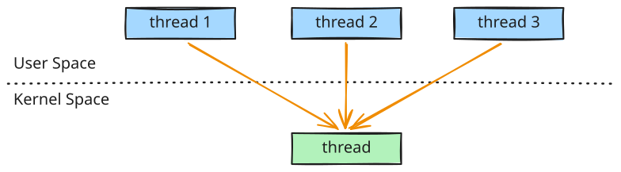
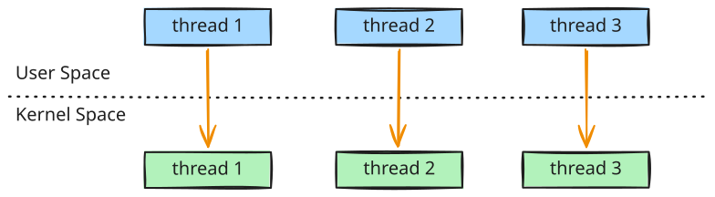
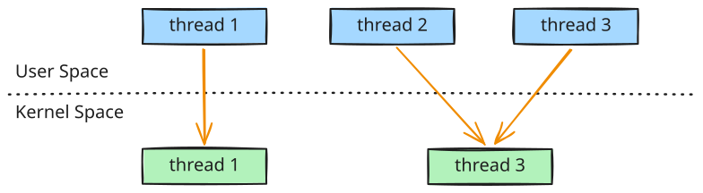
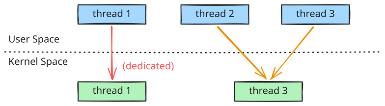

# User-Level & Kernel-Level Threads

In a multithreaded operating system, threads exist at two distinct levels: **User-Level Threads** (running in user space) and **Kernel-Level Threads** (running in kernel space). 

---

## User-Level vs. Kernel-Level Threads

Understanding the division of labor between user space and kernel space is key to understanding modern thread management:

| Attribute | User-Level Threads (ULT) | Kernel-Level Threads (KLT) |
| :--- | :--- | :--- |
| **Management** | Managed entirely in user space by a **thread library** (the OS kernel is unaware of their existence). | Managed and scheduled directly by the **Operating System Kernel**. |
| **Libraries** | POSIX Pthreads, Java Threads, Windows Threads. | Supported by almost all modern OS kernels (Linux, macOS, Windows). |
| **Performance** | **Very Fast:** Thread creation, destruction, and context switching do not require kernel mode transitions. | **Slower:** Thread operations require transitioning from user mode to kernel mode (system calls). |
| **Blocking** | If one thread blocks on an I/O operation or system call, the **entire process** blocks because the kernel only sees one process. | If one thread blocks, the kernel can schedule another thread from the same process, preventing the application from freezing. |
| **Parallelism** | Cannot utilize multi-core processors for parallel execution because the OS only allocates a single CPU core to the parent process. | Can execute in parallel across multiple CPU cores. |

---

## Multithreading Models

To run user-level threads on a system, they must be mapped to kernel-level threads. Operating systems use different **multithreading models** to define this relationship.

### 1. Many-to-One Model
The Many-to-One model maps many user-level threads to a single kernel-level thread. Thread management is handled entirely in user space.

*   **Behavior:** Only one user-level thread can access the kernel at a time.
*   **Drawback:** If any user-level thread performs a blocking system call (e.g., waiting for disk I/O), the single kernel thread blocks, causing the **entire process** to halt.
*   **Multicore Limitation:** Multiple user threads cannot run in parallel on multi-core systems because only one kernel thread is executing.
*   **Status:** Obsolete; rarely used in modern production systems.

### 2. One-to-One Model
The One-to-One model maps each user-level thread to a corresponding kernel-level thread.

*   **Behavior:** Spawning a user-level thread automatically spawns an accompanying kernel thread.
*   **Advantage:** Provides high concurrency. If one thread blocks, the operating system can schedule other threads from the same process. It fully utilizes multi-core processors for true parallel execution.
*   **Drawback:** Creating a kernel thread introduces kernel overhead. To prevent system degradation, OS implementations often impose a limit on the maximum number of threads an application can create.
*   **Status:** The standard model used by modern operating systems (Linux, Windows, macOS).

### 3. Many-to-Many Model
The Many-to-Many model multiplexes a pool of many user-level threads onto an equal or smaller number of kernel-level threads.

*   **Behavior:** The developer can create as many user-level threads as necessary. The operating system dynamically adjusts the number of kernel threads to match the available CPU cores and workload requirements.
*   **Advantage:** Combines the benefits of both models: it avoids the bottleneck of Many-to-One blocking while keeping kernel thread overhead in check.
*   **Status:** Theoretically optimal, but highly complex to implement in practice because it requires coordination between the user-space scheduler and the OS kernel scheduler.
*   **Real-World Example (Go Scheduler):** Go's concurrency model (Goroutines) is a highly successful implementation of the Many-to-Many ($M:N$) model. The Go runtime multiplexes $M$ goroutines onto $N$ OS threads using a scheduler known as the **GMP model** (Goroutine(user-level thread), Machine(kernel-level thread), Logical Processor(CPU cores)). This enables lightweight user-space context switches while dynamically handshaking with OS threads to prevent application stalls when a goroutine performs a blocking system call.

### 4. Two-Level Model
The Two-Level model is a variation of the Many-to-Many model, but it permits a specific user-level thread to be pinned/bound to a dedicated kernel thread.

*   **Use Case:** Highly critical background tasks (like real-time UI render threads or event loops) can be pinned to their own dedicated kernel thread to prevent them from being queued behind other user-level threads.

## Thread Blocking Behavior in Multithreading Models

When a User-Level Thread (ULT) blocks, the impact on the underlying Kernel-Level Thread (KLT) depends on **what** caused the blocking:

### 1. Kernel-Space Blocking (e.g., Disk I/O, OS System Calls)

* **Mechanism:** The OS kernel only manages KLTs. If a ULT blocks on a kernel operation (like reading a file from disk or calling a blocking system network socket), the underlying KLT executing that ULT **must also block** and enter a sleep state.
* **Many-to-Many (M:N) Handling:** The user-space scheduler detects this block and schedules the remaining runnable ULTs onto the other active, unblocked KLTs in the pool. Many runtimes (such as Go) will dynamically spawn new KLTs to maintain concurrency.
* **Many-to-One Limitation:** Because there is only a single KLT, that KLT blocks, freezing the **entire process** and halting all other ULTs.

### 2. User-Space Blocking (e.g., Language Channels, Virtual Locks)

* **Mechanism:** If a ULT blocks on a user-space synchronization primitive (like waiting on a Go channel, a Java virtual thread lock, or a runtime timer), the underlying KLT **does not block**.
* **Handling:** The user-space scheduler simply context-switches the blocked ULT out and schedules another runnable ULT onto the **same KLT**. The KLT remains 100% active in CPU execution without requiring a kernel context switch.

---

## POSIX Pthreads Specification

**Pthreads** refers to the **POSIX standard (IEEE 1003.1c)** API for thread creation and synchronization.

*   **Specification vs. Implementation:** Pthreads defines a standard API *specification* (functions, arguments, behavior). It is up to the individual operating system vendors to write the *implementation* in their library and kernel.
*   **Platform Support:** 
    *   **UNIX-like OS (Linux, macOS, Solaris):** Implement Pthreads natively as part of their standard C libraries (e.g., `glibc` on Linux implements Pthreads using the Native POSIX Thread Library, or NPTL).
    *   **Windows:** Does not support Pthreads natively (runs Windows API threads), but third-party wrappers can map Pthreads calls to Windows native threads.

---

## Reference

<iframe width="560" height="315" src="https://www.youtube.com/embed/PuZJ0GCtF3I?si=6RSd7GiQZS6J3lGU" title="YouTube video player" frameborder="0" allow="accelerometer; autoplay; clipboard-write; encrypted-media; gyroscope; picture-in-picture; web-share" referrerpolicy="strict-origin-when-cross-origin" allowfullscreen></iframe>