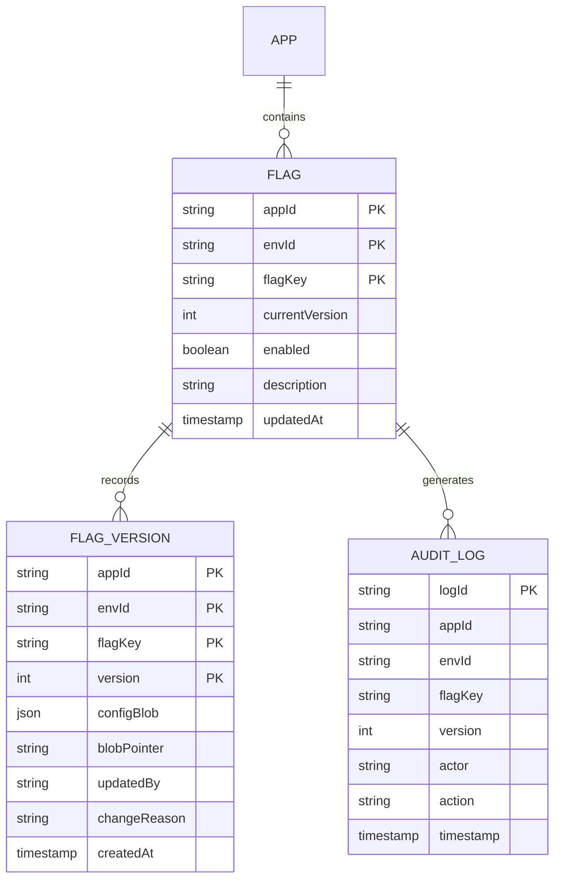
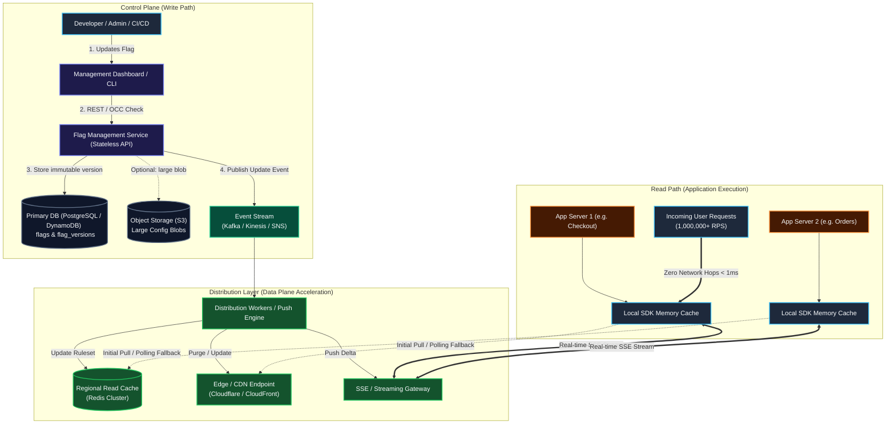

# Design a Feature Flag Service

**What is a Feature Flag Service?**

A feature flag service is a high-performance configuration platform that enables engineering and product teams to dynamically modify system behavior, toggle functionality, and roll out features at runtime without deploying new code or restarting services. 

Feature flags power critical production workflows including **canary releases**, **percentage-based rollouts**, **A/B testing**, **user-targeted beta programs**, and **instant kill switches** for disaster recovery.

---

## Functional Requirements

1. **Flag Management (Control Plane):**
    - Developers and operators can create, read, update, and delete (CRUD) feature flags via a dashboard or REST API.
    - Support multiple environments (e.g., `development`, `staging`, `production`) and applications (`appId`).
    - Support flexible targeting rules based on user attributes (e.g., `user_id`, `country`, `email_domain`, `subscription_tier`).
    - Support deterministic percentage rollouts (e.g., roll out to 10% of users consistently).
2. **Instant Rollback:**
    - Ability to instantly roll back any flag to an older configuration with zero downtime.
3. **Low-Latency Evaluation (Data Plane):**
    - Client applications and backend microservices can evaluate flag values for any given evaluation context in real time.
4. **Auditability & Change Tracking:**
    - Full history of all flag changes with attribution (`updatedBy`, `changeReason`, timestamp).

**Out of Scope:**

- Complex real-time analytics pipelines for user experiment metrics (e.g., tracking conversion funnels or click-through rates).
- User authentication/identity provider service (assumes an external IdP / OAuth2 / SSO).

---

## Non-Functional Requirements

- **Ultra-Low Latency (< 10 ms):** Read evaluations must take **< 1 ms** in-memory when evaluated locally via SDKs, and network configuration pulls must remain well under 10 ms.
- **High Availability (99.999% for Reads):** The evaluation path must **never fail**, even if the central database, management API, or control plane is completely offline.
- **Cardinal Architectural Rule:** **Reads should never depend on the control plane.**
- **High Scalability:** 
    - Read throughput: Scale to **1,000,000+ evaluations/sec** globally across thousands of client instances.
    - Write throughput: Relatively low (~10 to 100 flag mutations per minute).
- **Eventual Consistency & Fast Propagation:** Flag updates should propagate from the control plane to global SDKs within **1–2 seconds**.
- **Fault Tolerance:** SDKs must fail open/safe using local in-memory fallback defaults if network delivery channels fail.

---

## Capacity Estimation & Numbers

To calibrate our design for an enterprise-scale tech company:

- **Logical Applications (`appId`):** ~50 distinct product namespaces / config domains:
    - **~20 Client-Side Apps:** Mobile apps (iOS, Android), Web SPAs, Merchant Portals, and internal admin tools (evaluated client-side or at Edge CDN, no dedicated backend fleets).
    - **~30 Backend Product Domains:** Core Commerce, Payments, Logistics, Media, Identity, etc.
- **Backend Microservice Fleets (Runtime Consumers):** ~100 distinct backend service fleets:
    - The ~30 backend domains average 3 microservices each ($30 \times 3 \approx 90$), plus ~10 shared cross-cutting platform services (`auth-service`, `notification-service`, `risk-engine`, etc.), totaling **~100 fleets**.
    - Each fleet runs tens to hundreds of container pods embedding the SDK.
- **Total Active Flags:** ~10,000 flags partitioned across these 50 applications and their environments (`dev`, `staging`, `prod`) — averaging ~200 flags per application namespace.
- **Config Blob Size:** 
    - An average flag rule definition is ~500 bytes (ranging from ~350 bytes for basic toggles to 1–2 KB for multivariate flags with user whitelists).
    - Aggregated ruleset per application: $200 \text{ flags} \times 500 \text{ B} \approx 100 \text{ KB}$ raw JSON (or ~15–20 KB compressed).
    - Global multi-tenant footprint: $10,000 \times 500 \text{ B} \approx 5 \text{ MB}$ raw JSON.

??? example "Why ~500 Bytes per Flag? (Real-World JSON Breakdown)"

    A common misconception is that a feature flag is just a single key-value boolean like `{"enabled": true}` (~30 bytes). In production, flags require targeting conditions, percentage bucketing, variations, and telemetry metadata:

    ```json
    {
      "key": "checkout_v2_recommendations",
      "version": 14,
      "enabled": true,
      "description": "Gradual rollout of AI upsell carousel with tier filtering",
      "defaultValue": "control",
      "variations": [
        {"id": "control", "value": false},
        {"id": "treatment_a", "value": true}
      ],
      "rules": [
        {
          "id": "internal_qa_allowlist",
          "clauses": [
            {"attribute": "email", "operator": "ENDS_WITH", "values": ["@company.com", "@qa.org"]}
          ],
          "serve": "treatment_a"
        },
        {
          "id": "geo_and_tier_rollout",
          "clauses": [
            {"attribute": "country", "operator": "IN", "values": ["US", "CA", "GB"]},
            {"attribute": "subscriptionTier", "operator": "IN", "values": ["ENTERPRISE", "PRO"]}
          ],
          "rollout": {
            "bucketBy": "userId",
            "percentage": 25,
            "seed": "checkout_salt_91"
          },
          "serve": "treatment_a"
        }
      ]
    }
    ```

    - **Flag Metadata & Descriptions:** ~120 bytes
    - **Variations & Default Fallback:** ~80 bytes
    - **Targeting Clauses (attributes, operators, lists):** ~200 bytes
    - **Rollout Hashing & Percentage Bucketing:** ~100 bytes
    - **Total compact JSON:** **~500 bytes** (uncompressed).
- **Read Workload (Data Plane):**
    - ~100 microservice fleets running thousands of container instances + edge gateways.
    - Aggregate evaluation rate: **1,000,000 evaluations/second**.
    - If evaluations hit a central database directly: $1\text{M RPS} \times 1\text{KB} \approx 1\text{ GB/sec}$ database egress bandwidth $\rightarrow$ **Single point of failure and extreme cost**.
    - Solution: Move evaluations directly into client SDK memory.
- **Write Workload (Control Plane):**
    - ~100 updates/day peak ($< 0.1 \text{ writes/sec}$). Writes are rare compared to reads ($10^7:1$ read-to-write ratio).

---

## Core Entities & Data Model

To achieve auditability and instant rollbacks, we decouple the current active pointer from the immutable version history.



### Database Schema

#### 1. `flags` (Current Active Pointer Table)

Stores the current state pointer for each flag within an application environment.

| Field | Type | Description |
| :--- | :--- | :--- |
| `appId` | `VARCHAR(64)` | Partition Key: Application / Service Identifier |
| `envId` | `VARCHAR(32)` | Environment (`production`, `staging`, `dev`) |
| `flagKey` | `VARCHAR(128)` | Unique flag name (e.g., `checkout_new_ui_v2`) |
| `currentVersion` | `INTEGER` | Points to the active version in `flag_versions` |
| `enabled` | `BOOLEAN` | Master switch for the flag |
| `updatedAt` | `TIMESTAMP` | Timestamp of last modification |

#### 2. `flag_versions` (Immutable Version History Table)

Every change produces a newly incremented, immutable version row. **Existing version rows are never mutated.**

| Field | Type | Description |
| :--- | :--- | :--- |
| `appId` | `VARCHAR(64)` | Partition Key part 1 |
| `envId` | `VARCHAR(32)` | Partition Key part 2 |
| `flagKey` | `VARCHAR(128)` | Partition Key part 3 |
| `version` | `INTEGER` | Sort Key: Sequentially incremented version number |
| `configBlob` | `JSONB` / `TEXT` | Full targeting rules JSON (if $< 400 \text{ KB}$) |
| `blobPointer` | `VARCHAR(512)` | S3/Object Storage URI (for large rule configs) |
| `updatedBy` | `VARCHAR(128)` | User or Service Account ID who authored change |
| `changeReason` | `TEXT` | Rationale/Jira ticket/PR reference |
| `createdAt` | `TIMESTAMP` | Creation timestamp |

??? tip "Why Immutable Versions Make Rollbacks Trivial"
    Because historical versions are never overwritten, a rollback does **not** involve recreating old state. A rollback simply performs:
    
    1. Set `currentVersion = targetOldVersion` in `flags`.
    2. Write an audit log entry (`action = "ROLLBACK"`).
    3. Broadcast a standard flag update event.
    
    The entire system immediately reverts to the exact verified state of that version.

---

## API Design

### 1. Control Plane (Management APIs)

These APIs are accessed by the Developer Web UI, CLI, or CI/CD pipelines.

#### 1. Create a Feature Flag (POST to Collection)

Creates a new feature flag entity within an application namespace.

```http
POST /api/v1/apps/{appId}/flags
Content-Type: application/json

{
  "flagKey": "checkout_new_ui_v2",
  "description": "Gradual rollout of checkout redesign",
  "variationType": "BOOLEAN",
  "defaultValue": false,
  "maintainer": "checkout-team@company.com",
  "tags": ["checkout", "growth", "q3-2026"]
}
```

**Response (`201 Created`):**
```http
HTTP/1.1 201 Created
Location: /api/v1/apps/storefront/flags/checkout_new_ui_v2
Content-Type: application/json

{
  "appId": "storefront",
  "flagKey": "checkout_new_ui_v2",
  "status": "INITIALIZED",
  "createdAt": "2026-09-17T01:00:00Z"
}
```
*(If `checkout_new_ui_v2` already exists, returns `409 Conflict`.)*

---

#### 2. Update Feature Flag Rules (PUT to Specific Resource)

Modifies the targeting rules or rollout configuration of an existing flag in a specific environment.

```http
PUT /api/v1/apps/{appId}/envs/{envId}/flags/{flagKey}
If-Match: "version-12"
Content-Type: application/json

{
  "enabled": true,
  "changeReason": "Ramping up to 25% for tier-1 users (PROJ-4102)",
  "rules": [
    {
      "priority": 1,
      "attribute": "country",
      "operator": "IN",
      "values": ["US", "CA"],
      "rolloutPercentage": 25,
      "serveValue": true
    }
  ],
  "defaultValue": false
}
```

**Response (`200 OK`):**
```http
HTTP/1.1 200 OK
ETag: "version-13"
Content-Type: application/json

{
  "flagKey": "checkout_new_ui_v2",
  "version": 13,
  "status": "ACTIVE",
  "updatedAt": "2026-09-17T01:05:00Z"
}
```
*(If `If-Match` does not match the current version, returns `412 Precondition Failed` or `409 Conflict` to prevent overwriting another admin's changes.)*

#### Instant Rollback of a Feature Flag

```http
POST /api/v1/apps/{appId}/envs/{envId}/flags/{flagKey}/rollback
Content-Type: application/json

{
  "targetVersion": 11,
  "changeReason": "High latency detected in payment gateway, reverting to v11"
}
```

**Response (`200 OK`):**

```json
{
  "flagKey": "checkout_new_ui_v2",
  "revertedToVersion": 11,
  "newVersionPointer": 14,
  "status": "ROLLED_BACK",
  "updatedAt": "2026-09-16T22:05:12Z"
}
```

---

### 2. Data Plane (Distribution & SDK APIs)

These lightweight endpoints serve application SDKs.

#### Full Ruleset Bootstrap (On SDK Startup)

```http
GET /api/v1/rulesets?appId=storefront&envId=production
If-None-Match: "v14-hash-9b2f"
```

**Response (`200 OK` or `304 Not Modified`):**

```json
{
  "environment": "production",
  "rulesetVersion": 14,
  "hash": "v14-hash-9b2f",
  "flags": {
    "checkout_new_ui_v2": {
      "version": 14,
      "enabled": true,
      "rules": [
        {
          "attribute": "country",
          "operator": "IN",
          "values": ["US", "CA"],
          "rolloutPercentage": 25,
          "serve": true
        }
      ],
      "defaultValue": false
    },
    "search_semantic_v1": {
      "version": 3,
      "enabled": false,
      "defaultValue": false
    }
  }
}
```

#### Real-Time Update Stream (SSE Endpoint)

```http
GET /api/v1/rulesets/stream?appId=storefront&envId=production
Accept: text/event-stream
```

**Stream Event Response:**

```text
event: flag_update
data: {"flagKey": "checkout_new_ui_v2", "version": 14, "action": "UPDATE", "config": {...}}

event: flag_delete
data: {"flagKey": "deprecated_banner", "version": 15, "action": "DELETE"}
```

---

## High Level Design

### Architectural Separation: Control Plane vs. Data Plane

The system strictly decouples the **Write/Control Path** from the **Read/Data Path**:



### End-to-End Execution Flow

#### 1. The Write Path (Control Path)
1. An engineer modifies targeting rules via the **Dashboard** or **Management API**.
2. The **Flag Management Service** validates the rules and applies **Optimistic Concurrency Control (OCC)** using the current version number.
3. The service writes a new row to `flag_versions` (e.g., version 13) and updates the pointer in `flags`. If the ruleset is exceptionally large ($> 400\text{ KB}$), it offloads the payload to S3 and stores the pointer.
4. Upon database commit, the service publishes a `FlagUpdatedEvent` to a message stream (**Kafka**, **AWS Kinesis**, or **SNS+SQS**).
5. The management API responds immediately to the developer with `200 OK`.

#### 2. The Distribution Path
1. **Distribution Workers** consume the `FlagUpdatedEvent` from the stream.
2. They compile the full active ruleset for that `appId` and `envId`.
3. Workers update the regional **Redis cluster** and push invalidation / pre-warmed blobs to **Edge/CDN distribution endpoints**.
4. Workers notify the **SSE / Streaming Gateway**, which immediately broadcasts a compact JSON delta to all connected SDK clients.

#### 3. The Read Path (Data Path)
1. **Startup:** When an application server starts, the embedded SDK requests the full ruleset once from the nearest Edge/CDN or Regional Read API and stores it in **local in-memory memory**.
2. **Runtime Evaluation:** Every incoming user request calls `sdk.evaluate("checkout_new_ui_v2", userContext)`.
   - The SDK computes the result **entirely locally in RAM** without making any network calls.
   - Response time is consistently **$< 0.1 \text{ ms}$ (sub-millisecond)**.
3. **Continuous Sync:** The SDK maintains a persistent Server-Sent Events (SSE) connection. When a flag updates, the SDK receives the delta and updates its in-memory map atomically.
4. **Resilience:** If the streaming connection drops, the SDK falls back to periodic polling with exponential backoff and continues evaluating using its cached memory.
