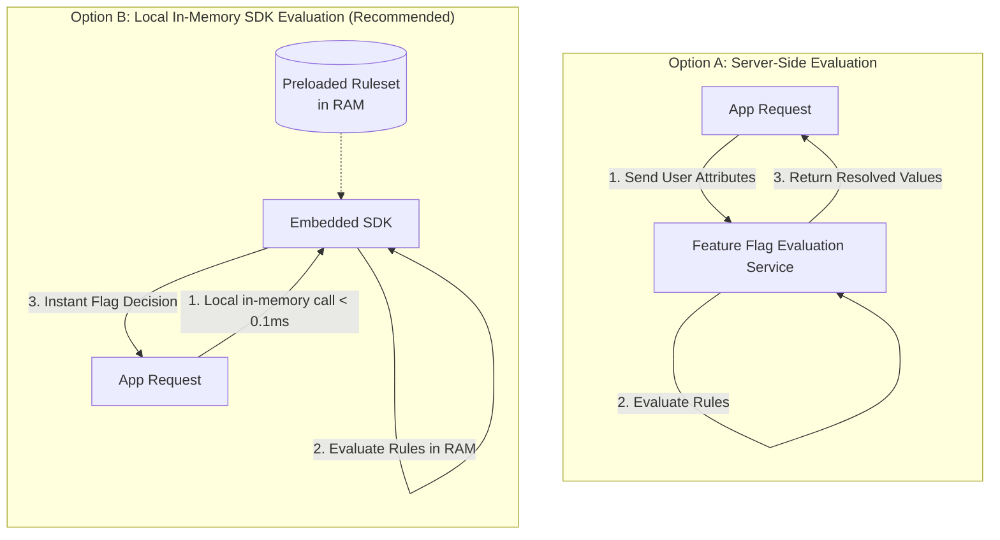
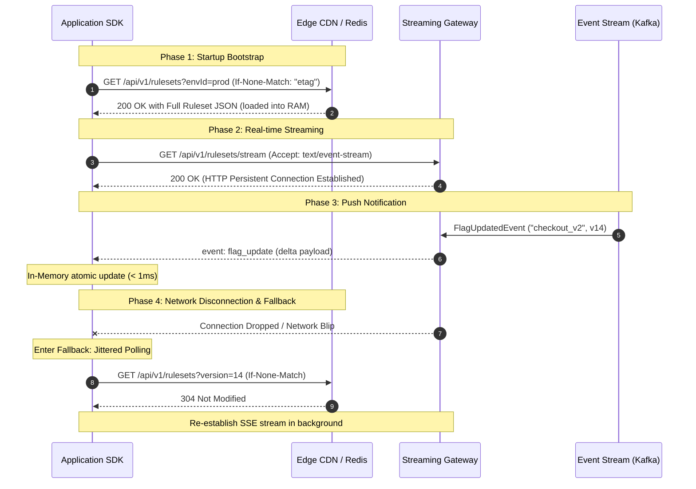
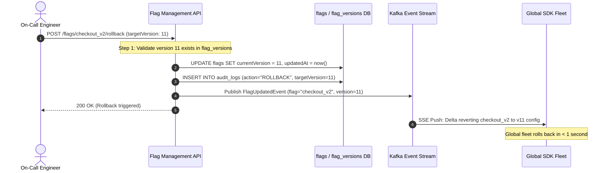
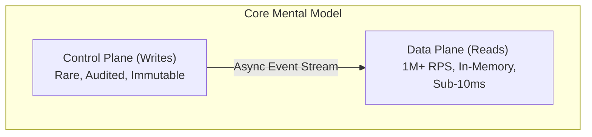

# Design a Feature Flag Service

## Deep Dives

---

### 1. Rule Evaluation: Local SDK Evaluation vs. Server-Side Evaluation

A critical architectural decision in feature flag design is **where rules are evaluated**.



#### Comparison Matrix

| Dimension | Option A: Server-Side Evaluation | Option B: Local SDK Evaluation (Recommended) |
| :--- | :--- | :--- |
| **Evaluation Latency** | **Poor (10–30 ms)**: Incurs a network round trip on every user request. | **Exceptional (< 0.1 ms)**: In-memory hash table lookup and CPU rule check. |
| **Availability Dependency** | **Tightly Coupled**: If the flag service is down or degraded, app requests fail or stall. | **Fully Decoupled**: The app continues to evaluate flags from local RAM even during complete backend outages. |
| **Backend Load** | **Extreme**: 1M app requests/sec = 1M RPCs to the flag evaluation service. | **Minimal**: Backend only serves periodic ruleset diffs or SSE events (~few requests per min per pod). |
| **Privacy & Security** | Sensitive user attributes (PII, email, company ID) are transmitted across the wire. | **Zero PII Leakage**: User context stays strictly inside the application process memory. |
| **Rule Secrecy** | Full rules remain hidden on the server. | Complex rules and flag keys are sent to the client (acceptable for backend, consideration for mobile). |

??? success "Why Local SDK Evaluation is the Industry Standard"
    For production backend microservices (and systems like LaunchDarkly), **local evaluation is strictly superior**. It delivers sub-millisecond evaluations, isolates the application's critical path from network anomalies, eliminates 99.9% of backend traffic, and preserves user privacy.

#### Deterministic Percentage Rollouts (No Shared State)

To roll out a feature to 10% of users without maintaining a centralized list of selected users, the SDK computes a deterministic hash:

```text
bucket = MurmurHash3(userId + ":" + flagKey) % 100
is_enabled = bucket < rolloutPercentage
```

1. **Deterministic:** User `12345` always maps to the exact same bucket value (e.g., bucket `7`) for `checkout_v2`.
2. **Independent:** Adding `flagKey` as salt ensures a user in the 10% cohort for `flag_a` is not guaranteed to be in the 10% cohort for `flag_b`.
3. **Stateless:** Evaluates in microseconds without database queries.

```python title="sdk_evaluator.py"
import mmh3

def evaluate_flag(flag_config: dict, user_context: dict) -> bool:
    if not flag_config.get("enabled", False):
        return flag_config.get("defaultValue", False)

    for rule in flag_config.get("rules", []):
        attr_val = user_context.get(rule["attribute"])
        
        # Attribute matching (e.g. country == "US")
        if rule["operator"] == "IN" and attr_val in rule["values"]:
            rollout_pct = rule.get("rolloutPercentage", 100)
            if rollout_pct >= 100:
                return rule["serveValue"]
            
            # Deterministic MurmurHash3 percentage bucket
            hash_key = f"{user_context.get('userId')}:{flag_config['key']}"
            bucket = abs(mmh3.hash(hash_key)) % 100
            if bucket < rollout_pct:
                return rule["serveValue"]

    return flag_config.get("defaultValue", False)
```

---

### 2. Config Delivery Pipeline: SSE vs. Long Polling vs. Periodic Polling

To keep local SDK caches synchronized with the control plane, the system implements a tiered delivery strategy:



#### Comparison of Delivery Protocols

| Mechanism | Update Latency | Server Resource Cost | Firewalls & Proxies | Failure Mode |
| :--- | :--- | :--- | :--- | :--- |
| **Periodic Polling** | High (poll interval, e.g., 30s) | High (millions of empty requests) | Simple HTTP | Tolerant to drops |
| **Long Polling** | Moderate (< 1s) | Moderate connection hold | Reliable | Frequent reconnections |
| **Server-Sent Events (SSE)** | **Instant (< 500 ms)** | **Very Low** (Single unidir connection) | **Standard HTTP/2, traverses all proxies** | Reconnects automatically |
| **WebSockets** | Instant (< 500 ms) | High (Bidirectional overhead, custom ping/pong) | Often blocked or terminated by L7 proxies | Complex reconnection logic |

#### Mitigating Thundering Herds on Config Refresh

When thousands of SDK pods reconnect after a regional network recovery, they could easily overwhelm the distribution layer. We protect the system via:

1. **Full Jitter Exponential Backoff:**
   $$\text{Sleep} = \text{random}(0, \, \min(M, \, B \cdot 2^{\text{attempt}}))$$
2. **Conditional HTTP Requests:** SDKs always send `If-None-Match: <ruleset_hash>`. The Edge/CDN returns `304 Not Modified` with an empty body if the config has not changed, saving 99% of bandwidth.

??? example "Deep Dive: How Conditional HTTP Requests (ETag & 304 Not Modified) Save 99% Bandwidth"

    Without conditional requests, every SDK poll or reconnection forces the Edge/CDN to re-transmit the entire 100 KB ruleset JSON over the network. With conditional requests (RFC 7232), the Edge layer eliminates redundant data transfer:

    **Step 1: First Request (Initial Bootstrap)**

    ```http
    GET /api/v1/rulesets?appId=storefront&envId=production HTTP/2
    Host: flags-edge.company.com
    ```
    **Edge Response (`200 OK` with payload):**
    ```http
    HTTP/2 200 OK
    Content-Type: application/json
    ETag: "v14-9b2f6a7c"
    Content-Length: 102400

    { ... 100 KB JSON Ruleset ... }
    ```
    *The SDK parses the JSON into RAM and saves the ETag identifier (`"v14-9b2f6a7c"`).*

    **Step 2: Subsequent Poll or Reconnect after Network Blip**

    ```http
    GET /api/v1/rulesets?appId=storefront&envId=production HTTP/2
    Host: flags-edge.company.com
    If-None-Match: "v14-9b2f6a7c"
    ```
    **Edge Evaluation & Response (`304 Not Modified` without payload):**
    1. The Edge/CDN compares the client's `If-None-Match` header to its cached ruleset ETag.
    2. Because the flag config has **not** changed, the Edge does not return any JSON:
    ```http
    HTTP/2 304 Not Modified
    ETag: "v14-9b2f6a7c"
    ```
    *(Empty HTTP Body = 0 bytes transferred)*

    **Why this saves > 99% Bandwidth & CPU:**
    
    - **Payload Transfer:** Drops from **100,000 bytes** to **0 bytes** (only ~200 bytes of HTTP headers).
    - **Bandwidth Reduction:** $\frac{100{,}000 - 200}{100{,}000} \approx \mathbf{99.8\% \text{ bandwidth saved}}$.
    - **CPU Utilization:** Zero JSON parsing/deserialization on the SDK side; zero JSON serialization on the server side.
    - **Origin Database Protection:** Handled entirely at the Edge/CDN without querying the primary database.

3. **Edge Microcaching:** Edge CDNs (Cloudflare / CloudFront) cache ruleset payloads for 2–5 seconds with `stale-while-revalidate`.

---

### 3. Immutable Versioning, History & Zero-Downtime Rollbacks

#### The Rollback Workflow

In traditional systems, rollbacks often mean overwriting database records or running risky SQL `UPDATE` operations. In our design, versions are strictly **immutable**.



#### Retention Strategy: Fast Compliance vs. Cost Optimization

- **Hot Storage (`flag_versions` table):**
  - Retain the **last 1,000 versions** per flag directly in PostgreSQL / DynamoDB.
  - This satisfies 100% of day-to-day operational needs, fast UI diff comparisons, and instant rollbacks.
- **Cold Storage (S3 Archive):**
  - A background worker archives versions older than 1,000 into compressed Parquet / JSON files in S3 Glacier.
  - Keeps database storage lean and predictable while ensuring enterprise compliance (SOC2, ISO 27001 audit trails).

---

### 4. Reliability, Security & Concurrency Controls

#### 1. Optimistic Concurrency Control (OCC)
To prevent two administrators from accidentally overwriting each other's changes:

```text
UPDATE flags 
SET currentVersion = :newVersion, updatedAt = :now 
WHERE appId = :appId AND envId = :envId AND flagKey = :flagKey AND currentVersion = :expectedVersion;
```

If another admin modified the flag between read and write, the `UPDATE` returns 0 affected rows, and the API rejects the request with `HTTP 409 Conflict`.

#### 2. Signed SDK Keys & Environment Isolation
- Each environment (`dev`, `staging`, `prod`) issues distinct, cryptographically signed SDK keys (`HMAC-SHA256`).
- **Data plane isolation:** Production SDK keys can **only** read configurations belonging to `envId = "production"`.
- A misconfigured staging service or leaked development key cannot access or perturb production flags.

#### 3. Aggressive Caching for Kill Switches
- Flags labeled as `is_kill_switch: true` bypass all attribute-based targeting rules.
- They evaluate to a flat boolean (`true`/`false`), enabling fast-path in-memory CPU evaluation.
- When flipped to emergency shutoff (`false`), the distribution layer broadcasts high-priority push events to all channels.

---

### 5. Caching Philosophy: Acceleration Layer vs. Source of Truth

??? failure "Anti-Pattern: Using Redis as the Source of Truth"
    Storing feature flags only in Redis or treating Redis as the authoritative primary store leads to catastrophic data loss during cache flushes, cluster partitions, or memory evictions.

??? success "Production Pattern: Ephemeral Acceleration Layer"
    - **Source of Truth:** Primary Database (PostgreSQL / DynamoDB) + Versioned Object Storage (S3).
    - **Redis / CDN Role:** Ephemeral, read-only distribution accelerators. If the entire Redis cluster dies, it can be completely rebuilt from the primary database within minutes.
    - **Single-Flight Cache Warming:** When a cache miss occurs at the Edge or Regional API, the service uses single-flight (mutex locking) so only **one** upstream database query is executed, protecting the primary store.

---

### 6. Observability & Operational Metrics

| Metric | Target SLA | Alert Condition | Remediation |
| :--- | :--- | :--- | :--- |
| **Propagation Latency (p99)** | $< 1.5 \text{ seconds}$ | $> 5.0 \text{ seconds}$ | Scale SSE gateway pods; check Kafka consumer lag. |
| **SDK Cache Staleness** | 0 versions behind | $> 5\%$ fleet on version $N-2$ | Alert on disconnected SSE streams; force SDK fallback poll. |
| **Edge Cache Hit Ratio** | $> 99.9\%$ | $< 98.0\%$ | Investigate cache invalidation storm or flapping flags. |
| **Local Evaluation Duration** | $< 0.1 \text{ ms}$ | $> 1.0 \text{ ms}$ | Flag rule too complex (e.g., regex explosion or giant list lookup). |

---

### 7. Crisp 5-Minute Interview Blueprint

When asked to design a feature flag service in a system design interview, follow this crisp, high-scoring presentation structure:



#### Step 1: The Elevator Pitch (30 seconds)
> *"A production-ready feature flag service must obey one cardinal rule: **Reads should never depend on the control plane.**
> 
> I decouple the system into a **Control Plane** (where developers mutate immutable, versioned configurations) and a **Data Plane** (where applications evaluate flags locally in SDK memory). Updates propagate asynchronously via streaming events, achieving sub-millisecond local reads, 99.999% availability, and instant zero-risk rollbacks."*

#### Step 2: System Scale & Numbers (30 seconds)
- **Scale:** 1M+ flag evaluations/second; ~100 writes/day ($10^7 : 1$ read-to-write ratio).
- **Latency:** Local in-memory evaluation takes **$< 0.1 \text{ ms}$**; network rule fetch **$< 10 \text{ ms}$**.
- **Propagation:** Global convergence within **1–2 seconds**.

#### Step 3: Storage & Immutability (1 minute)
- **`flags` table:** Stores current version pointers and status per environment.
- **`flag_versions` table:** Stores immutable historical snapshots. 
- **Rollbacks:** Rollback is an $O(1)$ forward update that sets `currentVersion` back to a previously validated version number and broadcasts an event.
- **Retention:** Keep the last 1,000 versions hot in the database; archive older ones to S3.

#### Step 4: Data Plane & Delivery (2 minutes)
- **Local SDK Evaluation:** Download rules once; evaluate in-process using MurmurHash3 for percentage rollouts. No network calls per user request, zero PII leaves the app.
- **Delivery:** SDK pulls full ruleset on boot, subscribes to Server-Sent Events (SSE) for deltas, and gracefully falls back to jittered polling if disconnected.
- **Acceleration:** Redis and CDN act only as ephemeral distribution layers, never the primary source of truth.

#### Step 5: Reliability & Edge Cases (1 minute)
- **Concurrency:** Optimistic Concurrency Control (OCC) with version headers prevents conflicting admin writes.
- **Security:** Cryptographically signed, environment-scoped SDK keys prevent cross-environment contamination.
- **Disaster Recovery:** If the entire feature flag infrastructure goes down, application SDKs continue serving the last-known good rules from RAM without a single failure.
