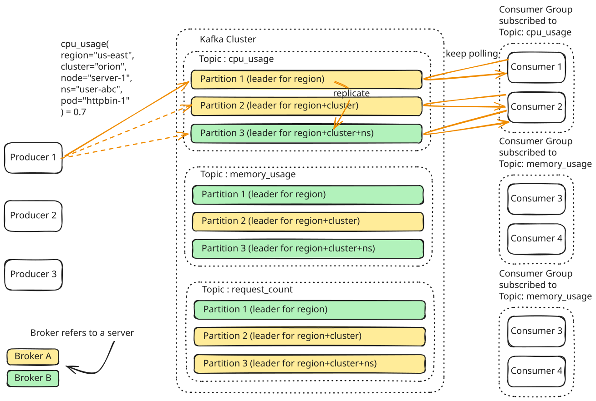

# Kafka

Kafka is an open-source distributed event streaming platform used as a **message queue** or a **stream processing system**. It is designed for high performance, scalability, and durability.

---

## Basic Terminology and Architecture

*   **Brokers:** Individual servers in a cluster responsible for storing data and serving client requests.
*   **Partitions:** Ordered, immutable log sequences where messages are appended. Partitions are the basic unit of scale and parallelism.
*   **Topics:** Logical categories used to group and organize partition sequences.
*   **Producers:** Client applications that publish messages to Kafka topics.
*   **Consumers:** Client applications that subscribe to and read messages from Kafka topics.

!!! info "Topic vs. Partition"

    *   **Topic:** A logical grouping of messages for organization.
    *   **Partition:** A physical commit log hosted on a broker. A topic is split across one or more partitions to scale throughput.

---

## How Kafka Works

1.  **Write Path:** Producers write serialized messages to the leader broker of a target partition.
2.  **Replication:** Follower brokers pull and replicate data from the leader partition to ensure fault tolerance.
3.  **Read Path:** Consumers pull batches of messages from the leader partition sequentially in a continuous polling loop.



---

## When to Use Kafka

### Use Kafka as a **Message Queue** to:
*   **Asynchronous Processing:** Decouple slow, CPU/IO-heavy tasks (e.g., video transcoding) from user request paths to improve latency.
*   **Ordering Guarantees:** Route related messages (by key) to the same partition for strict in-order processing.
*   **Load Leveling:** Buffer spikes in message volume when producers temporarily outpace consumer processing capacity.

### Use Kafka as an **Event Stream** to:
*   **Real-time Processing:** Process continuous data streams instantly (e.g., real-time ad click aggregations).
*   **Pub-Sub Fan-out:** Deliver the same message stream to multiple independent consumer groups simultaneously.

---

## Scalability and Partitioning

### Performance Limits

*   **Message Size:** Keep messages **< 1MB** for optimal network and disk performance.
*   **Capacity:** A single broker typically handles up to **1TB of storage** and **1M messages/second**.
*   **Horizontal Scaling:** Adding brokers distributes disk storage and increases fault tolerance.
*   **Under-Partitioning:** A topic's partition count defines its maximum parallel throughput; adding brokers without increasing partition count leaves new brokers idle.

### Partitioning Strategy

Producers route messages to partitions using a message key:

*   **Routing Formula:** `partition = hash(key) % num_partitions` (uses MurmurHash2 by default).
*   **Hot Partitions:** Poorly distributed keys (e.g., a single hyper-active user ID) cause resource hotspots. Keys must be chosen to distribute evenly across the partition space.

#### Handling Hot Partitions:

*   **No Key (Round-Robin):** Cycles messages evenly across partitions. *Trade-off: Loses key-based ordering.*
*   **Random Salting:** Appends a random suffix to keys to split the hot load. *Trade-off: Complicates downstream consumer-side aggregations.*
*   **Compound Keys:** Combines multiple attributes (e.g., `user_id + timestamp`) to increase key entropy.
*   **Backpressure:** Throttles the producer write rate to prevent overwhelming the destination broker.

---

## Fault Tolerance and Durability

### Replication Mechanism

*   **Leader/Follower Roles:** Each partition has one Leader broker (handles active reads/writes) and multiple Follower brokers (replicate data).
*   **Acks Configuration:** Setting `acks=all` ensures a write is acknowledged only after all **In-Sync Replicas (ISR)** write it to disk, offering the strongest durability.

### Consumer Failure Recovery

*   **Offset Management:** Consumers persist their progress (offsets) to a dedicated internal topic. Recovered consumers read their last committed offset to resume processing without data loss.
*   **Rebalancing:** If a consumer crashes, the broker detects the missing heartbeat and automatically reassigns its partitions to other healthy consumers in the group.

---

## Handling Retries and Errors

### Producer Retries
To handle network glitches, Kafka producers support automatic retries and deduplication:

```javascript
const producer = kafka.producer({
  retry: {
    retries: 5,            // Retry up to 5 times on transient failures
    initialRetryTime: 100, // Wait 100ms before retrying
  },
  idempotent: true,        // Enable sequence numbers to prevent duplicate writes
});
```

### Consumer Retries

*   **Dead Letter Queue (DLQ):** Route persistently failing messages to a separate "dead-letter" topic to prevent blocking the partition's message processing loop.
