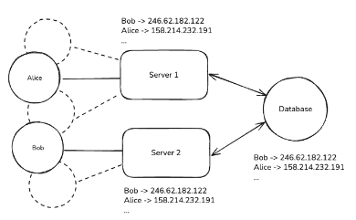
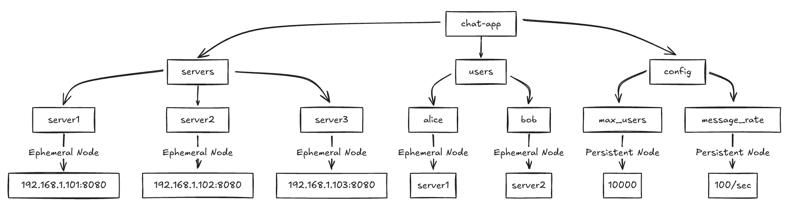
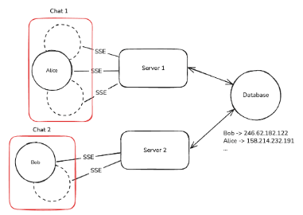

# ZooKeeper

ZooKeeper provides **a consistent, reliable source of truth that all servers can trust** in a distributed system.

- When servers come online, they register in ZooKeeper.
- When users connect to servers, that mapping gets stored in ZooKeeper.
- ZooKeeper then notifies interested servers about changes and automatically handles failures through its ephemeral nodes.
- It gives you reliable **service discovery**, **configuration management**, and **leader election** without building these complex distributed algorithms yourself.

---

## ZooKeeper Basics

The way to think of ZooKeeper is like **a synchronized metadata filesystem** — each node that's connected should have the same view of this data.

**Three key concepts:**

- The data model based on ZNodes
- The server roles within a ZooKeeper ensemble
- The watch machanism that enables real-time notifications




### Data Mode: ZNodes

- ZooKeeper organizes its data in a hierarchical namespace that looks a lot like a file system or a tree.
- The nodes in this tree are called **ZNodes**.
- ZNodes can store data (typically small amounts, **under 1MB**) and have **associated metadata**.

For the chat application, imagine a structure like below:

``` bash
/chat-app
  /servers           # Directory of available servers
    /server1         # Ephemeral node containing "192.168.1.101:8080" the location of this server
    /server2         # Ephemeral node containing "192.168.1.102:8080" the location of this server
    /server3         # Ephemeral node containing "192.168.1.103:8080" the location of this server
  /users             # Directory of online users
    /alice           # Ephemeral node containing "server1" the server that alice is connected to
    /bob             # Ephemeral node containing "server2" the server that bob is connected to
  /config            # Application configuration
    /max_users       # Persistent node containing "10000" the maximum number of users allowed
    /message_rate    # Persistent node containing "100/sec" the maximum number of messages per second allowed
```



- When Alice (on Server 1) wants to send a message to Bob, Server 1 just looks up /chat-app/users/bob to discover Bob is on Server 2, then routes the message appropriately.
- If Bob disconnects and reconnects to Server 3, the ZNode is automatically updated, ensuring messages are always routed correctly.


### Server Roles and Ensemble

ZooKeeper runs on a group of servers called an **ensemble**, to avoid a single point of failure. Within this ensemble, servers take on different roles:

- **Leader**: responsible for **processing all update requests**
- **Followers**: follow the leader's instructions and help **serve read requests**.

When our chat servers connect to ZooKeeper, they connect to all servers in the ensemble:

``` js
// Chat Server 1 connecting to ZooKeeper
ZooKeeper zk = new ZooKeeper("zk1:2181,zk2:2181,zk3:2181", 
                             3000, /* session timeout */ 
                             watcher /* callback */);
```

### Watches: Knowing When Things Change

Watches allow servers to be notified when a ZNode changes, eliminating the need for constant polling or complex server-to-server communication.

#### How watches help

When Server 1 starts up, it sets a watch on the `/chat-app/users` directory:

``` js
// Server 1 watching for user changes
zk.getChildren("/chat-app/users", true, null);
```

When Bob disconnects from Server 2 and reconnects to Server 3, Server 3 updates Bob's ZNode:

``` js
// Server 3 updates Bob's location
zk.setData("/chat-app/users/bob", "server3".getBytes(), -1);
```

ZooKeeper automatically notifies Server 1 about this change through its watcher callback:

``` js
// Server 1's watcher callback
public void process(WatchedEvent event) {
    if (event.getType() == EventType.NodeDataChanged && 
        event.getPath().equals("/chat-app/users/bob")) {
        // Fetch the new data and reset the watch for future changes
        byte[] data = zk.getData("/chat-app/users/bob", true, null);
        String bobsServer = new String(data);
        // Update local memory
        routingTable.put("bob", bobsServer);
    }
}
```


---

## Key Capabilities

### Configuration Management

One of **the most common uses** of ZooKeeper is to **store and distribute configuration data** across a distributed system. The main update process is:

- Update a single ZNode: `set /chat-app/config/enable_reactions "true"`
- All chat servers watching this node receive a notification
- Servers update their behavior without restarting

When using ZooKeeper for configuration, focus on storing dynamic configuration values that might change at runtime. Static configuration that only changes during deployments is often better kept in files or environment variables.


### Service Discovery

Consider a microservice architecture for an online streaming platform. When a new video upload service needs to find available transcoders, it simply:

- Reads `/streaming/services/video-transcoder` children
- Connects to one of the available transcoder instances
- Sets a watch to be notified of any changes to the available transcoders

``` bash
/streaming
  /services
    /video-transcoder
      /instance1 "10.0.0.1:8080"
      /instance2 "10.0.0.2:8080"
    /recommendation-engine
      /instance1 "10.0.1.1:9000"
      /instance2 "10.0.1.2:9000"
    /payment-processor
      /instance1 "10.0.2.1:5000"
```

### Leader Election

In distributed systems, it's often necessary to **designate one node as a "leader" responsible for certain operations**(i.e. Payment transactions or schedule jobs).

- Each server creates a sequential ephemeral node under a designated path
- The server with the lowest sequence number becomes the leader
- All other servers watch the node with the next lowest sequence number
- If a leader fails, its node disappears, and the next server in sequence steps up

``` bash
# Server 1 creates:
create -s -e /chat-app/leader/node- "server1"  # Creates /chat-app/leader/node-0000000001

# Server 2 creates:
create -s -e /chat-app/leader/node- "server2"  # Creates /chat-app/leader/node-0000000002

# Server 3 creates:
create -s -e /chat-app/leader/node- "server3"  # Creates /chat-app/leader/node-0000000003
```

Here's how it might look in our chat application if we wanted to elect a server to handle global announcements:

- Server 1 is now the leader since it has the lowest sequence number.
- Server 2 watches node-0000000001, and Server 3 watches node-0000000002.
- If Server 1 fails, its node disappears, Server 2 is notified and becomes the new leader, and Server 3 now watches Server 2.

### Distributed Locks


---

## How ZooKeeper Works

### Consensus with ZAB

ZooKeeper uses the **ZooKeeper Atomic Broadcast (ZAB) protocol** for its own coordination.

- **Leader Election**: When the ZooKeeper ensemble starts or the current leader fails, servers use a voting process to elect a new leader. The primary factor in leader election is having the most up-to-date transaction history. If multiple servers have equivalent transaction histories, then the server with the highest ID will be preferred.
- **Atomic Broadcast**: Once a leader is elected, all write requests go to the leader. The leader then broadcasts these changes to all followers. A write is only considered successful when a majority (quorum) of servers have persisted the change.

### Strong Consistency Guarantees

Several important consistency guarantees that make it reliable for distributed coordination:

- **Sequential Consistency**: Updates from a client are applied in the order they were sent. If a client updates node A and then node B, all servers will see the update to A before the update to B.
- **Atomicity**: Updates either succeed or fail completely. There are no partial updates.

### Read and Write Operations

ZooKeeper's architecture is specifically optimized for read-dominant workloads

- **Read Operations**: Any server in the ensemble can serve read requests directly from its in-memory copy of the data. ratios of around 10:1 reads to writes.
- **Write Operations**: All write requests must go through the leader, which coordinates the update across the ensemble using the ZAB protocol, ensuring consistent ordering but making writes more expensive than reads.

### Sessions and Connection Management

uses the concept of sessions to manage client connections and maintain ephemeral nodes.

- **Session Establishment**: When a client connects to ZooKeeper, it establishes a session with a configurable timeout (typically 10-30 seconds).
- **Heartbeats**: The client sends periodic heartbeats to maintain its session. If ZooKeeper doesn't receive a heartbeat within the timeout period, it assumes the client has failed.
- **Session Recovery**: If a client loses its connection to a ZooKeeper server, it can connect to a different server and recover its session, as long as it does so before the session times out.
- **Session Expiration**: If a session expires, all ephemeral nodes created by that client are automatically deleted, and all watches registered by that client are removed.

### Storage Architecture

How does ZooKeeper ensure that data is not lost, especially if a server in the ensemble crashes?

- **Transaction Log**: Every state change (transaction) is **first written to a transaction log on persistent storage**. This write-ahead logging ensures that **no acknowledged update is ever lost**, even if a server crashes immediately after confirming the update.
- **Snapshots**: Periodically, ZooKeeper creates snapshots of its in-memory database to speed up recovery. When a server restarts, it loads the most recent snapshot and then replays transaction logs to recover the complete state.

The transaction log is the most performance-critical part of ZooKeeper.

### Handling Failures

Here's what happens in our chat application when a server fails:

1. Server 2 crashes.
1. Server 2's ZooKeeper session times out (typically after 10-30 seconds)
1. All ephemeral nodes created by Server 2 are automatically deleted, including:
    - `/chat-app/servers/server2`
    - All `/chat-app/users/X` where X was connected to Server 2
1. Other servers with watches on these nodes receive notifications
1. They update their routing tables to mark users as offline
1. When a new Server 3 comes back online, it creates a new session and registers itself

---

## ZooKeeper in the Modern World

**Limitations:**

- Hot Spotting Issue
  - When many clients watch the same ZNode (common in leader election or locks), servers can be overwhelmed with notification traffic.
  - At scale, popular nodes become bottlenecks.
- Performance Limitations
  - ZooKeeper's consistency model makes writes expensive as they must propagate through the leader to a quorum.
  - Its in-memory storage model limits data capacity—keep ZNodes under 1MB and ensure your dataset fits in memory.
- Operational Complexity
  - ZooKeeper requires careful configuration of Java parameters, disk layouts, and ongoing monitoring of timeouts and connections.

If your design requires storing large amounts of data, handling extremely high write loads, or minimizing operational complexity, you might want to consider alternatives.


---

## When to use ZooKeeper?

### Smart Routing

- For optimal performance, we want **users from the same chat room to be collocated on the same server**.
- When millions of users are watching the same live video, having all viewers of that stream connected to the same server (or server group) minimizes cross-server communication overhead.
- ZooKeeper serves as the coordination point for your API gateway, maintaining a mapping of which chat rooms or live streams are handled by which servers.
- When a new user connects, your gateway queries ZooKeeper to determine the optimal server for that user based on their chat room or live stream ID.



### Infra Design Problems

Particularly relevant in deep infra system design interviews such as
- Design a distributed message queue
- Design a distributed task scheduler

### Durable Distributed Locks

- Redis can handle distributed locks for many use cases
- ZooKeeper is strictly **better for scenarios requiring hierarchical locks with complex dependencies**(like locking a directory and its files).


