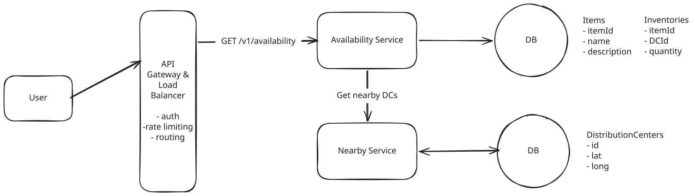
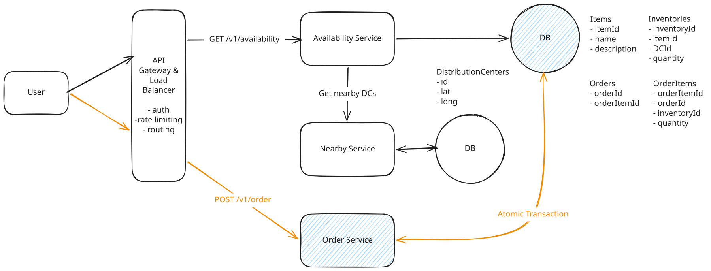

# Local Delivery Service

**What is Gopuff?**

Gopuff delivers goods typically found in a convenience store via rapid delivery and 500+ micro distribution centers (DCs).

---

## Functional Requirements

1. Customers query availablity of items, deliverable in 1 hour, by location.
1. Customers order multiple items at the same time.

**Out of Scope:**

- Handling payments/purchases
- Handling driver routing and deliveries
- Item search functions
- Cancellations and returns


---

## Non-Functional Requirements

1. Availability requests should be fast (<100ms) to support use-cases like search.
1. Ordering should be strongly consistent: No double booking.
1. System should support 10k DCs and 100k items across DCs.
1. Order volume will be 10m orders/day.

**Out of Scope:**

- privacy and security
- disaster recovery

---

## Core Entities

- **Inventory**: A physical instance of an item, located at a DC.
- **Item**: A type of item, e.g. Cheetos.
- **DistributionCenter**: A physical location where items are stored.
- **Order**: A collection of `Inventory` which have been ordered by a user

---

## API Design

### 1. Query availablity of items

``` json
GET /v1/availability?lat={}&long={}&keyword={}&page_size={}&page_num={} ->

{
  items: [
    {
      name: NAME,
      quantity: QTY,
    },
  ],
}
```

### 2. Order items

``` json
POST /v1/order
Authentication: JWT(userId)
{
  lat: LAT,
  long: LONG,
  items: [
    {
      name: "ITEM1",
      quantity: 5,
    },
    {
      name: "ITEM2",
      quantity: 2,
    },
  ],
} ->

200 OK
{
  status: ORDERED | FAILURE
}
```

---

## High-Level Design


### 1. Query availablity of items

**Event Flow:**

1. A user makes a request to the **Availability Service** with the user's location X and Y and any relevant filters.
1. The Availability Service fires a request to the **Nearby Service** with the user's location X and Y.
1. The Nearby Service returns a list of DCs that can deliver to the user's location.
1. With the DCs available, the availability service query the database with those DC IDs.
1. The Availability Service sums up the results and returns them to the user.




### 2. Order items

Require **strong consistency** to make sure two users aren't ordering the same item. **Using a lock** is usually considered to avoid **double booking**.

??? warning "Good Solution: Two data stores with a distributed lock"

    **Approach**

    - have separate databases for orders and inventory.
    - When an order to placed we'll lock the relevant inventory records, create the order record, decrement the inventory, and release the lock.
    - use a key-value store for inventory and a relational database for orders.

    **Challenges**

    - What if our service crashes after we created the order but before we decremented the inventory? A subsequent user might order the inventory we had promised to the first user.
    - What if two orders have overlapping inventory requirements? We might **deadlock** if both User1 and User2 are trying to buy A and B, but User1 has the lock for A and User2 has the lock for B - neither can proceed.


??? success "Great Solution: Singular Postgres transaction"

    **Approach**

    - Putting both orders and inventory in the same database and take advantage of the ACID properties of the Postgres database.
    - Using a singular transaction with isolation level `SERIALIZABLE` we can ensure that the entire transaction is atomic.

    **Challenges**

    - While consolidating our data down to a single database has a lot of benefits, it's not without drawbacks. We're partly coupling the scaling of inventory and orders and we can't take advantage of the best data store for each use case.


**Order Event Flow:**

1. The user makes a request to the **Order Service** to place an order for items A, B, and C.
1. The **Order Service** creates a singular transaction in the DB:
    1. Checks the inventory for items A, B, and C > 0.
    1. If any of the items are out of stock, the transaction fails.
    1. If all items are in stock, the transaction records the order and decrements the quantity in **Inventories table**.
    1. A new row is created in the **Orders table** and **OrderItems table**.
    1. The transaction is committed.
1. If the transaction succeeds, return the order to the user.

