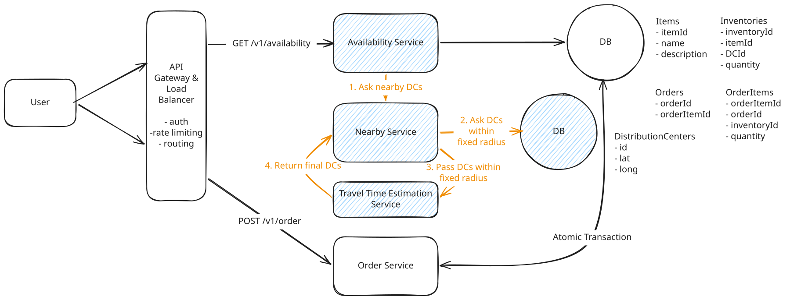
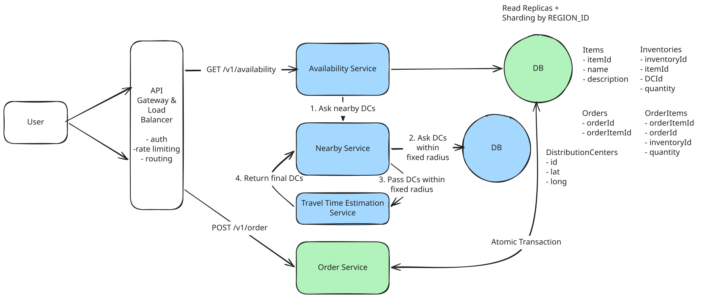

# Local Delivery Service

## Deep Dives

### 1. Make availability lookups incorporate traffic and drive time

When determining nearby DCs, factors other than distance should also be considered for the travel times, such as traffic and road conditions.

??? failure "Bad Solution: Use a Travel Time Estimation Service Against all DCs"

    **Approach**

    Update the entire `DistributionCenters` table by querying periodically (like every 5 minutes) to `Travel Time Estimation` Service.

    **Challenges**

    - Making too many queries to the Travel Time Estimation Service.
    - Most of the DCs we're querying aren't close enough to ever plausibly be delivered in 1 hour.

??? success "Great Solution: Use a Travel Time Estimation Service Against Nearby DCs"

    **Approach**

    - When an input comes in, we can scope down the "candidate" DCs by taking a fixed radius and limiting ourselves to only evaluating those.
    - Pass these candidates to the Travel Time Service to get the final candidates.





### 2. Make availability lookups fast and scalable

Looking up inventory availiability directly from the database introduces a lot of load onto the database.

- 10M orders per day
- ~100K seconds per day
- only 5% of these users will end up buying where the rest are just shopping

``` bash
Queries: 10M orders/day / (100K seconds/day) * 10 / 0.05 = 20k queries/second
```

How can we scale to support 20k QPS?

??? success "Great Solution: Query Inventory Through Cache"

    **Approach**

    Add a Redis instance working as a cache for the availability lookups.
        
        - If the cache hits, return that result.
        - If the cache misses, do a lookup on the underlying database and then write the results into the cache. Setting a low TTL(e.g., 1 minute) ensures that these results are fresh.

    **Challenges**

    Need to ensure that the cache is always up to date with the inventory table. The Order Service will need to expire affected cache entries when it writes to the inventory table.


??? success "Great Solution: Postgres Read Replicas and Partitioning"

    **Approach**

    - **Grouping DCs by the first 3 digits of zipcode and partition them**. As a result, all queries will go to mostly 1 or 2 partitions rather than the entire inventory dataset.
    - Use **read replicas for availability** since we can tolerate a small amount of inconsistency. Orders need to be strongly consistent(thus transactions need to go to the leader DB instance), but availability queries can go to read replicas.

    **Challenges**

    - need to manage the sizing of our replicas to balance with traffic.
    - find a way to avoid a single hot replica.

---

## Final Design



- Blue: "Query availablity of items" path
- Green: "Order items" path