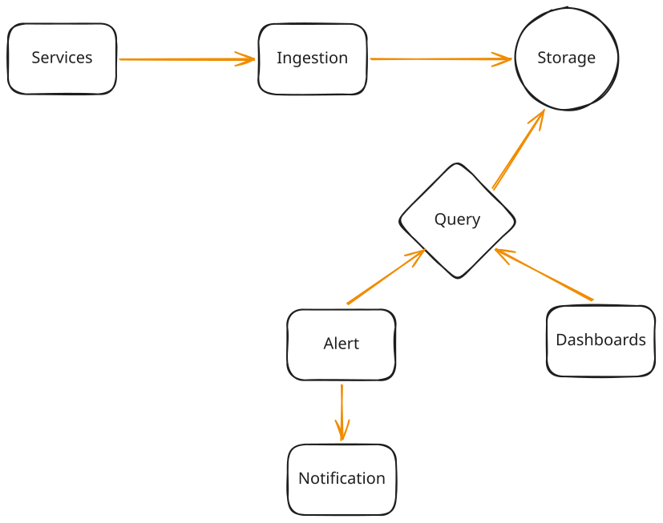

# System Design - Metrics Monitoring Part 1

**What is a Metrics Monitoring Platform?**

A platform that collects performance data (CPU, memory, throughput, latency) from distributed systems, stores it as time-series data, visualizes it on dashboards, and triggers alerts on threshold breaches.

---

## Functional Requirements

1. **Ingest Metrics:** Support system-level (CPU, memory, network) and custom application metrics.
2. **Query & Visualize:** Provide dashboards with time-range filtering and mathematical aggregation.
3. **Alerting:** Allow users to define alerting thresholds over sliding time windows (e.g., "p99 latency > 500ms for 5m").
4. **Notifications:** Send alert notifications to external channels (Slack, PagerDuty).

**Out of Scope:**

*   Log aggregation
*   Distributed tracing (traces/spans)
*   ML-driven anomaly detection

---

## Non-Functional Requirements

*   **Ingestion Scale:** **5M metrics/second** (500k servers × 100 metrics every 10s).
*   **Storage Volume:** **1 GB/second** (~200 bytes per metric point × 5M metrics/s).
*   **Query Latency:** Dashboards must load in **< 2 seconds**.
*   **Alert Latency:** Alerts must fire within **< 1 minute** of threshold breach.
*   **CAP Theorem:** Prioritize **High Availability** and **Eventual Consistency** (AP system).
*   **Robustness:** Handle delayed or out-of-order data gracefully.

---

## Core Entities

*   **Metric:** A measurement with labels and a timestamped value (e.g., `cpu_usage{host="server-1", region="us-east"} = 0.75`).
*   **Label:** Key-value pairs for filtering and grouping (e.g., `region="us-east"`).
*   **Series:** Chronological sequence of `(timestamp, value)` pairs for a unique metric + label combination.
*   **Alert Rule:** Conditions triggered over time (e.g., CPU > 90% for 5m) that generate notifications.
*   **Dashboard:** A collection of panels visualizing metric queries.

---

## Data Flow



---

## API Design

*Note: While JSON is shown below for readability, a production system at this scale would use **Protobuf** or another binary protocol over gRPC.*

### 1. Ingest Metrics (Batched)
`POST /v1/metrics/ingest`
```json
{
  "metrics": [
    {
      "name": "cpu_usage",
      "labels": {
        "host": "server-1",
        "region": "us-east-1"
      },
      "value": 0.75,
      "timestamp": 1717770000
    }
  ]
}
```

### 2. Query Metrics
`GET /v1/metrics/query?query=<expression>&start=<epoch>&end=<epoch>`
Response:
```json
{
  "series": [
    {
      "metric": "cpu_usage",
      "labels": { "host": "server-1" },
      "values": [[1717770000, 0.75], [1717770010, 0.78]]
    }
  ]
}
```

### 3. Define Alert Rules
`POST /v1/alert/rules`
```json
{
  "name": "High CPU Alert",
  "query": "avg(cpu_usage{region='us-east-1'}) > 0.9",
  "for": "5m",
  "channels": ["slack:#oncall", "pagerduty:team-infra"]
}
```
