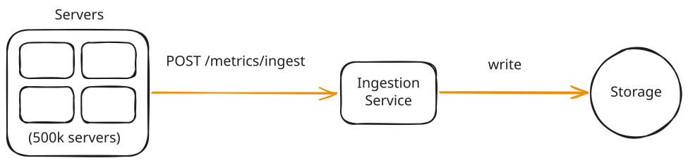
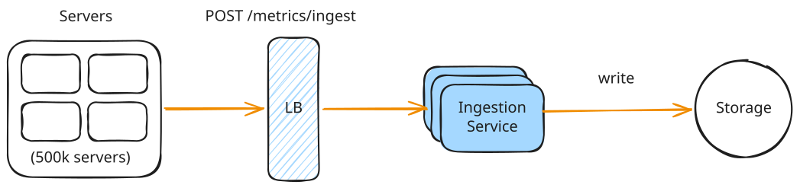
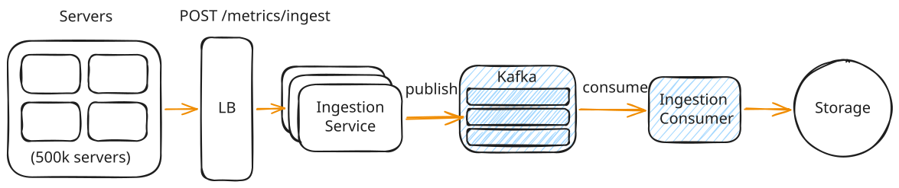
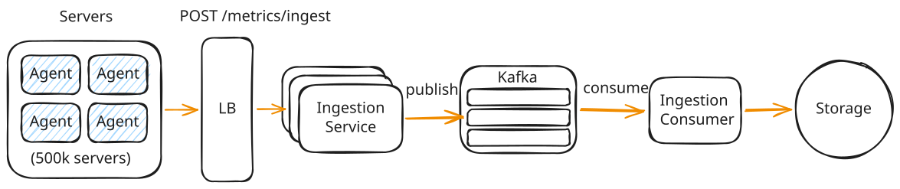
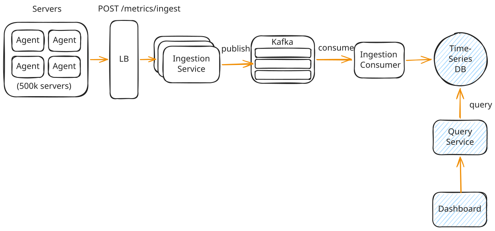
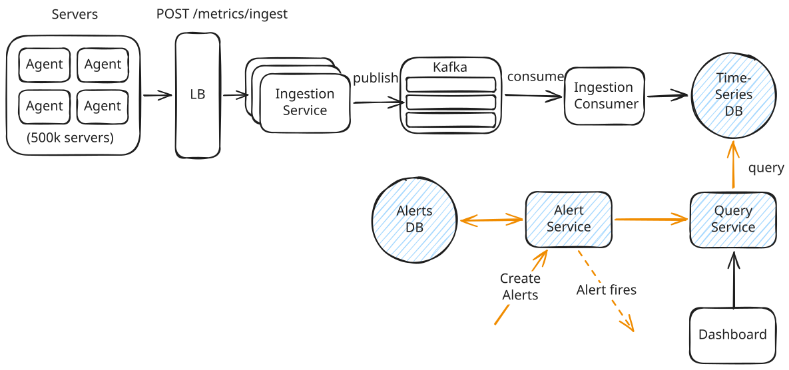
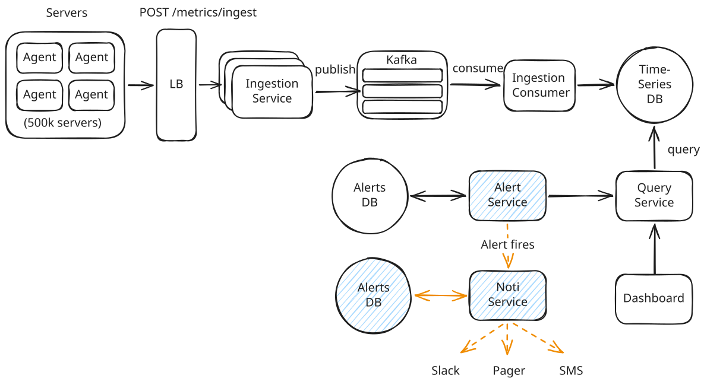

# System Design - Metrics Monitoring Part 2

## High-Level Design

### 1. Ingest Metrics

Direct pushing from servers to a central ingestion service is simple but fails under 5M writes/second, overwhelming both the ingestion layer and the database.



??? failure "Bad: Scale the Ingestion Service Horizontally"

    

    ### Approach
    *   Add instances behind a Load Balancer.
    *   Scale horizontally (e.g., 50 instances if each handles 100k writes/s).
    *   Use auto-scaling policies to handle spikes.

    ### Challenges
    *   **Database Bottleneck:** Spawning 50 instances shifts the 5M writes/s load directly to the database layer.
    *   **No Buffer:** Database slowdowns or transient outages cause immediate data loss.
    *   **No Backpressure:** Cannot throttle ingestion or replay data post-failure.

??? warning "Good: Decouple with a Message Queue"

    

    ### Approach
    Publish validated metrics to **Kafka**, partitioned by `hash(metric_name + labels)`.

    *   **Backpressure:** Kafka buffers ingestion spikes; consumers pull at their own pace.
    *   **Durability:** Metrics persist in Kafka until consumed.
    *   **Parallelism:** Replicated partitions enable parallel consumer processing.

    ### Challenges
    *   **Complexity & Latency:** Adds operational overhead and 10-50ms ingestion latency.
    *   **Reliability:** Requires handling consumer failures and ensuring at-least-once delivery.

??? success "Great: Agent-Based Collection with Local Buffering"

    

    ### Approach
    Run a lightweight **collector/agent** background process on each of the 500k servers:
    
    *   Collects metrics locally at high frequency (e.g., 1s).
    *   Buffers and batches metrics locally in memory/disk.
    *   Periodically flushes batched metrics to the ingestion service.

    ### Benefits
    *   **Reduced Request Volume:** Batching reduces HTTP requests from 5M/s to 50k/s.
    *   **Edge Aggregation:** Computes metrics (e.g., percentiles) locally before shipping.
    *   **Fault Tolerance:** Local buffers absorb network/ingestion downtime.

    ### Challenges
    *   **Fleet Management:** Managing agent configuration and lifecycle across 500k nodes.
    *   *Note: This is the industry standard (e.g., Datadog Agent, Prometheus Node Exporter).*

---

### 2. Query and Visualize Metrics

Dashboard queries require scanning, filtering, and aggregating millions of data points with sub-second response times.

??? failure "Bad: Store in a Relational Database"

    ### Approach
    Store each data point as a row in Postgres:
    ```go
    type metric struct {
      id          int64
      metric_name string
      labels      map[string]string
      value       float64
      timestamp   int64
    }
    ```
    Query using SQL:
    ```sql
    SELECT time_bucket('1 minute', "timestamp") as bucket, AVG("value")
    FROM metrics
    WHERE "metric_name" = 'cpu_usage' AND "labels" @> '{"region": "us-east"}'
      AND "timestamp" BETWEEN '2024-01-01' AND '2024-01-02'
    GROUP BY bucket;
    ```

    ### Challenges
    *   **Scale Limit:** Standard RDBMS cannot sustain 5M writes/s.
    *   **Sharding Complexity:** Horizontal sharding breaks cross-shard query aggregation.
    *   **Read Degradation:** Query latency scales exponentially with table size.
    *   **Retention Bottleneck:** Periodic `DELETE` queries cause high write amplification and database vacuum pressure.

    ??? note "Retention Management (DELETEs)"
        To enforce a retention policy (e.g., delete data > 30 days), RDBMS requires executing massive periodic `DELETE` queries. At scale, this incurs heavy write and storage reclamation overhead.

    ??? note "Write Amplification"
        Under MVCC, `DELETE` statements do not free disk space immediately; they write "dead markers" to pages. This causes **Write Amplification** (writing WAL logs and dirtying data pages on disk just to delete data).

    ??? note "Vacuum Pressure"
        To reclaim space from dead tuples, the background **VACUUM** process must scan tables and rewrite indexes. At 5M writes/s, the volume of dead rows causes CPU/IO bottlenecks and table bloat (Autovacuum lag).

??? success "Great: Use a Time-Series Database"

    ### Approach
    Use a Time-Series Database (TSDB) (e.g., VictoriaMetrics, InfluxDB, TimescaleDB):

    *   **Append-only Writes:** Uses LSM-tree or append-only storage engines optimized for high write throughput (no random updates).
    *   **Time-based Partitioning:** Automatically chunks data into time-based tables (e.g., hourly/daily). Old data is deleted instantly via `DROP TABLE`, bypassing the MVCC `DELETE` bottleneck.
    *   **Columnar Compression:** Stores data by column. Specialized compression algorithms (Delta-of-Delta for timestamps, Gorilla/XOR for floats) reduce storage by up to 90%.
    *   **Built-in Rollups:** Automatically aggregates raw data (10s) into 1-minute, 1-hour, and 1-day tables, drastically reducing scan sizes for long-range queries.

    ### Challenges
    
    *   **High Cardinality:** Unique label combinations (e.g., dynamic pod names, IP addresses) explode the number of distinct series, degrading memory and query performance.

#### Why a separate Query Service?
*   **Read/Write Segregation (CQRS):** 
    - *Writes* are continuous, predictable, and write-heavy.
    - *Reads* are sporadic, read-heavy, and CPU-intensive (scans).
    - Separation allows scaling and tuning each layer independently.
*   **Caching:** Implements a query-caching layer without impacting ingestion throughput.



---

### 3. Define Alert Rules with Thresholds

For alert latencies < 1 minute, complex stream processing (Flink/Spark) is unnecessary. A periodic polling service (evaluating rules against the TSDB every 15–30s) is sufficient and operationally simpler.



---

### 4. Receive Notifications When Alerts Fire

A **Notification Service** handles alert delivery logic between the evaluator and external channels:

*   **Deduplication:** Filters out redundant alerts; notifications are only sent on state transitions (e.g., *Active* $\rightarrow$ *Resolved*).
*   **Grouping:** Batches multiple firing alerts within a short window (e.g., 30s) by labels (e.g., `service` or `cluster`) to prevent alert fatigue.
*   **Silencing & Routing:** Manages maintenance windows and routes alerts to specific teams.

