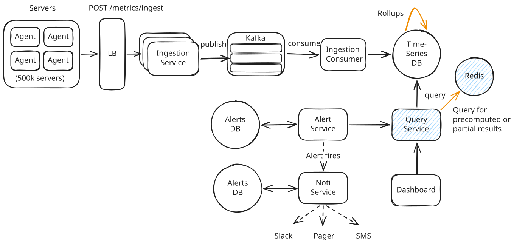
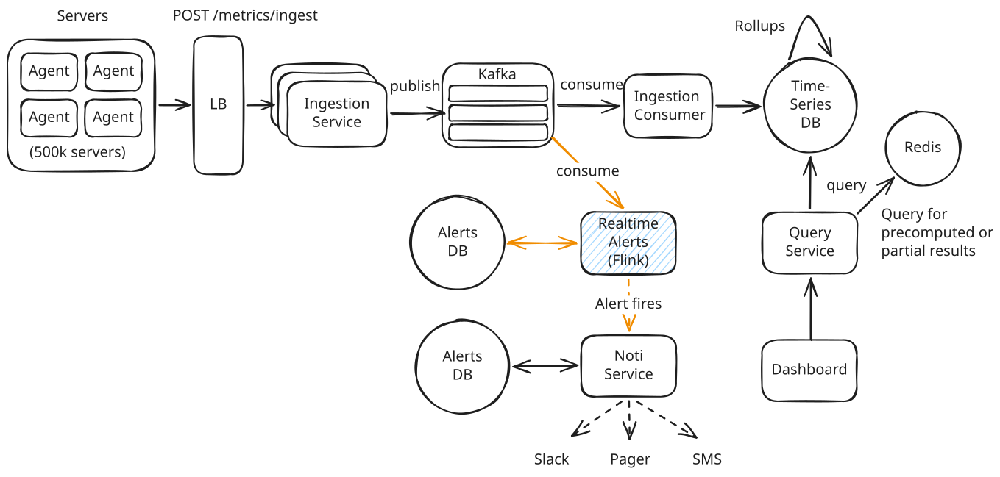
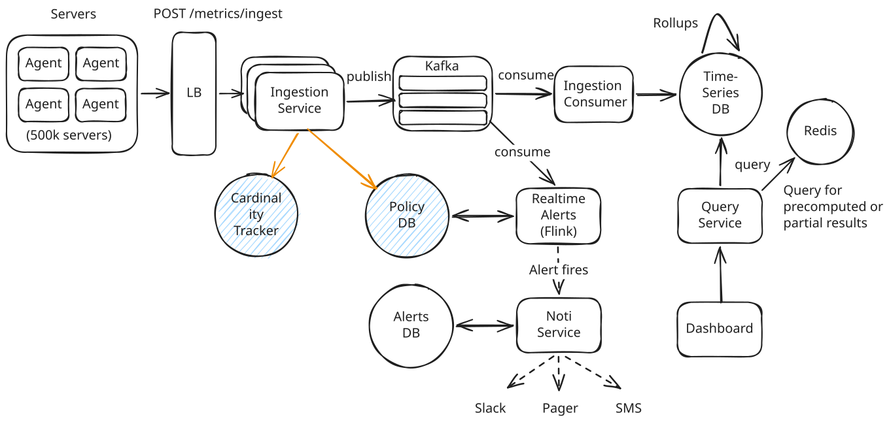
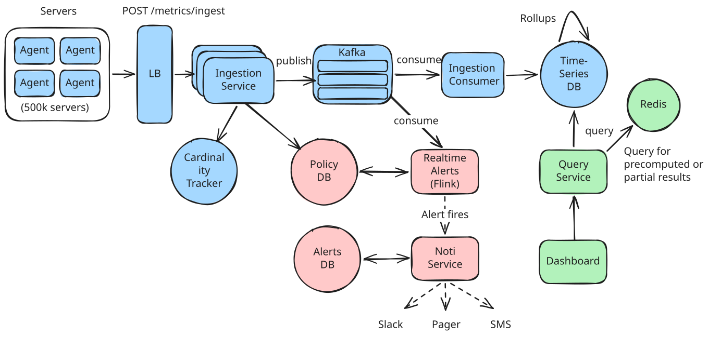

# System Design - Metrics Monitoring Part 3

## Deep Dives

### 1. How to Serve Low-Latency Dashboard Queries

A query like "show me CPU usage for all pods in production over the last 30 days" can touch billions of data points.

??? failure "Bad: Query Raw Data Directly"

    ### Approach
    Store all metrics at full resolution (10-second intervals) and query the raw database directly.

    ### Challenges
    *   **Raw Scan Cost:** 30 days of 10s raw data is 259,200 data points per series.
    *   **Scale Bottleneck:** Querying 1,000 pods requires scanning 259 million rows (~25GB of data) for a single dashboard panel, causing high latency.

??? warning "Good: Pre-Computed Rollups at Multiple Resolutions"

    ### Approach
    Store data at multiple aggregated resolutions:

    *   **Raw:** 10s intervals, kept for 2 days.
    *   **1-minute:** Kept for 2 weeks.
    *   **1-hour:** Kept for 90 days.
    *   **1-day:** Kept for 2 years.

    A 30-day query automatically uses hourly rollups (720 points per series) instead of raw data.

    ### Challenges
    *   **Lossy Data:** Pre-aggregations (averages) lose the original distribution.
    *   **Percentile Challenge:** Querying metrics like p99 requires storing complex data structures (histograms or sketches) at each rollup interval.

??? success "Great: Caching Layer + Query Splitting"

    ### Approach
    Add an in-memory cache (Redis) in front of the TSDB:

    *   **Query Splitting:** Break queries into two parts: query raw DB for recent data (last 2h) for freshness, and query Redis cache for historical data.
    *   **Precomputation:** Periodically precompute popular dashboard queries and store them in the cache.
    *   **Result Caching:** Cache query results with keys based on `query + time_range`.

    

    ### Challenges
    *   **Cache Invalidation:** Backfilled data or corrections require targeted cache invalidation.
    *   **Memory Overhead:** Cache size must be monitored to avoid RAM exhaustion.

---

### 2. How to Reduce Alert Latency Below 1 Minute

The bottleneck with polling-based Alert Evaluators is that they query the database on a schedule instead of reacting to data as it arrives.

??? warning "Good: Increase Polling Frequency"

    ### Approach
    Run the Alert Evaluator more frequently (every 15 or 30 seconds instead of every minute).

    ### Challenges
    *   **High Query Load:** Querying 10,000 rules every 15s generates ~670 queries/second on the database.
    *   **Hard Limit:** Still bound by the polling interval (up to 14s latency).

??? success "Great: Stream Processing for Real-Time Alerts"

    ### Approach
    Use a stream processing framework like **Flink** to evaluate alerts against the live Kafka data stream.

    1.  Flink reads metrics from the Kafka ingestion topic.
    2.  Flink maintains windowed state (e.g., rolling 5-minute buffers) for each metric series.
    3.  Alert rules run as Flink operators that continuously evaluate conditions against these windows.
    4.  Flink emits alert events instantly upon threshold violations.

    

    ### Challenges
    *   **Operational Overhead:** High deployment and maintenance complexity.
    *   **Rule Updates:** Modifying alert rules dynamically without losing current window state is challenging.
    *   **State Management:** Requires robust checkpointing to prevent losing alert states during failures.

---

### 3. How to Ensure High Availability

We must isolate and secure two distinct paths:
1.  **Ingestion Path:** Maintain metric collection and storage during downstream outages.
2.  **Alerting Path:** Ensure continuous threat detection and notification delivery.

??? warning "Good: Redundancy + Durable Buffers"

    ### Approach
    Introduce redundancy at each stage:

    *   **Ingestion:** Multiple service instances behind a load balancer.
    *   **Buffer:** Replicated Kafka partitions.
    *   **Storage:** Multi-node TSDB cluster.
    *   **Alerting:** Redundant consumer groups.
    *   **Notifications:** Alert Service queue with retries.

    ### Challenges
    *   **Data Expiration:** Excessive downstream lag can cause Kafka to purge data before consumption.
    *   **Alert Latency:** Buffering delays detection times.

??? success "Great: End-to-End HA for Both Data and Alerts"

    ### Approach
    *   **Ingestion HA:**
        -   *Local Buffering:* Agents cache data locally and retry if the ingestion service is down.
        -   *Zone Redundancy:* Replicate Kafka brokers across availability zones.
        -   *Idempotency:* Ingestion writes use deduplication IDs to prevent duplicates on retries.
    *   **Alerting HA:**
        -   *State Checkpointing:* Save Flink state to resume seamlessly after worker failure.
        -   *Alert Event Bus:* Write alert events to a Kafka topic before notifying users.
        -   *Fallback Delivery:* Alert Service retries and fails over to secondary notification channels.

    ### Challenges
    *   Requires managing complex distributed states and coordination logic.

---

### 4. How to Handle Cardinality Explosion

Implement **Cardinality Enforcement** in the Ingestion Service:

1.  **Policy Store (Postgres):** Defines allowed label keys and maximum series limits per metric.
2.  **Cardinality Tracker (Redis):** Fast in-memory counter tracking unique series counts.

**Enforcement Flow:**

1.  Metric arrives at the ingestion service.
2.  Strip disallowed label keys based on the Policy Store.
3.  Hash the remaining labels to generate a unique Series ID.
4.  Check the Cardinality Tracker in Redis:
    *   **Existing Series:** Accept and write.
    *   **New Series:** Validate against the per-metric series cap.
        -   *Under Cap:* Increment count, accept, and publish to Kafka.
        -   *Over Cap:* Drop metric and increment `dropped_metrics` counter.

---

## Conclusion

