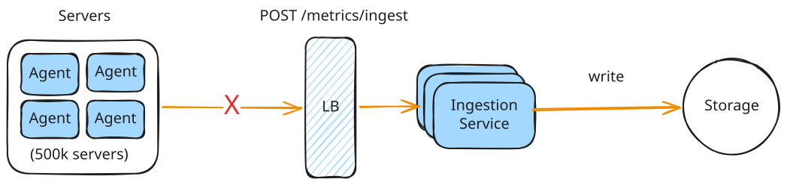
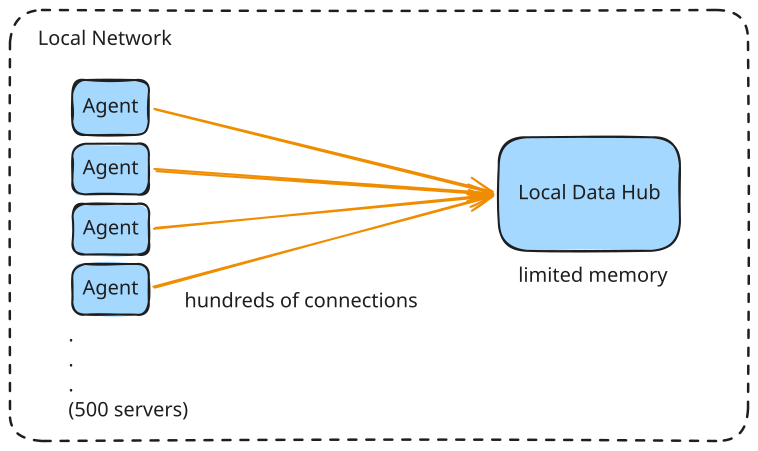

# Metrics Monitoring - Deep Dives 2

## Telemetry Collection & Edge-to-Cloud Streaming

> **Handling Network Blips**: What happens if the cellular or local internet connection drops for 4 hours?

### Local Buffering

When network connectivity drops, the edge agent **must cache telemetry locally**. To prevent data loss and resource exhaustion on constrained edge hardware, a multi-tier local buffering strategy is used:

#### Dual-Tiered Queue (Memory-to-Disk)

- **In-Memory Ring Buffer:** Under normal conditions, metrics are buffered in RAM for fast, low-overhead batching.
- **Disk Spilling:** If the network is down or RAM utilization hits a threshold, the agent serializes and appends
  metrics to a local disk-based queue (e.g., SQLite, RocksDB, or a circular binary log).

#### Bounded Capacity & Eviction Policy

- **Storage Cap:** The disk buffer is strictly bounded (e.g., max 500MB) to prevent filling the device's flash storage.
- **FIFO Eviction:** Once the cap is reached, the oldest data is dropped (First-In, First-Out) to prioritize fresh real-time telemetry.

#### Durability & Crash Recovery 

Telemetry is written to a local {==Write-Ahead Log (WAL)==} on disk. If the edge hardware suffers a power failure
  during the outage, the agent reads the WAL upon reboot to reconstruct the queue.

#### Throttled Recovery Flush

When connectivity is restored, the agent uploads the historical buffer in chunks using **adaptive rate-limiting** and **exponential backoff with jitter** to avoid overwhelming the central ingestion service. Real-time metrics are prioritized over backlogged data.

!!! info "Adaptive Rate-limiting"

    * **Load Control:** Prevents the agent from saturating edge network bandwidth or overwhelming the ingestion server when flushing hours of backlogged data.
    * **Dynamic Congestion Control:** Adjusts the metrics transmission rate dynamically based on network latency and server response codes (e.g., throttling down on HTTP `429` or high round-trip times, and scaling up when the channel is clear).

!!! info "Exponential Backoff With Jitter"

    * **Exponential Backoff:** The client increases the delay between retry attempts exponentially (e.g., $1\text{s}, 2\text{s}, 4\text{s}$) to avoid hammering a recovering server.
    * **Jitter:** Introduces random variation to retry intervals (e.g., $4\text{s} \pm \text{random}$). Without jitter, thousands of disconnected edge devices would retry simultaneously, creating a **thundering herd** spike.

---

## High-Frequency Local Data Ingestion & Concurrency

> "Design an in-memory local data hub for the controller that ingests continuous parallel data streams from 500 local power meters and makes the aggregate state available to local control algorithms in real time."

### Concurrency Model

Ingesting high-frequency parallel streams from hundreds of concurrent inputs using a single globally locked data structure (e.g., `sync.Mutex` guarding a map) leads to severe **lock contention**. To handle high concurrency with sub-millisecond latency, we design the ingestion pipeline around three key patterns:

#### 1. Worker Pool & Bounded Channels (CSP Model)
* **Decoupled Architecture:** Network interfaces accept incoming connections, parse raw metrics, and publish them to a thread-safe **bounded channel**. A fixed pool of worker routines (matching the system's CPU cores) consumes from the channel.
* **Natural Backpressure:** The bounded channel acts as an in-memory buffer. If processing slows down, the channel fills up and naturally blocks the receiving network threads, slowing down client reads at the socket level.

#### 2. Sharded Ingestion (Contention-Free Queueing)
* **Single-Consumer Partitioning:** To eliminate a single channel bottleneck, we use a sharded channel architecture. The network thread routes metrics to a specific worker's channel using `hash(sensor_id) % num_workers`.
* **Zero Lock Contention:** Since each worker routine exclusively reads from its own private channel, there is no lock or queue contention between processing threads.

#### 3. Lock-Free Ring Buffers (Disruptor Pattern)
* **CAS (Compare-And-Swap) Coordination:** For ultra-low latency, we bypass OS-level locks entirely using a pre-allocated circular ring buffer.
* **Atomic Sequences:** Writers (network threads) and readers (processing threads) coordinate slot access using CPU atomic operations (e.g., CAS) to increment sequence pointers. This avoids thread context-switching and locks, keeping memory and CPU pipeline throughput flat.

### Memory Management

---

## Local Command Execution & Distributed Consensus (Edge-to-Device)

---

## Designing a Rate Limiter or Governor for Edge Hardware