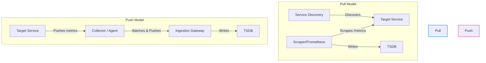

# System Design - Metrics Monitoring Part 4

## Deep Dives 2

### 1. Ingestion Model: Pull vs. Push

A key architectural decision in metrics platforms is whether the monitoring system **pulls** (scrapes) metrics from targets or targets **push** metrics to the system.



#### Pull Model (e.g., Prometheus)
*   **Mechanism:** The monitoring server dynamically discovers targets (via Kubernetes API or Consul) and periodically polls (scrapes) their `/metrics` HTTP endpoints.
*   **Pros:**
    *   *Target Health:* If a scrape fails, the system immediately registers a target down state (implicit heartbeat).
    *   *Self-Protection:* The server controls the scrape rate, preventing ingestion overload.
    *   *No Client-Side Configuration:* Targets do not need to know where the monitoring backend resides.
*   **Cons:**
    *   *Scaling Bottleneck:* The scraper server must manage active polling states, limiting horizontal scalability.
    *   *Network Constraints:* Requires direct network access from the server to all targets (complex across private networks/NATs).

#### Push Model (e.g., OpenTelemetry, Datadog)
*   **Mechanism:** Applications or local agents push batches of metrics to a central ingestion gateway.
*   **Pros:**
    *   *Easier Scaling:* Ingestion gateways are stateless receivers that scale horizontally behind a load balancer.
    *   *Ephemeral Workloads:* Ideal for short-lived tasks (e.g., serverless functions) that terminate before a scraper can poll them.
    *   *Firewall Friendly:* Works across firewalls and private networks since clients initiate outbound connections.
*   **Cons:**
    *   *Overload Risk:* Traffic spikes can overwhelm the ingestion layer (requires queuing/backpressure).
    *   *Silent Failures:* If a client stops pushing, the backend cannot distinguish between a dead service and an idle one without separate heartbeats.

---

### 2. Scaling the Time-Series Metadata Index (Inverted Index)

To execute a query like `cpu_usage{service="billing", env="prod"}`, the database must instantly locate matching Time-Series IDs among millions of active series.

#### The Problem: Scanning is too slow
Sequentially scanning millions of series metadata records introduces unacceptable query latency.

#### The Solution: Inverted Index (Posting Lists)
TSDBs build an **Inverted Index** that maps label key-value pairs to lists of matching Series IDs (**Posting Lists**).

```text
  Label Key-Value           Posting List (Series IDs)
  [ service="billing" ] ───> [ 102, 105, 204, 308 ]
  [ env="prod"        ] ───> [ 102, 204, 401, 512 ]
```

#### Query Execution Flow:
1.  **Lookup:** The query engine retrieves the posting lists for `service="billing"` and `env="prod"`.
2.  **Intersection:** It performs a fast set intersection (bitwise AND) on the two posting lists:
    $$\{102, 105, 204, 308\} \cap \{102, 204, 401, 512\} = \{102, 204\}$$
3.  **Data Fetch:** The engine directly fetches the raw metrics data blocks for Series IDs `102` and `204`.

#### Scaling the Index:
*   **Sharding:** The index is sharded by Series ID to distribute lookup load.
*   **In-Memory Cache:** Active posting lists are cached in RAM (e.g., using RocksDB or custom block indexes) to bypass disk reads.

---

### 3. Long-Term Storage Tiering & Compaction

Storing raw metrics at high resolution indefinitely is cost-prohibitive. Modern TSDBs separate writes from long-term storage using a **Tiered Storage Architecture**.

```text
                       ┌─────────────────────────┐
                       │  Write-Ahead Log (WAL)  │ (Local NVMe Disk)
                       └─────────────────────────┘
                                    │
                                    ▼
                       ┌─────────────────────────┐
                       │    In-Memory Chunks     │ (2 hours cache)
                       └─────────────────────────┘
                                    │
                                    ▼
                       ┌─────────────────────────┐
                       │   Immutable Block Files │ (Local Disk)
                       └─────────────────────────┘
                                    │
                                    ▼ [ Uploaded by Shipper ]
                       ┌─────────────────────────┐
                       │    Object Storage       │ (S3 / GCS / Azure Blob)
                       └─────────────────────────┘
```

#### 1. Ingestion Tier (Fast NVMe / Memory)
*   **WAL (Write-Ahead Log):** Incoming metrics are appended to a local WAL for durability.
*   **Memory Buffer:** Data is buffered in RAM in 2-hour blocks.

#### 2. Block Storage Tier (Local Disk)
*   Every 2 hours, the memory buffer is flushed to local disk as an immutable **Block File**.
*   A Block File contains highly compressed raw metric samples and its corresponding inverted index for that 2-hour window.

#### 3. Cold Storage Archive (Object Storage)
*   A background shipper process uploads completed local block files to inexpensive **Object Storage (S3/GCS)**.
*   Local disks then prune old blocks, keeping their storage footprint flat.

#### 4. The Compactor
A background **Compactor** service runs continuously on the object storage tier:
*   **Merging:** Merges multiple small 2-hour blocks into larger 24-hour or 30-day blocks to optimize index compression.
*   **Deduplication:** Removes duplicate data points caused by retry attempts.
*   **Downsampling:** Aggregates older raw data into 1-minute or 1-hour resolution blocks, deleting the original raw data to save storage costs.
