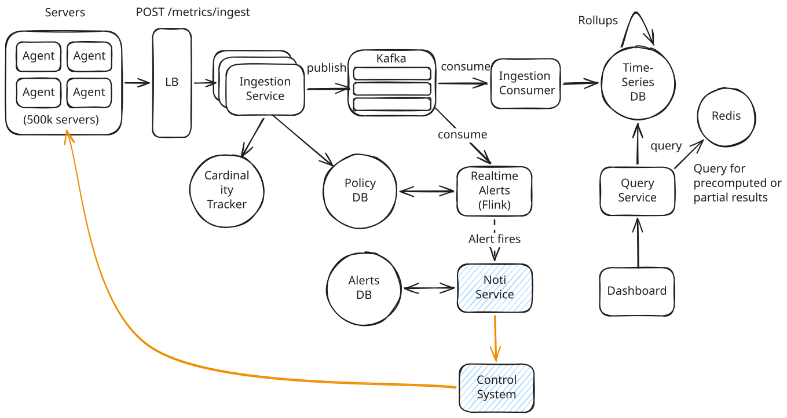

# Metrics Monitoring - Deep Dives 3

## Local Command Execution & Distributed Consensus (Edge-to-Device)

> "Design a local control system that receives a safety-critical command from a remote API and ensures it is successfully distributed and executed across 50 physical battery modules locally."

### Idempotency & Reliability

To prevent duplicate execution of safety-critical commands (e.g., setting operational power thresholds or triggering emergency shutdowns) during transient network failures and automatic retries, the edge controller employs a robust deduplication and idempotency framework:

#### 1. Unique Command IDs & Idempotency Keys

* **Cryptographic UUIDs:** Every command initiated by the cloud API is tagged with a unique, cryptographically secure `Command-ID` (or idempotency key) at its creation source. 
* **Command Registry:** The edge controller persists an index of recently received and executed Command IDs in a local lightweight database (e.g., SQLite or RocksDB) with a sliding TTL window (e.g., 24 hours).
* **Early Deduplication:** When a command arrives, the controller checks the registry. If the `Command-ID` already exists, the controller rejects the duplicate execution path and returns the cached execution result (success or error) immediately.

#### 2. Monotonic State Versioning

* **State Epochs:** Each physical module maintains a local monotonically increasing version counter (e.g., `state_version`). 
* **Conditional State Transitions:** Command payloads include the expected current version (e.g., `execute if version = 104`). If a retried command arrives after the state has already transitioned to version `105`, the transition is rejected as stale, preventing double-application or out-of-order execution of delayed retries.

#### 3. Ephemeral State Querying

* **Read-Before-Write Verification:** Prior to distributing a command to physical modules (e.g., over CAN bus or Modbus), the controller queries the physical device's registers. If the device is already in the target state (e.g., relay is open, threshold is set), the write command is skipped, guaranteeing safety even if the command database fails.

### Partial Failures

Handling partial failures (e.g., when 45 sub-units accept a command but 5 time out or fail) requires a deterministic strategy since database-style atomic rollbacks are often physically dangerous or impossible on hardware. The controller manages these scenarios through:

#### 1. Quorum & Operational Thresholds
* **Minimum Operational Quorum:** We define a strict quorum threshold (e.g., 90% of modules must succeed). If the command fails on more than the allowed limit, the transaction is marked as a system-wide failure.
* **Degraded Roll-Forward (Safe States):** Rather than attempting a complex rollback (which could introduce dangerous transient states), the controller executes a roll-forward. It isolates the 5 failed sub-units and recalculates the total system-level operational thresholds based on the remaining active 45 units.

#### 2. Reconciliation Loop (Self-Healing)
* **Desired vs. Actual State:** The controller continuously runs an asynchronous reconciliation loop. 
* **State Recovery:** If a module failed due to transient communication noise (e.g., a packet drop on the local CAN/Modbus), the loop periodically retries the state synchronization until the module's actual state aligns with the cluster's desired state.

#### 3. Heartbeat & Fallback (Fail-Safe)
* **Watchdog Timeouts:** Individual sub-units expect periodic heartbeat signals from the main controller.
* **Autonomous Fallback:** If a sub-unit times out during command distribution and loses communication with the controller, it autonomously transitions itself into a localized, low-risk "fail-safe" state (e.g., minimum power output or isolated standby mode).

### Protocol Choice

To fan out commands efficiently to dozens of local hardware interfaces under low latency and bandwidth constraints, we evaluate two primary local message distribution models:

#### 1. Lightweight Broker-Based Pub/Sub (MQTT)
* **Low Overhead & QoS Guarantees:** MQTT is designed for constrained networks. We utilize **QoS 1 (At least once)** or **QoS 2 (Exactly once)** delivery flags to guarantee command receipt.
* **Keep-Alives & LWT:** MQTT's **Last Will and Testament (LWT)** feature allows the controller to immediately detect if a sub-unit broker client goes offline unexpectedly, triggering a safety state change without waiting for timeouts.

#### 2. Brokerless or Embedded Pub/Sub (NATS / NATS JetStream)
* **Ultra-Low Latency:** NATS provides a sub-millisecond, highly optimized communication fabric. Its tiny footprint is ideal for embedding directly into the edge controller.
* **Subject-Based Fan-Out:** The controller publishes a command to a wildcard subject (e.g., `controller.commands.>`). Sub-units subscribe only to their relevant identifiers (e.g., `controller.commands.module05`), allowing targeted multicast and parallel command execution.

#### 3. Bridge to Hard Real-Time Buses
* **Protocol Translation:** The pub/sub client running at the hardware interface translates the high-level message payload (e.g., JSON/Protobuf via NATS/MQTT) into industrial hardware frame formats (like **Modbus TCP/RTU**, **CANopen**, or **EtherCAT**) for execution on physical device controllers.

