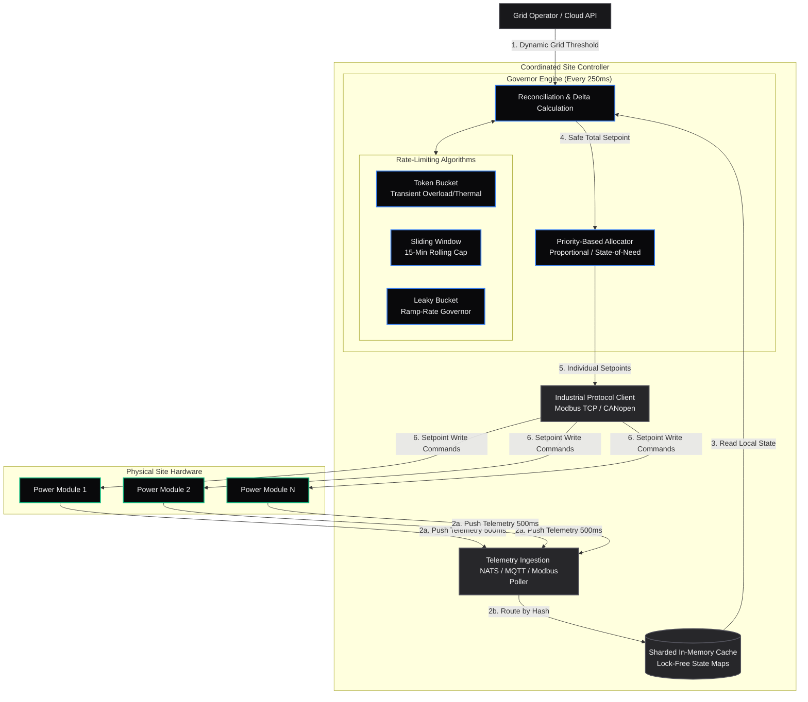

# Metrics Monitoring - Deep Dives 4

## Designing a Rate Limiter or Governor for Edge Hardware

> "Design a software governor component on the controller that ensures the aggregated charging rate of 100 EV chargers on-site never exceeds a dynamic maximum power threshold provided by the grid operator."

### Scenario

#### Step 1: Grid Condition & Dispatch Command
1. The utility operator or a central monitoring system detects a grid issue (e.g., a power shortage or frequency drop).
1. The central system sends a high-level dispatch request to the site controller: "Export 15 Megawatts (MW) immediately."

#### Step 2: Governor Evaluation (The Token Bucket check)

Before distributing the command to the individual storage sub-units, the site controller runs the request through its software governor:

1. **Check Headroom**: The governor looks at its virtual  token_bucket  variable in memory.
1. **Determine Mode**:
    - **If tokens are available (System is cool)**: The governor approves the full 15 MW request (allowing a transient burst). It deducts the corresponding tokens from the virtual bucket.
    - **If tokens are depleted (System is hot)**: The governor curtails the request, capping it at the continuous safe limit of, say, 10 MW.
1. **Output**: The governor outputs a finalized target setpoint (either the requested 15 MW or the throttled 10 MW).

#### Step 3: Allocation & Distribution

Now that the controller has determined the safe total output (e.g., 10 MW), it decides how to divide this load among the physical hardware:

1. The controller uses the **Priority-Based Allocation** algorithm to divide the 10 MW target across the healthy, online storage sub-units.
1. If there are 50 online sub-units, it might decide each unit should output 200 kW ($200\text{ kW} \times 50 = 10\text{MW}$).

#### Step 4: Physical Command Execution

1. The site controller translates the allocated values into low-level industrial protocols (e.g., Modbus register writes or CAN bus frames).
1. It sends commands like: "Unit 01: Set Output to 200 kW", "Unit 02: Set Output to 200 kW", etc.
1. The sub-units receive the command and adjust their power electronics (inverters) to discharge the requested kilowatts.

#### Step 5: The Reconciliation Loop

1. The sub-units continuously stream their actual physical metrics (e.g., output kW, internal temperature) back to the site controller.
1. The site controller uses these metrics to verify execution and dynamically update the virtual token bucket (e.g., if temperature rises faster than expected, it drains tokens faster).

---

### Rate-Limiting Algorithms

When designing a hardware governor, standard software rate-limiting algorithms can be mapped to physical electrical and thermal constraints instead of API request rates:

#### 1. Token Bucket (Handling Transient Spikes & Thermal Capacity)

* **API Analogy:** Tokens represent allowed requests; a full bucket allows a burst of traffic.
* **Physical Power Mapping:** Tokens represent **thermal capacity** (allowable heat absorption in cables/transformers) or transient **inrush current** tolerances. 
* **Behavior:** Physical systems can tolerate short-term overloads above their continuous rating (e.g., motor startups or equipment surges) for a brief duration. A full token bucket allows a burst of peak power. As tokens drain (representing accumulated thermal stress), the governor dynamically throttles the aggregated load down to the continuous safe operating threshold.

#### 2. Leaky Bucket (Ramp-Rate Smoothing)

* **API Analogy:** Requests enter at variable speeds but leak out at a constant, smooth rate.
* **Physical Power Mapping:** Represents **grid ramp-rate limiting** (load step limitations).
* **Behavior:** Sudden, massive changes in site power consumption can destabilize the local microgrid, causing voltage sags or frequency deviations. The leaky bucket restricts how quickly the aggregated load can ramp up or down, smoothing a sharp demand spike into a gradual, linear load curve.

#### 3. Sliding Window (Rolling Average Energy Limits)

* **API Analogy:** Checks the rolling count of requests over a sliding time interval.
* **Physical Power Mapping:** Represents **peak demand integration intervals** (utility billing and transformer loading).
* **Behavior:** Utility companies often bill commercial sites based on the maximum average power used during a sliding window (e.g., a rolling 15-minute interval). The sliding window algorithm tracks cumulative energy consumption (kilowatt-hours) in real time. If the projected average power within the current sliding window is on track to exceed the dynamic threshold, the governor proactively curtails power output across modules for the remainder of the interval.

---

### Priority-Based Allocation

When total site load exceeds the dynamic power threshold provided by the grid, the governor cannot simply drop the grid connection. Instead, it must dynamically shed or curtail loads. To determine which assets receive power and which are curtailed, the system implements a multi-level priority allocation scheme:

#### 1. Tiered Load Classification (Static Priority)
All physical devices and subsystems are mapped into strict priority classes:

*   **Tier 1: Critical (Non-Curtailable):** Mission-critical infrastructure, life-safety equipment, networking hardware, and the edge controller itself. Power to these devices is never restricted.
*   **Tier 2: Essential (Regulated):** Primary facility loads, such as base HVAC ventilation, primary lighting, and industrial processing lines. These loads can be optimized or slightly curtailed (e.g., dimmed or duty-cycled) but not fully shut down.
*   **Tier 3: Discretionary (Curtailable):** Secondary comfort systems (e.g., auxiliary heating), non-essential auxiliary equipment, and convenience vehicle power receptacles. These loads are fully deferrable and are the first to be curtailed during a power deficit.

#### 2. Proportional Curtailment (Fair-Share Scaling)
Rather than turning Tier 3 devices completely off (which can trigger abrupt electrical transients), the governor applies proportional scaling:

*   **Linear Scaling:** If the power limit requires a 40% reduction in the discretionary tier, the controller communicates with all Tier 3 controllers to scale down their power consumption limit to 60% of their requested demand in parallel.

#### 3. State-of-Need Weighting (Dynamic Priority)

Within a single tier (especially for deferrable loads like thermal storage units or convenience outlets), the governor allocates power dynamically based on a **State-of-Need** score:

*   **Deficit-Based Allocation:** Priority is given to sub-units with the highest deficit relative to their operational target. For example, a climate control system furthest from its target temperature receives priority over one that is near its target, optimizing total system efficiency under constraints.

---

### State Synchronization

To dynamically adjust limits and calculate remaining capacity in real-time, the governor must maintain an accurate, low-latency picture of each physical load endpoint (e.g., active terminals, sub-units). The system achieves this synchronization through a hybrid telemetry pipeline:

#### 1. Hybrid Push-Pull Telemetry Pipeline

*   **Push-Based Streaming (Normal Path):** Each indvidual load endpoint streams its metrics (current current-draw, temperature, status flag) asynchronously via a local lightweight pub/sub broker (e.g., NATS or MQTT) at a high frequency (e.g., every 500ms).
*   **Pull-Based Fallback (Active Polling):** If an endpoint stops publishing telemetry due to message drops, the controller falls back to active polling. It sends direct query requests (e.g., Modbus TCP read registers) on a round-robin schedule to retrieve the missing state.

#### 2. Sharded In-Memory State Cache

*   **Contention-Free Storage:** Telemetry messages from the endpoints are received by the controller and routed via sharded queues (as detailed in Sharded Ingestion) to dedicated worker goroutines.
*   **In-Memory Cache:** Each worker maintains a local, lock-free state map representing the endpoints assigned to its shard. This avoids lock contention on a single global database.

#### 3. Periodic Control & Delta Calculation Loop

*   **High-Frequency Wakeup:** The governor runs a periodic loop (e.g., every 250ms to 500ms).
*   **Summation & Allocation:** In each tick, the governor reads the cached values, sums the total active load, and calculates the delta (difference) between the aggregated demand and the dynamic grid threshold.
*   **Adjustment commands:** If the delta is negative (power deficit), the governor immediately distributes updated power limits back to the active endpoints, bringing the site back into compliance before safety thresholds are tripped.

---

### Site Controller Architecture Diagram

The following diagram represents the end-to-end data flow and execution lifecycle of the Site Controller:

