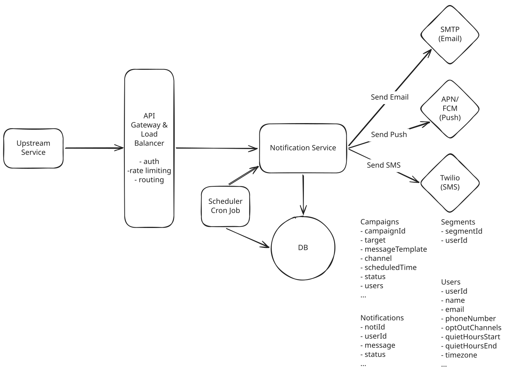

# Notification System

**What is a Notification System?**

A notification system is an internal platform that other teams at a company use to send messages to users across channels like push, email, and SMS. Product services hand it a message and a recipient, and the platform takes care of actually delivering it.

---

## Functional Requirements

1. Upstram services send a notification to a user via push, email, or SMS, either immediately or in the future.
1. Upstream services send campaigns, the same message delivered to a whole segment of users, immediately or scheduled.
1. Users set notification preferences (channel opt-outs and quiet hours).

---

## Non-Functional Requirements

We'll design for surges of **5,000 notifications per second** or roughly 50x our sustained rate.

1. at-least-once delivery guarantee with best-effort deduplication
1. handle surges of ~5,000 notifications per second
1. deliver high priority notifications like OTPs and security alerts within 5 seconds of acceptance, even during a surge

**Out of Scope:**

- Strict ordering of notifications across channels
- Compliance workflows around consent and span regulation

!!! info "Two very different traffic classes"

    - High priority notifications(OTPs, security alerts) are low volume but latency sensitive.
    - Standard notifications(promos, digests) arrive in huge bursts, but nobody cares for the late delivery.

---

## Core Entities

- **Notifications**: A single message to a single user on a single channel, along with its current status. Instance of Campaign.
- **Campaign**: A scheduled send to a group of users, with delivery time, channel, and audience.
- **Segment**: A named audience like "all users in Canada".
- **User**: The recipient.

---

## API Design

### 1. Send a notification to a user

``` json
POST /notifications -> 200 OK { id, status }
{
  userId,
  channel,    // push | email | sms
  priority,   // high | standard
  content,    // { title, body }
  scheduledAt // optional, defaults to now
}
```

### 2. Send campaigns

``` json
POST /campaigns -> 202 Accepted { id }
{
  segmentId,
  channel,      // push | email | sms
  priority,     // high | standard
  templateId,
  scheduledAt   // optional, defaults to now
}
```

### 3. Set notification preferences

``` json
PUT /users/{userId}/preferences -> Preferences
{
  optOuts,    // ["sms"]
  quietHours  // { start: "22:00", end: "08:00", tz }
}
```

---

## High-Level Design



### 1. Send a notification to a user

**Event Flow for Direct Notification:**

1. The Upstream Service POSTs to `/notifications` with a `userId`, channel, and content.
1. The Notification Service looks up the user's email address from `Users` table in the database.
1. The Notification Service writes a `Notification` row with status PENDING, then calls the provider.
1. The Notification Service updates the row to SENT or FAILED based on the email provider's response, and returns a 200 with the notification id and that status.

With this, the provider can send an email or SMS since these are known addresses.

For push, APNs and FCM deliver to a device token. The phone mints that token, and the Notification Service stores it before any send:

1. The user opens the product's mobile app (for example, Slack) and grants notification permission. The app asks the operating system for a token. iOS obtains one from APNs, and Android obtains one from FCM. The token identifies this install of the app on this phone.
1. After the user logs in, the app has a `userId`, so it uploads the token to the Notification Service. It uploads again whenever the operating system rotates the token for that install. The app sends a stable `deviceId` for the install so this upload updates that device and the user's other devices stay registered.

    ``` json
    PUT /users/{userId}/devices/{deviceId} -> Device
    Body: {
      platform,   // ios | android
      pushToken
    }
    ```

1. The Notification Service upserts a device record for that `userId` and `deviceId`, stored with the user's other data.
1. Later, an upstream service calls `POST /notifications` with `channel: push`. The Notification Service looks up the saved tokens for that `userId` and hands each token, plus the title and body, to APNs or FCM, which delivers to that install.


**Event Flow for Scheduled Notification:**

1. The Notification Service writes the row with status `SCHEDULED`.
1. A **scheduling cron job** scans the Notifications table every minute for scheduled rows whose time has arrived and pushes each one through the same send path a send-now request takes.


### 2. Send campaigns

**Event Flow:**

1. When a caller POSTs to `/campaigns`, write a Campaign row and hand back a 202 right away.
1. The cron job wakes up and finds a Campaign whose `scheduledAt` has passed.
1. It reads the segment's membership to resolve the list of receipients.
1. For each recipient, it pushes a send through the same path a direct notification takes.
1. Marks the campaign complete.


### 3. Set notification preferences

Preferences are attributes on the User, which gets written through the preferences endpoint and routed by the Gateway to the Notification Service.

Users get an opt-out per channel and a quiet hours window. Quiet hours apply to standard notifications but not to high priority ones like OTPs and fraud alerts, of course.

