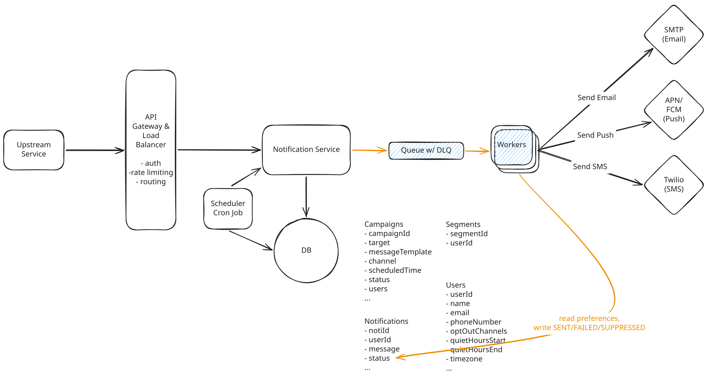
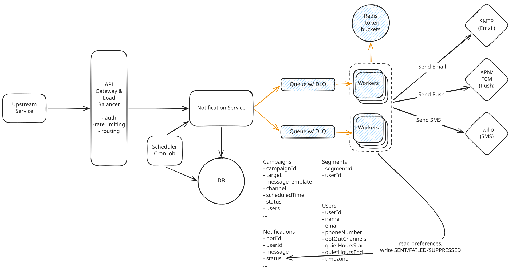
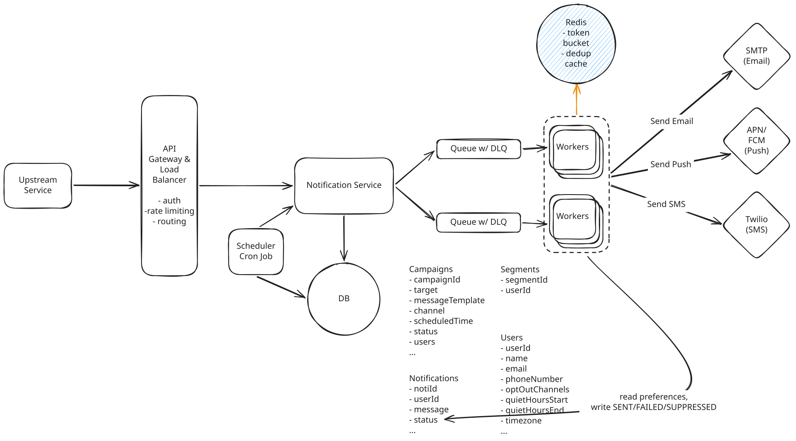
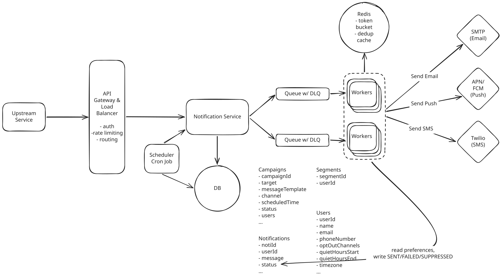

# Notification System

## Deep Dives

### 1. How to guarantee an accepted notification is never dropped?

Right now the Notification Service writes the row, calls the provider, updates the status, and only then returns to the caller. The entire request is synchronous. We need to get delivery off the request path.

??? failure "Bad Solution: Retry Inside the Request"

    **Approach**

    If the provider fails, back off and try again a few times before giving up.

    **Challenges**

    - The remaining retries are stored only in the Notification Service process's memory. A crash or a deploy restarts the process and wipes that memory, so any notification still waiting to be retried is never sent.
    - Also, during a real provider outage, the caller's connection is held open for the length of our backoff, and the auth service starts timing out on logins because our SMS provider is degraded. 
    - the caller can't tell the difference between "we gave up" and "we never got it." What we have built here is at-most-once delivery, the exact opposite of what we promised the caller.

??? warning "Good Solution: Durable Records with a Polling Dispatcher"

    **Approach**

    Decouple sending the notification from acknowledging the caller. 

    - The Notification Service writes the row with status PENDING and responds to the caller.
    - A background service polls the Notifications table for PENDING rows, calls the provider for each, and marks them SENT or FAILED.
    - Rows that fail get picked up again on a later poll.

    The response goes out before anyone has called a provider, so it can't report an actual delivery outcome. That's the 202. Callers who need to know how a send went ask for it separately.

    ``` bash
    POST /notifications      -> 202 Accepted { id }
    GET  /notifications/{id} -> { id, status, updatedAt }
    ```

    **Challenges**

    - Two dispatchers can claim the same PENDING row and send the notification twice.
    - We track attempt count and next-try time ourselves, and each poll scans a growing pile of finished rows unless we prune or partition the table.
    - Polling every 10 seconds leaves a new notification waiting up to 10 seconds before it is sent.

??? success "Great Solution: Publish First to a Durable Queue"

    **Approach**

    The Notification Service hands the notification to a durable queue and returns its 202 once the queue has acknowledged it. If we crash before the enqueue the caller gets an error and sends it again.

    Delivery process:

    1. A worker receives a message from the queue, which hides it from other workers for a visibility timeout.
    1. It looks up the recipient's email address or device token and checks their preferences.
    1. It calls the provider.
    1. It writes the outcome to a Notification row in Postgres, SENT if the provider accepted it and FAILED if it didn't. A FAILED row records the attempt and leaves the message eligible for retry.
    1. Only then does it delete the message from the queue.

    If a worker dies before it finishes, the message stays in the queue. Once its visibility timeout expires, another worker picks it up and tries again. After too many failures, the message moves to a dead-letter queue for someone to inspect instead of being retried forever.

    **Challenges**

    - SQS is at-least-once so can internally produce duplication even if we didn't start with a duplicate message.





### 2. How to deliver high priority notifications within 5 seconds, even during a campaign blast?

Say a marketing campaign sends a notification to a million users at 9am. We can add all million notifications to the queue almost immediately, but our providers only let us send 5,000 per second across the three channels. The queue taks a little over three minutes to clear.

But then the auth service accepts a login OTP seconds later. It goes into the same queue the promos are in, a million messages back, and at 5,000 sends per second it waits 200 seconds. Now we have the problem.

??? warning "Good Solution: Separate Queues per Priority Tier"

    **Approach**

    Split the queue by the priority. We'll have the service send notifications to the appropriate queue, and we'll set up the workers to drain the high priority queue first. This means our OTP sits in a small queue that gets served first even while our marketing queue is completely backed up.

    **Challenges**

    We've solved queue position, but everything downstream of it is still shared.

    Think about our providers. If standard traffic is consuming our entire Twilio rate allocation, the high priority SMS is going to get throttled anyway.

??? success "Great Solution: Independent Worker Pools with Per-Tier Provider Budgets"

    **Approach**

    We need more isolation (separating queues and worker pools) and more control (provider budgets and token buckets).

    Say Twilio sells us 1,000 SMS per second. Today any tier can spend all 1,000 of them leading to our OTP being starved.

    So we can carve that allocation up by tier and enforce it with a shared token bucket in **Redis**. Every worker draws a token before it calls the provider, and we refill the bucket at the top of each one-second window under two rules:

    1. High priority gets a reserved slice of the bucket. Say, 100 of the 1,000 requests per second are allocated just for the high priority group.
    1. Standard gets the remaining 900 and can't touch the reserved 100, no matter how far behind it falls.

    We should give the high priority tier its own compute too. Its queue gets a separate pool of workers.

    **Challenges**

    - The high priority pool sits underused most of the time, but that's a deliberate choice worth the tradeoff.



#### Surviving a provider brownout

Say Twilio's API p99 climbs from under a second to 30 seconds. Our workers don't know that, so they keep calling, and each stuck call pins a worker for 30 seconds. Three ways to handle this:

1. **Circuit breaker**: We track the failure and timeout rate per provider. Once it crosses a threshold the breaker opens, so calls fail immediately instead of waiting out a 30-second timeout.
1. **Bulkhead**: Cap how many calls to one provider can be in flight at once like a semaphore. When Twilio has its allotment outstanding, no more workers start a call to it.
1. **Provider router**: Give the channels that have substitutes a primary and a backup. If SMS is down maybe email is the only option we offer for authentication.

### 3. How to prevent duplicate notifications on top of at-least-once delivery?

Up until this point, every decision we've made has correctly favored at-least-once delivery. The downside is that sending duplicate messages is now a lot more likely.

For example, when we pull a notification off the queue, a worker can call Twilio and then die before it deletes the message. The SMS was actually sent, but the queue doesn't know this. So once the visibility timeout in SQS runs out, another worker pulls that same message and sends the notification again.

True exactly-once delivery is impossible to achieve, but we can go a long way toward keeping duplicates rare.

??? warning "Good Solution: Clamin the ID Before Sending"

    **Approach**

    Before anything else we need a stable ID typically called an idempotency key or a deduplication key. If a retry were to produce a different ID than the original, there is no way anything downstream can tell the two apart.

    On `POST /notifications`, the caller can pass an idempotency key. We build the notification's ID from that key, so a retry of the same request gets the same ID as the first attempt. The second insert hits the existing primary key and does not add another row.

    Campaign messages work the same way. Each notification per user is stamped `campaignId:userId`. If the cron job that fans one campaign out into one notification per user in that segment(group of users) crashes and runs again, it produces the same IDs as the first run.

    That stamp stays the same only when the campaign ID stays the same, so `POST /campaigns` takes an idempotency key too. A retried campaign create with no key gets a new `campaignId`. Every message is stamped differently, and every recipient gets the promo twice.

    With a stable ID, a worker uses that ID as a lock. Before it sends, it writes the ID to Redis with `SET NX`. The write succeeds only when that key is still absent, so the first worker to write it is the one allowed to send.

    The write is atomic. If the queue makes the message visible again while the first worker is still sending, a second worker can pick up the same message. Both try to claim the ID, and only one write succeeds.

    **Challenges**

    This stops two racing workers from both sending, but it breaks badly when a worker crashes.

    1. A user taps "log in", and the auth service POSTs an OTP with idempotency key `otp-8412`.
    1. The Notification Service derives notification ID `n:otp-8412`, sends it to the high priority queue, and returns 202.
    1. Worker A receives the message and runs `SET n:otp-8412 NX`. It gets back OK, so it can move forward.
    1. Worker A's host gets nuked by a deploy. Nothing was sent, and the message was never deleted.
    1. The visibility timeout lapses and the queue redelivers the message to Worker B.
    1. Worker B runs `SET n:otp-8412 NX`, gets back nil, and wrongly assumes the notification is already handled.
    1. Every redelivery after that does exactly what Worker B did.

    We just turned at-least-once into at-most-once.

??? success "Great Solution: Check Before the Send, Record After the Ack"

    **Approach**

    In Redis, record the notification as sent only after the provider has accepted it. A worker that crashes before that acceptance leaves no marker, so a later redelivery can still send.

    Before calling the provider, the worker checks Redis for `sent:{notificationId}`. If the key is present, this notification was already accepted, so the worker drops the queue message and does not send again. If the key is absent, the worker calls the provider. Only after the provider accepts does the worker write the key, with a 48-hour expiry so a later replay from the dead-letter queue still looks like a duplicate.

    ```
    GET sent:{notificationId}              # before dispatch: present -> duplicate, drop it
    SET sent:{notificationId} 1 EX 172800  # only after the provider accepts
    ```

    That order is what the claim-before-send approach gets backwards. There, Worker A wrote the lock and died before the provider accepted, so Worker B saw the lock and skipped a notification that had never gone out. Here the key is written only after acceptance. Worker A dies before that, Worker B's check misses, and Worker B sends.

    We still write the status to the database, and the database stays the source of truth. Checking it before every send is too slow during a surge, so Redis holds the recently sent IDs in front of it.

    **Challenges**

    - A worker calls Twilio, Twilio accepts the message and sends it, and the worker dies before writing the outcome row. A duplicate can still slip through during that narrow window.



---

## Final Design

