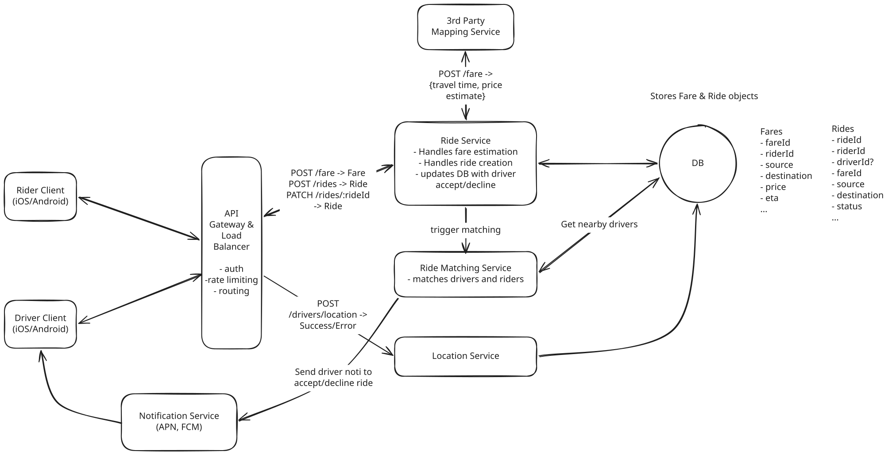

# Uber

**What is Uber?**

Uber is a ride-sharing platform that connects passengers with drivers who offer transportation services in personal vehicles. It allows users to book rides on-demand from their smartphones, matching them with a nearby driver who will take them from their location to their desired destination.

---

## Functional Requirements

1. Riders input a start location and a destination and get a fare estimate.
1. Riders request a ride based on the estimated fare.
1. Upon request, riders are matched with a driver who is nearby and available.
1. Drivers accept/decline a request and navigate to pickup/drop-off.

---

## Non-Functional Requirements

1. Low latency matching(<1 minutes to match or failure)
1. Strong consistency in ride matching
1. High throughput, especially during peak hours or special events(100k requests from same location)


---

## Core Entities

- **Rider**: personal details, preferred payment methods
- **Driver**: personal details, vehicle info, preferences, availability status
- **Fare**: represents an estimated fare for a ride. It includes the pickup and destination locations, the estimated fare, and the estimated time of arrival.
- **Ride**: represents an invididual ride from the moment a rider confirms a fare estimate and requests a ride, all the way until its completion.
- **Location**: the real-time location of drivers. 

---

## API Design

### 1. Get a fare estimate

``` json
POST /fare -> Fare
{
  pickupLocation,
  destination
}
```

### 2. Request a ride based on the estimated fare

The request initiates the ride matching process by signaling the backend to find a suitable driver, thus creating a new ride object.

``` json
POST /rides -> Ride
{
  fareId
}
```

### 3. Update driver location endpoint

This endpoint is used by drivers to update their location in real-time. It is called periodically by the driver client to ensure that the driver's location is always up to date.

``` json
POST /drivers/location -> Success/Error
Authentication: JWT(driverId)
{
  lat, long
}
```

### 4. Accept a ride request

Upon acceptance, the system updates the ride status and provides the driver with the pickup location coordinates.

``` json
PATCH /rides/:rideId -> Ride
{
  accept/deny
}
```

---

## High-Level Design



### 1. Get a fare estimate

**Users will do:**

1. search for their desired destination.
1. make a request to get an estimated price for the ride.
1. request a ride with the given fare or do nothing.


**Event Flow:**

1. make `POST` request with the pickup location and destination to `/fare` endpoint
1. The API Gateway receives the request and handles auth/rate-limiting before forwarding the request to the Ride Service.
1. The Ride Service makes a request to the Third Party Mapping API 
    - to calculate the distance and travel time between the pickup and destination locations
    - to apply the pricing model to the distance and travel time to generate a fare estimate
1. The Ride Service creates a new Fare entity in the DB with the details about the estimated fare.
1. The service returns the Fare entity to the Rider client.
1. The Rider makes a decision about whether accept the fare and request a ride.


**Fare table**

- `fareId`
- `riderId`
- `source`
- `destination`
- `price`
- `eta`
- ...

### 2. Request a ride based on the estimated fare

Requesting a ride by a user creates a new entry in the Ride table in DB. 

**Ride table**

- `rideId`
- `riderId`
- `driverId`
- `fareId`
- `source`
- `destination`
- `status`
- ...

**Event Flow:**

1. The user sends a `POST` request to `/rides` with the `fareId` they are accepting.
1. The request is forwarded to the Ride Service.
1. The Ride Service creates a new entry in the Ride table, linking to the relevant Fare that was accepted, and initializing the Ride's status as `requested`.
1. Next, it triggers the matching flow to assign a driver to the ride.


### 3. Riders should be matched with a driver who is nearby and available

**New Components:**

- **Driver Client**: 
    - the interface for drivers to receive ride requests and provide location updates.
    - It communicates with the Location Service to send real-time location updates.
- **Location Service**:
    - manages the real-time location data of drivers.
    - provides the Ride Matching Service with the latest location data to facilitate accurate and efficient driver matching.
- **Ride Matching Service**:
    - match ride requests with the best available drivers based on proximity, availability, driver rating, and other factors.

**Event Flow:**

1. The user confirms their ride request(`PATCH /rides/:rideId`).
1. The Ride Service creates a ride object and then forwards the request to the Ride Matching Service to trigger the matching workflow.
1. Meanwhile drivers are sending their current location to the Location Service, updating the database with the latest location lat & long.
1. The matching workflow then uses these updated locations to query for the closest available drivers in an attempt to find an optimal match.


### 4. Accept a ride request

**New Components:**

- **Notification Service**: 
    - dispatching real-time notifications to drivers when a new ride request is matched to them.
    - ensures drivers are promptly informed so they can accept ride requests in a timely manner.
    - Notifications are sent via APNs(Apple Push Notification service) and FCM(Firebase Cloud Messaging).

**Request Flow:**

1. After the Ride Matching Service determines the ranked list of eligible drivers, it sends a notification to the top driver on the list via APNs or FCM.
1. The top driver receives the notification and accepts the ride request by sending `PATCH /rides/:rideId`. If decline, the system will send a notification to the next driver on the list.
1. The `PATCH /rides/:rideId` request is routed to the Ride Service. The Service updates the status of the ride to `accepted` and updates the assigned driver accordingly. It then returns the pickup location coordinates to the Driver Client.
1. With the coordinates in hand, the Driver uses on client GPS to navigate to the pickup location.