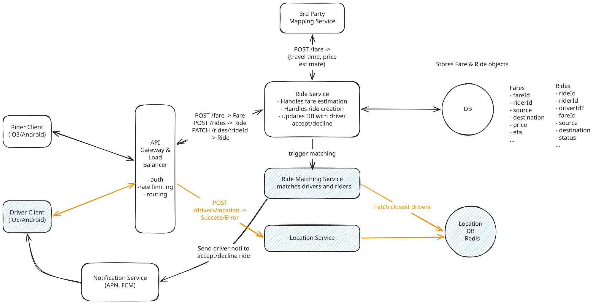
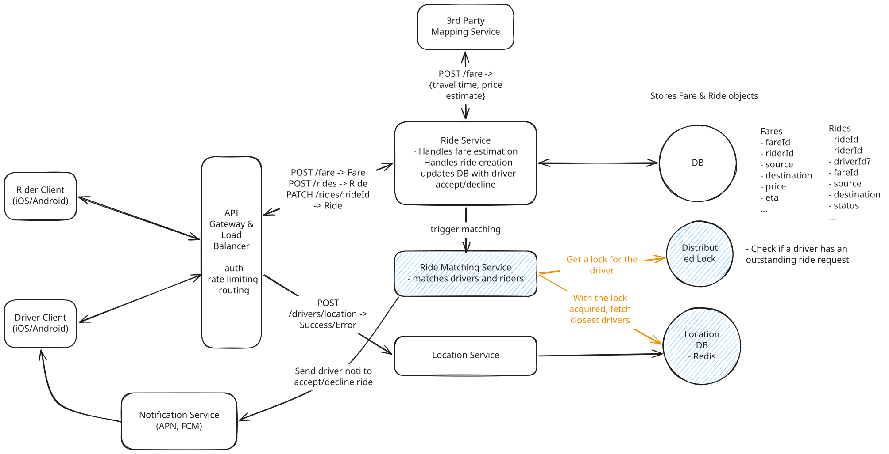
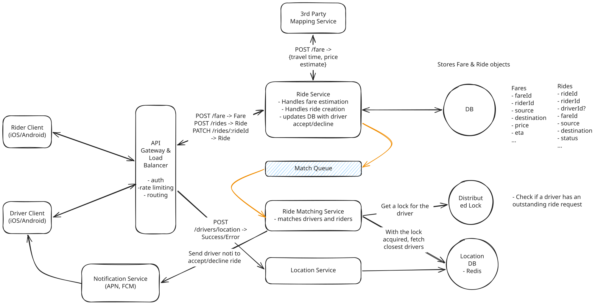
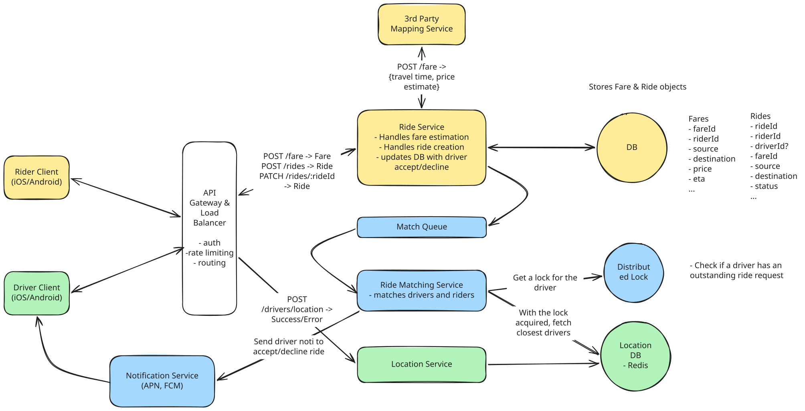

# Uber

## Deep Dives

### 1. How to handle frequent driver location updates and efficient proximity searches on location data?

Two main problems:

1. **High Frequency of Writes**: `10M drivers` / `5 seconds/update` = `2M update/seconds`. Either DynamoDB or PostgreSQL need to be scaled up so much that it becomes prohibitively expensive for most companies.
1. **Query Efficiency**: 
    - query a table based on lat/long we would need to perform a full table scan.
    - Even with indexing on lat/long columns, traditional B-tree indexes are not well-suited for multi-dimensional data like geographical coordinates.

??? warning "Good Solution: Batch Processing and Specialized Geospatial Database"

    **Approach**

    - Updates are aggregated over a short interval and then batch-processed, reducing the number of write operations.
    - For proximity searches, a specialized geospatial database with appropriate indexing is used.
        - Quad-trees index driver locations, allowing for faster proximity searches.
        - Quad-tres partition the space into quadrants recursively, which can significantly speed up the process of finding all drivers within a certain area.
        - PostgreSQL supports a plugin called **PostGIS** that allows to use geospatial data types and functions.

    **Challenges**

    - The interval between batch writes introduces a delay.

??? success "Great Solution: Real-Time In-Memory Geospatial Data Store"

    **Approach**

    Use in-memory datastore like **Redis**, which supports geospatial data types and commands.

        - **geohasing**: encodes latitude and longitude coordinates into a 52-bit integer score within a sorted set, where each number(e.g., `driverId`) is associated with its geohash score.
        - **geospatial commands**:
            - `GEOADD` for adding local data and `GEOSEARCH` for querying nearby locations within a given radius.
            - Since each `GEOADD` command overwrites the previous location for a given driver, we always have the most recent position.
            - To handle stale data from drivers who go offline, we can run a periodic cleanup process.

    **Challenges**

    - **durability** since Redis is an in-memory data store. It can be mitigated in a few ways:
        - **Redis persistence**: enable Redis persistence mechanisms like RDB (Redis Database) or AOF (Append-Only File) to periodically save the in-memory data to disk.
        - **Redis Sentinel**: Sentinel provides automatic failover if the master node goes down, ensuring that a replica is promoted to master.

### 2. How to manage system overload from frequent driver location updates while ensuring location accuracy?

In most candidates original design, they have drivers ping a new location every 5 seconds or so. Can we intelligently reduce the number of pings while maintaining accuracy?

??? success "Great Solution: Adaptive Location Update Intervals"

    **Approach**

    Implement adaptive location update intervals, which dynamically adjust the frequency of location updates based on contextual factors such as speed, direction of travel, proximity to pending ride requests, and driver status.

    The driver's app uses ondevice sensors and algorithms to determine the optimal interval for sending location updates.

    **Challenges**

    the complexity of designing effective algorithms to determine the optimal update frequency.

### 3. How to prevent multiple ride requests to the same driver simultaneously?

- We only request one driver at a time for a given ride request AND that each driver only receives one ride request at a time.
- That driver would then have 10 seconds to accept or deny the request.

??? warning "Good Solution: Database Status Update with Timeout Handling"

    **Approach**

    - When we send a request to a driver, we would update the status of that driver to `outstanding_request`.
        - If the driver accepts the request, we update the status to `accepted`.
        - If they deny it, we update the status to `available`.
    - use a simple timeout mechanism within the Ride Service to ensure that the lock is released if the driver does not respond within the 10 second window.

    **Challenges**

    - If the Ride Service crashes or is restarted, the timeout will be lost and the lock will remain indefinitely.

??? success "Great Solution: Distributed Lock with TTL"

    **Approach**

    Use a distributed lock implemented with an in-memory data store like Redis.

    - When a ride request is sent to a driver, a lock is created with a unique identifier (e.g., `driverId`) and a TTL set to the acceptance window duration of 10 seconds.
    - The Ride Matching Service attempts to acquire a lock on the `driverId` in Redis.
        - If the lock is successfully acquired, it means no other service instance can send a ride request to the same driver.
        - If the driver accepts the ride within the TTL window, the Ride Matching Service updates the ride status to "accepted" in the database, and the lock is released in Redis.
        - If the driver does not accept the ride within the TTL window, the lock in Redis expires automatically.

    **Challenges**

    - the system's reliance on the availability and performance of the in-memory data store for locking.

### 4. How to ensure no ride requests are dropped during peak demand periods?

We need to protect against the case where an instance of the Ride Matching Service crashes or is restarted, leading to dropped rides.

??? failure "Bad Solution: First-Come, First-Served with No Queue"

    **Approach**

    Process ride requests as they come in without any queuing system.

    **Challenges**

    - It does not scale well during high-demand periods.
    - If a Ride Matching Service goes down, any ride requests that were being processed by that instance would be lost.

??? success "Great Solution: Queue with Dynamic Scaling"

    **Approach**

    Use a distributed message queue system like **Kafka**, which allows us to commit the offset of the message in the queue only after we have successfully found a match.

    - When a ride request comes in, it is added to the queue.
    - The Ride Matching Service then processes requests from the queue in a first-come, first-served manner.
    - If the queue grows too large, the system scales horizontally by adding more instances of the Ride Matching Service to handle the increased load.
    - If the Ride Matching Service goes down, the match request would still be in the queue, and a new instance of the service would pick it up.

    **Challenges**

    - the complexity of managing a queueing system
        - To reduce the complexity, use a managed queueing service like Amazon SQS, Amazon MSK (Managed Streaming for Apache Kafka), or Confluent Cloud.
    - FIFO queue problem. you could have requests that are stuck behind a request that is taking a long time to process.
        - use a priority queue instead

### 5. Driver fails to respond in a timely manner

Ideally we'd want the system to move on to the next driver if the current driver doesn't respond in a timely manner.

??? warning "Good Solution: Delay Queue"

    **Approach**

    - When a ride request is sent to a driver, we simultaneously schedule a delayed message in a queue (like Amazon SQS delay queue) that gets processed after the 10-second timeout period.
    - When the delayed message is processed, the system checks if the ride is still unassigned.
    - If so, it automatically moves to the next driver in the ranked list and sends them the ride request, while scheduling another delayed message for the new driver.

    **Challenges**

    - managing the complexity of multiple delayed messages and ensuring they are properly canceled when a driver accepts the ride.
    - requires careful coordination between the delay queue and the ride matching service to ensure consistency and avoid race conditions.

??? success "Great Solution: Durable Execution"

    **Approach**

    Use a durable execution framework like **Temporal** or **AWS Step Functions**.

    With durable execution, the entire ride matching workflow is modeled as a durable workflow that can handle complex business logic, including driver timeouts, retries, and fallback mechanisms.

    The entire process is fault-tolerant and can handle service failures, network issues, and other disruptions without losing state or dropping ride requests.

    **Challenges**

    - the additional complexity of introducing a workflow orchestration system
    - the benefits of guaranteed execution, built-in fault tolerance, and simplified business logic often outweigh these challenges

### 6. How to further scale the system to reduce latency and improve throughput?

??? success "Great Solution: Geo-Sharding with Read Replicas"

    **Approach**

    - Sharding our data geographically and using read replicas to improve read throughput.
    - This applies to everything from our services, message queue, to our databases -- all of which can be sharded geographically.

    **Challenges**

    - the complexity of sharding and managing multiple servers.
        - address this by using consistent hashing to distribute data across shards and by implementing a replication strategy to ensure that data is replicated across multiple servers.

---

## Final Design

- `Yellow`: request path
- `Blue`: match path
- `Green`: update location path