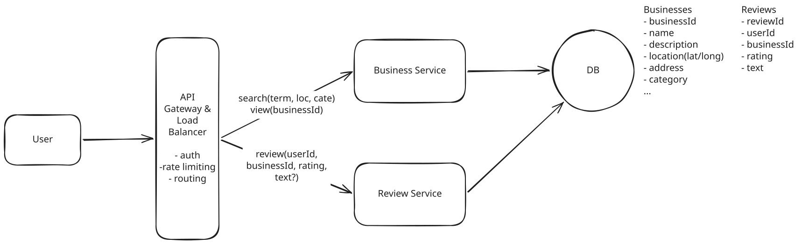

# Yelp

**What is Yelp?**

Yelp is an online platform that allows users to search for and review local businesses, restaurants, and services.

---

## Functional Requirements

1. Users **search for business** by name, location (lat/long), and category
1. Users **view businesses** (and their reviews)
1. Users **leave reviews** on businesses (1-5 star rating and optional text)

**Out of Scope:**

- Admins add, update, and remove businesses
- Users view businesses on a map
- Users are recommended businesses relevant to them


---

## Non-Functional Requirements

1. low latency for search (<500ms)
1. highly available, eventual consistency
1. scalable to handle 100M daily users and 10M businesses

**Out of Scope:**

- fault tolerant
- protect against spam and abuse

---

## Core Entities

- **Business**
- **User**
- **Review**

---

## API Design

### 1. Search for businesses

``` json
GET /businesses?query&location&category&page -> []Business
```

### 2. View businesses

``` json
// View business details
GET /businesses/:businessId -> Business

// View reviews for a business
GET /businesses/:businessId/reviews?page= -> []Review
```

### 3. Leave a review

``` json
POST /businesses/:businessId/reviews
{
  rating: number,
  text?: string
}
```

---

## High-Level Design



### 1. Search for businesses

**Event Flow:**

1. The client sends a GET request to `/businesses` with the search params.
1. The Business Service queries the database based on the search criteria.
1. The results are returned to the client.


### 2. View businesses

The next user action is to click on a business to view it's details.

**Event Flow:**

1. The client sends a GET request to `/businesses/:businessId`.
1. The Business Service retrieves business details and reviews from the Database.
1. The combined information is returned to the client.


### 3. Leave a review

We'll need to introduce one new service, the Review Service. This will handle the creation and management of reviews.

- Users search/view for businesses a lot
- but they hardly ever leave reviews

**Event Flow:**

1. The client sends a POST request to `/businesses/:businessId/reviews` with the review data.
1. The Review Service stores it in the database.
1. A confirmation is sent back to the client.