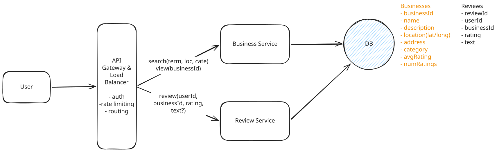

# Local Delivery Service

## Deep Dives

### 1. How to efficiently calculate and update the average rating for businesses to ensure it's readily available in search results?

Calculating the average rating on the fly for every search query would be terribly inefficient.

??? success "Great Solution: Synchronous Update with Optimistic Locking"

    **Approach**

    - Introduce a new column, `num_reviews`, into the Business table.
    - To update an average rating, we simple calculate `(old_rating * num_reviews + new_rating) / (num_reviews + 1)`

    **Challenges**

    What happens if multiple reviews come in at the same time for the same business? One could overwrite the other, leading to an inconsistent state!

    To solve this issue, we can use **optimistic locking**. Optimistic locking is a technique where we check if the current state of the business has changed before attempting to update it. If the state has changed since we read it, our update fails.




### 2. How to ensure a user can only leave one review per business?

It stops competitors from repeatedly leaving negative reviews (such as 1-star ratings) on their rivals' businesses.

??? success "Great Solution: Database Constraint"

    **Approach**

    This can be done via a unique constraint on the user_id and business_id fields.
        
    ``` sql
    ALTER TABLE reviews
    ADD CONSTRAINT unique_user_business UNIQUE (user_id, business_id);
    ```

### 3. How to improve search to handle complex queries more efficiently?

This is the crux of the interview. The challenge is that searching by latitude and longitude in a traditional database without a proper indexing is highly inefficient for large datasets. The below query performs a full table scan.

``` sql
SELECT * 
FROM businesses 
WHERE latitude > 10 AND latitude < 20 
AND longitude > 10 AND longitude < 20
AND name LIKE '%coffee%';
```

??? success "Great Solution: ElasticSearch"

    **Approach**

    Indexing strategies per type:

    - **Location**: use a geospatial index like `geohashes`, `quadtrees`, or `R-trees`.
    - **Name**: use a full text search index which uses a technique called `inverted indexes` to quickly search for terms in a document.
    - **Category**: use a simple `B-tree index`.

    **ElasticSearch** support all three of these indexing strategies. Elasticsearch is a search optimized database that is purpose built for fast search queries. We can issue a single search query to Elasticsearch that combines all of our filters and returns a ranked list of businesses.

    ``` json
    {
    "query": {
        "bool": {
        "must": [
            {
            "match": {
                "name": "coffee"
            }
            },
            {
            "geo_distance": {
                "distance": "10km",
                "location": {
                "lat": 40.7128,
                "lon": -74.0060
                }
            }
            },
            {
            "term": {
                "category": "coffee shop"
            }
            }
        ]
        }
    }
    }
    ```

    **Challenges**

    - ElasticSearch is not considered a primary database as:
        - not optimized to maintain transactional data integrity with full ACID compliance.
        - not optimized to handle complex transactions.
    - Use a **Change Data Capture(CDC)** to ensure the data in Elasticsearch remains in sync (consistent) with our primary database.

??? success "Great Solution: Postgres with Extensions"

    **Approach**

    use Postgres with the appropriate extensions enabled.

    - **PostGIS** extension can be used to index and query geographic data.
    - **pg_trgm** extension can be used to index and query text data.

    Given that this is a small amount of data, `10M businesses x 1kb each = 10GB + 10M businesses x 100 reviews each x 1kb = 1TB`, we don't need to worry too much about scaling.


### 4. How to allow searching by predefined location names such as cities or neighborhoods?

Users often search using more natural language terms like city names or neighborhood names. For example, Pizza in NYC.

We need a way to define a polygon for each location and then check if any of the businesses are within that polygon.

We simply need a way to:

1. Go from a location name to a polygon.
    1. Create a `locations` table in DB with columns for `name`(San Francisco), `type`(city or neighborhood), and `polygon`(geographic data).
    1. Index the `name` column for efficient lookups.
1. Use that polygon to filter a set of businesses that exist within it.
    - both Postgres via the PostGIS extension and Elasticsearch have functionality for working with polygons which they call Geoshapes or Geopoints respectively.
    - In the case of Elasticsearch, we can simply add a new `geo_shape` field to our business documents and use the `geo_shape` query to find businesses that exist within a polygon.
    - we can pre-compute the areas for each business upon creation and store them as a list of location identifiers in our business table. Now all we need is an inverted index on the location_names field via a "keyword" field in ElasticSearch.
    
    ``` json
    {
    "id": "123",
    "name": "Pizza Place",
    "location_names": ["bay_area","san_francisco", "mission_district"],
    "category": "restaurant"
    }
    ```


---

## Final Design


