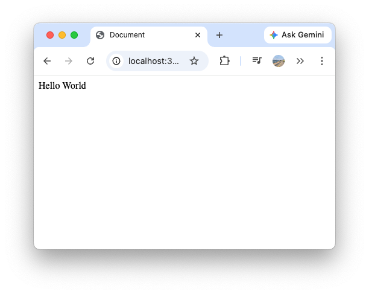
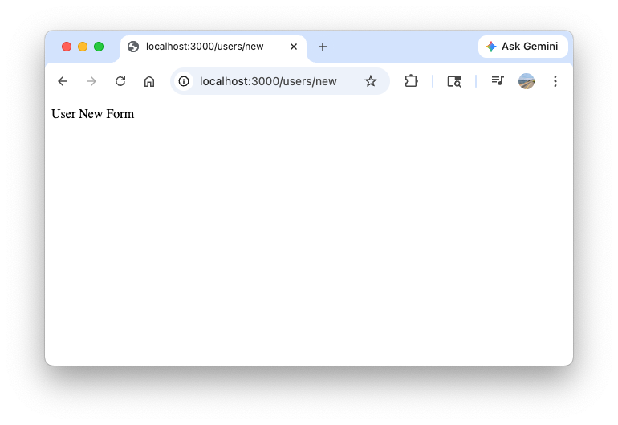
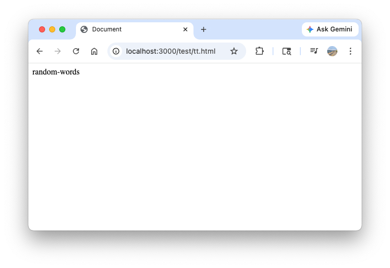
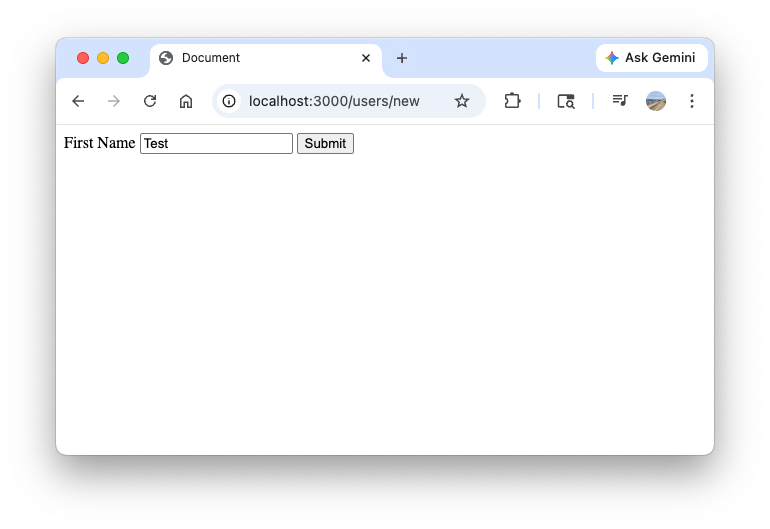
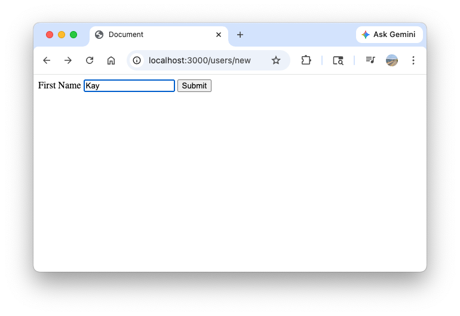
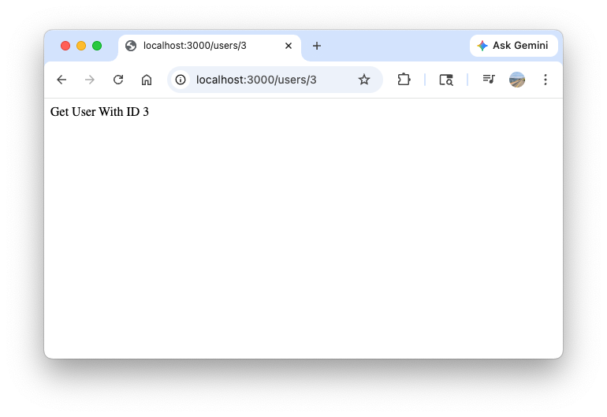
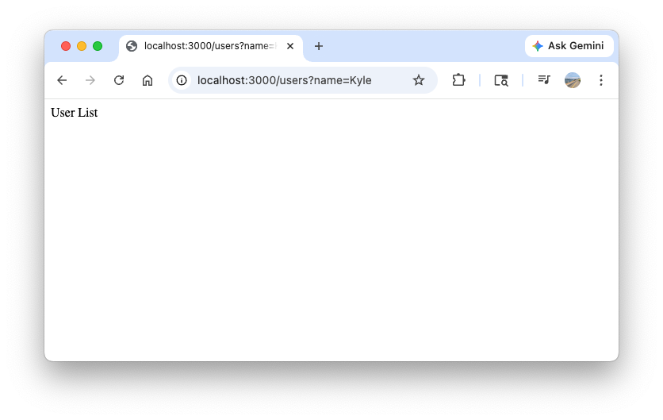

# Learn Express JS in 35 Minutes

!!! Note

    The following content is based on the YouTube video [Learn Express JS In 35 Minutes](https://www.youtube.com/watch?v=SccSCuHhOw0). Please refer to [the codebase](https://github.com/WebDevSimplified/express-crash-course/tree/main) to follow the instructions below.

## Project Setup

Initialize the project by generating a `package.json` file with default configurations:
``` bash
npm init -y

Wrote to /<redacted>/express-crash-course/package.json:

{
  "name": "express-crash-course",
  "version": "1.0.0",
  "description": "",
  "main": "index.js",
  "scripts": {
    "test": "echo \"Error: no test specified\" && exit 1"
  },
  "keywords": [],
  "author": "",
  "license": "ISC",
  "type": "commonjs"
}
```

Install **Express**, the primary framework for our application:
``` bash
npm i express

added 65 packages, and audited 66 packages in 2s
```

The installation adds Express to the `dependencies` section of the `package.json` file:
``` json title="package.json"
{
...
  "license": "ISC",
  "type": "commonjs",
  "dependencies": {
    "express": "^5.2.1"
  }
}
```

Next, install **Nodemon** as a development dependency:
``` bash
npm i --save-dev nodemon

added 26 packages, and audited 92 packages in 8s
```

Nodemon is a utility that monitors for any changes in your source and automatically restarts your server. Configure a custom script in `package.json` to facilitate this:
``` json hl_lines="2"
  "scripts": {
    "devStart": "nodemon server.js",
    "test": "echo \"Error: no test specified\" && exit 1"
  },
```

Create a `server.js` file in the root directory. The resulting project structure should appear as follows:
``` bash
tree -L 1
.
├── node_modules
├── package-lock.json
├── package.json
└── server.js
```

Executing `npm run devStart` will now run `server.js` through Nodemon, based on the configuration defined in `package.json`.

---
## Server Setup

``` js title="server.js"
const express = require('express')
const app = express()

app.listen(3000)
```

- **`require('express')`**: Imports the Express library into your project.
- **`express()`**: Creates an instance of an Express application, which we've named `app`.
- **`app.listen(3000)`**: Tells the server to start listening for incoming requests on port `3000`.


---
## Basic Routing & Rendering HTML

To render HTML templates, install the **EJS (Embedded JavaScript)** view engine:
``` bash
npm i ejs

added 2 packages, and audited 94 packages in 784ms
```

Configure Express to use EJS and define a basic route:
``` js hl_lines="4-9" title="server.js"
const express = require('express')
const app = express()

app.set('view engine', 'ejs')

app.get('/', (req, res) => {
  console.log("Here")
  res.render('index', {text: "World"})
})

app.listen(3000)
```

- **`app.set('view engine', 'ejs')`**: Configures the application to use EJS as the template engine for rendering views.
- **`app.get('/', ...)`**: Defines a route handler for GET requests to the root URL (`/`).
- **`res.render('index', {text: "World"})`**: Renders the `index.ejs` file located in the `views` directory and passes a data object (`{text: "World"}`) to the template.

Create the template file to display dynamic content:
``` html hl_lines="9" title="views/index.ejs"
<!DOCTYPE html>
<html lang="en">
<head>
  <meta charset="UTF-8">
  <meta name="viewport" content="width=device-width, initial-scale=1.0">
  <title>Document</title>
</head>
<body>
  Hello <%= locals.text || 'Default' %>
</body>
</html>
```

- **`<%= locals.text %>`**: EJS syntax used to output the value of the `text` variable passed from the server into the HTML.



When you navigate to `http://localhost:3000`, the server renders the `index.ejs` template, resulting in "Hello World" being displayed in the browser as shown above.

---
## Routers

To keep your application organized, you can extract related routes into separate files using Express Routers.

``` js hl_lines="11 13" title="server.js"
const express = require('express')
const app = express()

app.set('view engine', 'ejs')

app.get('/', (req, res) => {
  console.log("Here")
  res.render('index', {text: "World"})
})

const userRouter = require('./routes/users')

app.use('/users', userRouter)

app.listen(3000)
```

- **`require('./routes/users')`**: Imports the router module defined in the `routes/users.js` file.
- **`app.use('/users', userRouter)`**: Mounts the `userRouter` middleware at the `/users` path. This means any request starting with `/users` will be handled by this router.

Create the router file to handle user-specific routes:

``` js title="routes/users.js"
const express = require('express')
const router = express.Router()

router.get('/', (req, res) => {
  res.send("User List")
})

router.get('/new', (req, res) => {
  res.send('User New Form')
})

module.exports = router
```

- **`express.Router()`**: Creates a new, isolated router object. You can define routes on this object just like you do on the main `app`.
- **`router.get('/', ...)`**: Defines a route for the root of this router (which resolves to `/users` based on how it's mounted in `server.js`).
- **`router.get('/new', ...)`**: Defines a route for `/new` relative to this router (resolves to `/users/new`).
- **`module.exports = router`**: Exports the router object so it can be imported and used in other files, like our `server.js`.



When navigating to `http://localhost:3000/users/new`, the application uses the `userRouter` to match the `/new` path and responds with the "User New Form" text.

---
## Advanced Routing

### User CRUD

The following routes demonstrate basic CRUD (Create, Read, Update, Delete) operations using dynamic path parameters.

``` js hl_lines="6-16" title="routes/users.js"
const express = require('express')
const router = express.Router()

...

router.get('/:id', (req, res) => {
  res.send(`Get User With ID ${req.params.id}`)
})

router.put('/:id', (req, res) => {
  res.send(`Update User With ID ${req.params.id}`)
})

router.delete('/:id', (req, res) => {
  res.send(`Delete User With ID ${req.params.id}`)
})

module.exports = router
```

- **`/:id`**: Defines a dynamic parameter named `id`. Express will capture whatever value is provided in that segment of the URL.
- **`req.params.id`**: Provides access to the value of the `id` parameter extracted from the URL.
- **HTTP Methods**:
    - **`GET`**: Used to retrieve a specific user resource.
    - **`PUT`**: Used to update an existing user resource.
    - **`DELETE`**: Used to remove a specific user resource.

### User CRUD using `router.route()`

To reduce redundancy when multiple HTTP methods share the same path, you can use `router.route()`. This allows you to chain handlers for different methods on a single route definition.

``` js hl_lines="6-14" title="routes/users.js"
const express = require('express')
const router = express.Router()

...

router
  .route('/:id')
  .get((req, res) => {
    res.send(`Get User With ID ${req.params.id}`)
}).put((req, res) => {
    res.send(`Update User With ID ${req.params.id}`)
}).delete((req, res) => {
    res.send(`Delete User With ID ${req.params.id}`)
})

module.exports = router
```

- **`router.route('/:id')`**: Returns an instance of a single route which you can then use to handle HTTP verbs with optional middleware. 
- **Chaining**: Methods like `.get()`, `.put()`, and `.delete()` are chained together, significantly improving code readability and maintainability by grouping all logic for a specific path in one place.

### Handling Path Parameters with `router.param()`

``` js hl_lines="9 17-21" title="routes/users.js"
const express = require('express')
const router = express.Router()

...

router
  .route('/:id')
  .get((req, res) => {
    console.log(req.user)
    res.send(`Get User With ID ${req.params.id}`)
}).put((req, res) => {
    res.send(`Update User With ID ${req.params.id}`)
}).delete((req, res) => {
    res.send(`Delete User With ID ${req.params.id}`)
})

const users = [{ name: "Kyle" }, { name: "Sally" }]
router.param("id", (req, res, next, id) => {
  req.user = users[id]
  next()
})

module.exports = router
```

- **`router.param('id', ...)`**: A type of middleware that runs specifically when the URL contains the `id` parameter. This is useful for pre-loading data or performing validation across all routes that share the same path parameter.
- **`req.user = users[id]`**: In this example, the middleware looks up the user in a local array using the provided `id` and attaches it to the `req` object, making it accessible in the subsequent route handlers (e.g., `console.log(req.user)`).
- **`next()`**: Mandatory call to pass control to the next middleware or route handler in the stack.

---
## Middleware

Middleware functions are functions that have access to the request object (`req`), the response object (`res`), and the next middleware function in the application's request-response cycle. They can execute code, make changes to the request and response objects, end the request-response cycle, or call the next middleware in the stack.

### Global middleware

In this example, we define a global `logger` middleware that logs the requested URL for every incoming request.

``` js hl_lines="5 16-19" title="server.js"
const express = require('express')
const app = express()

app.set('view engine', 'ejs')
app.use(logger)

app.get('/', (req, res) => {
  console.log("Here")
  res.render('index', {text: "World"})
})

const userRouter = require('./routes/users')

app.use('/users', userRouter)

function logger(req, res, next) {
  console.log(req.originalUrl)
  next()
}

app.listen(3000)
```

- **`app.use(logger)`**: Registers the `logger` function as global middleware. Because it's defined at the top level without a specific path, it will run for every single request made to the server.
- **`function logger(req, res, next)`**:
    - **`req` / `res`**: Standard Express request and response objects.
    - **`next`**: A callback function that, when invoked, executes the next middleware in the pipeline.
- **`next()`**: **Crucial step.** If you don't call `next()`, the request will be left hanging, and the server will never send a response to the client.

Once registered, any access to an endpoint will trigger the log in your terminal:

``` bash hl_lines="4 6"
...
[nodemon] restarting due to changes...
[nodemon] starting `node server.js`
/users/1
{ name: 'Sally' }
/
Here
```

### Local middleware

Unlike global middleware which runs for every request, local middleware is applied only to specific routes. This is achieved by passing the middleware function as an additional argument to the route handler method.

``` js hl_lines="5 7" title="server.js"
const express = require('express')
const app = express()

app.set('view engine', 'ejs')
// app.use(logger)

app.get('/', logger, (req, res) => {
  console.log("Here")
  res.render('index', {text: "World"})
})
```

- **`app.get('/', logger, ...)`**: In this configuration, the `logger` middleware will only execute for GET requests to the root URL (`/`). Other routes, such as `/users`, will not trigger the logger.
- **Execution Order**: When a request matches the route, Express executes the middleware in the order they are provided as arguments. In this case, `logger` runs first, calls `next()`, and then the final request handler is executed.

---
## Rendering Static Files

Express provides a built-in middleware function, `express.static`, to serve static files such as images, CSS, and JavaScript.

=== "server.js"

    ``` js hl_lines="4" title="server.js"
    const express = require('express')
    const app = express()

    app.use(express.static('public'))

    app.set('view engine', 'ejs')

    const userRouter = require('./routes/users')

    app.use('/users', userRouter)

    app.listen(3000)
    ```

=== "tt.html"

    ``` html hl_lines="9" title="public/test/tt.html"
    <!DOCTYPE html>
    <html lang="en">
    <head>
      <meta charset="UTF-8">
      <meta name="viewport" content="width=device-width, initial-scale=1.0">
      <title>Document</title>
    </head>
    <body>
      random-words
    </body>
    </html>
    ```

- **`app.use(express.static('public'))`**: This line tells Express to serve all files located in the `public` directory as static assets.
- **Path Resolution**: Files are served relative to the static directory. For example, if you have a file at `public/test/tt.html`, it will be accessible in the browser at `http://localhost:3000/test/tt.html`.

``` bash hl_lines="7-10"
tree -L 3
.
├── node_modules
...
├── package-lock.json
├── package.json
├── public
│   ├── index.html
│   └── test
│       └── tt.html
├── routes
│   └── users.js
├── server.js
└── views
```



When you access a path that matches a file in the `public` folder, Express returns that file directly instead of looking for a matching route handler.

---
## Parsing Form/JSON Data

### Passing Data to HTML Templates

Express enables passing data from your route handlers directly into your HTML templates. In this example, a JavaScript object `{ firstName: "Test" }` is passed to the `users/new.ejs` view, where it is accessed and rendered using `locals.firstName`.

=== "users.js"

    ``` js hl_lines="8-10"
    const express = require('express')
    const router = express.Router()

    router.get('/', (req, res) => {
      res.send("User List")
    })

    router.get('/new', (req, res) => {
      res.render("users/new", { firstName: "Test" })
    })

    router.post('/', (req, res) => {
      res.send('Create User')
    })
    ...
    ```

=== "views/users/new.ejs"

    ``` html hl_lines="12"
    <!DOCTYPE html>
    <html lang="en">
    <head>
      <meta charset="UTF-8">
      <meta http-equiv="X-UA-Compatible" content="IE=edge">
      <meta name="viewport" content="width=device-width, initial-scale=1.0">
      <title>Document</title>
    </head>
    <body>
      <form action="/users" method="POST">
        <label>First Name
          <input type="text" name="firstName" value="<%= locals.firstName %>" />
        </label>
        <button type="submit">Submit</button>
      </form>
    </body>
    </html>
    ```



When navigating to the `/users/new` path, Express renders the template with the injected `firstName` value, pre-populating the form field accordingly.


### Handling Form Submissions and Data Persistence

To process data sent from an HTML form, your server must be configured to parse the request body. The following example demonstrates how to use the built-in `express.urlencoded` middleware to capture form input and persist it within a server-side data structure.

=== "server.js"

    ``` js hl_lines="5"
    const express = require('express')
    const app = express()

    app.use(express.static('public'))
    app.use(express.urlencoded({ extended: true }))
    ...
    ```

    - **`app.use(express.urlencoded({ extended: true }))`**: This middleware is essential for parsing `application/x-www-form-urlencoded` data, which is the default format for HTML form submissions. It populates the `req.body` object with the submitted data.

=== "routes/users.js"

    ``` js hl_lines="6-10 18-21" title="routes/users.js"
    ...
    router.get('/new', (req, res) => {
      res.render("users/new", { firstName: "Test" })
    })

    router.post('/', (req, res) => {
      const isValid = true
      if (isValid) {
        users.push({ firstName: req.body.firstName })
        res.redirect(`/users/${users.length - 1}`)
      } else {
        console.log("Error")
        res.render("users/new", { firstName: req.body.firstName })
      }
    })
    ...

    router
      .route('/:id')
      .get((req, res) => {
        console.log(req.user)
        res.send(`Get User With ID ${req.params.id}`)
    }).put((req, res) => {
        res.send(`Update User With ID ${req.params.id}`)
    }).delete((req, res) => {
        res.send(`Delete User With ID ${req.params.id}`)
    })

    const users = [{ name: "Kyle" }, { name: "Sally" }]
    router.param("id", (req, res, next, id) => {
      req.user = users[id]
      next()
    })


    module.exports = router
    ```

    - **`req.body.firstName`**: Accesses the value of the input field with the `name="firstName"` attribute defined in the HTML form.
    - **POST Request Flow**:
        1. **Parsing**: The `urlencoded` middleware extracts data from the request body.
        2. **Validation**: A simple conditional checks if the data is valid.
        3. **Persistence**: Valid data is pushed into the `users` array.
        4. **Redirection/Re-rendering**: If successful, the server redirects the user to the newly created resource. If validation fails, the server re-renders the form, often passing back the submitted data to preserve user input.

The sequence of actions for a successful submission is as follows:

1. **Form Submission**: The user enters "Kay" into the form and submits the POST request.
    
2. **Data Capture**: The `express.urlencoded` middleware parses the request body, populating `req.body.firstName` with the value "Kay".
3. **Data Persistence**: The application appends the `{ firstName: "Kay" }` object to the server-side `users` array using `users.push()`.
4. **Redirection**: The server issues a `res.redirect()`, instructing the browser to make a new GET request to the user's specific resource path (e.g., `/users/2`).
5. **Parameter Resolution**: When the browser requests the new path, the `router.param("id", ...)` middleware executes, identifying the user at index 2 and attaching it to the `req.user` object.
6. **Server Logging**: The `GET /users/:id` route handler receives the request, and `console.log(req.user)` outputs the resolved user object `{ firstName: 'Kay' }` to the terminal.
7. **Final Response**: The server sends the final response to the browser, rendering the confirmation message "Get User With ID 2".
    


---
## Parsing Query Parameters

Query parameters are key-value pairs appended to the end of a URL after a question mark (`?`). They are commonly used for filtering, sorting, or passing small amounts of data to the server. Express automatically parses these parameters and makes them available through the `req.query` object.

``` js hl_lines="5" title="routes/users.js"
const express = require('express')
const router = express.Router()

router.get('/', (req, res) => {
  console.log(req.query.name)
  res.send("User List")
})
...
```

- **`req.query`**: An object containing a property for each query string parameter in the route. For example, a request to `/users?name=Kyle` will result in `req.query` being `{ name: 'Kyle' }`.
- **Multiple Parameters**: You can pass multiple parameters by separating them with an ampersand (`&`), such as `/users?name=Kyle&age=25`, which would be parsed as `{ name: 'Kyle', age: '25' }`.



In the example above, navigating to `http://localhost:3000/users?name=Kyle` triggers the route handler, and the value of the `name` parameter is logged to the server terminal:

``` bash
[nodemon] restarting due to changes...
[nodemon] starting `node server.js`
Kyle
```
