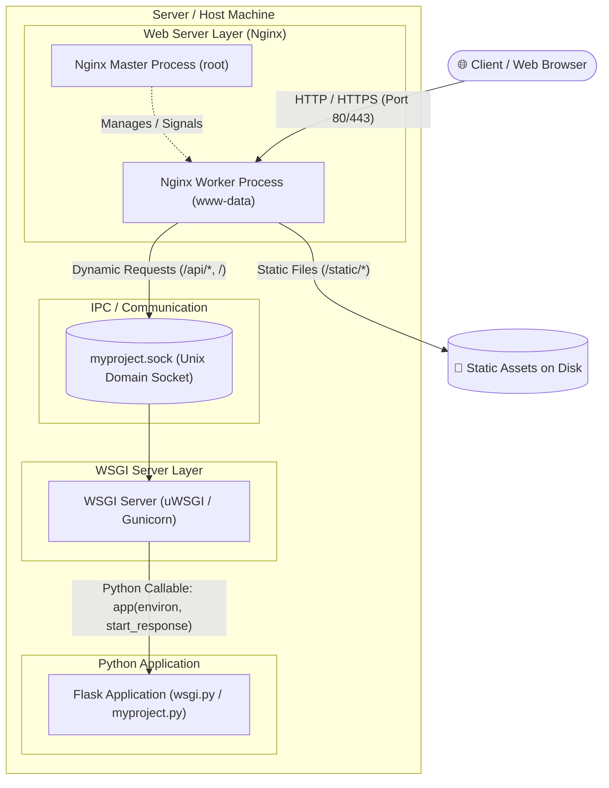
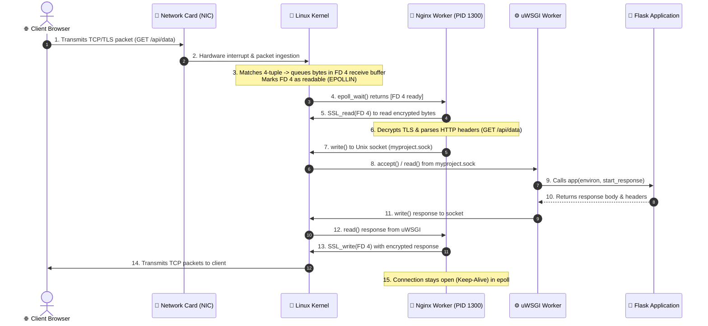
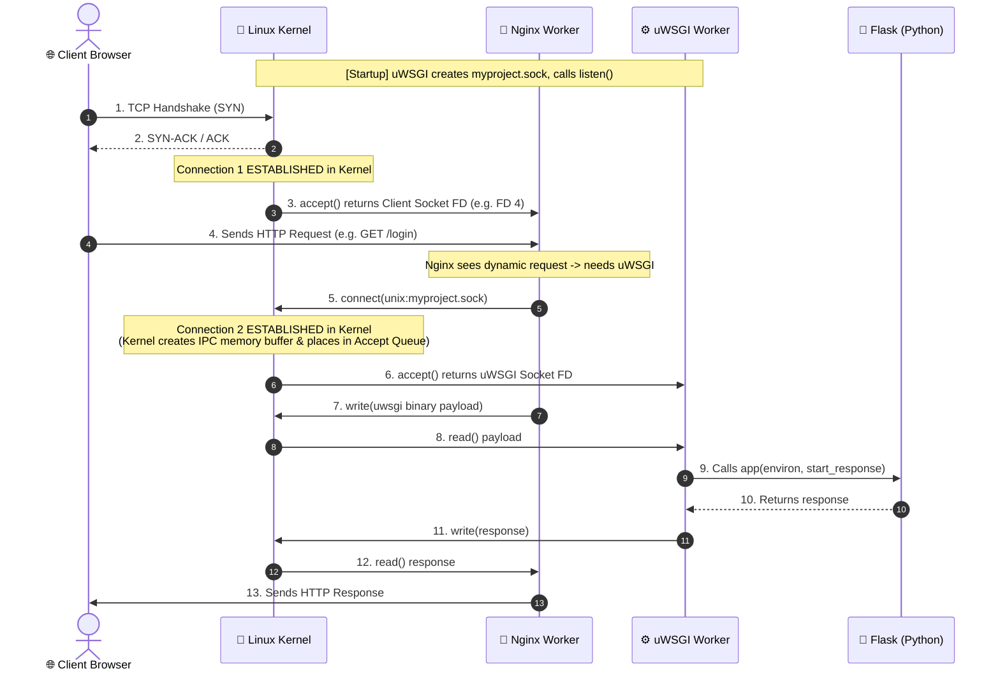

# Nginx + WSGI + Flask Architecture

When deploying a Python web application like Flask in production, **Nginx**, a **WSGI server** (e.g., uWSGI or Gunicorn), and **systemd** work together to provide a secure, fast, and resilient web stack.

---

## 1. High-Level Architecture & Responsibilities



### Component Breakdown

| Component | Role | What It Excels At | What It Cannot / Should Not Do |
| :--- | :--- | :--- | :--- |
| **Nginx** | Reverse proxy, static file server, TLS terminator | High-concurrency I/O, SSL handling, caching, serving static files (`.css`, `.js`, images), DDoS/rate limiting. | Cannot execute Python code directly. |
| **WSGI Server** *(uWSGI / Gunicorn)* | Python application server | Managing Python worker processes/threads, translating HTTP/socket requests to WSGI environment objects. | Inefficient at serving large static files, SSL termination, or managing slow client connections. |
| **Flask** | Web framework & application logic | Routing, business logic, database queries, template rendering, and API response generation. | Not designed to be exposed directly to public internet traffic or manage production concurrency. |

---

## 2. What Nginx and WSGI Do Each

### What Nginx Does
Nginx sits at the outer perimeter of the server, listening on public ports (80 for HTTP, 443 for HTTPS):

1. **Reverse Proxying:** Forwards dynamic requests to the backend WSGI server via a Unix domain socket or local TCP port.
2. **Static File Serving:** Directly delivers images, stylesheets, and scripts from the filesystem without involving Python, saving significant memory and CPU.
3. **SSL/TLS Termination:** Decrypts HTTPS traffic before forwarding plain requests internally.
4. **Security & Connection Handling:** Buffers slow client connections (mitigating Slowloris attacks), enforces rate limits, and blocks malicious IPs.
5. **Load Balancing:** Can distribute incoming requests across multiple WSGI application instances.

### What WSGI Does
**WSGI** (*Web Server Gateway Interface*, defined in [PEP 3333](https://peps.python.org/pep-3333/)) is the standard calling convention for web servers to forward requests to Python web frameworks:

1. **Request Translation:** Converts raw bytes from HTTP/sockets into Python dictionaries (`environ`) and provides a response callback (`start_response`).
2. **Process / Worker Management:** Spawns and manages worker processes/threads to handle concurrent Python requests.
3. **Application Execution:** Invokes the Flask entry point (e.g., `app` in `wsgi.py`), collects the status code, headers, and body returned by Flask, and passes them back to Nginx.

---

## 3. Nginx Process Model: Master vs. Worker Processes

Nginx does **not** run as a single monolithic process. Instead, it utilizes an asynchronous **Master-Worker architecture**:

```
[ Linux Kernel (Ports 80 & 443) ]
           │
     ┌─────┴─────────────────────┐
     ▼                           ▼
┌──────────────────────┐   ┌──────────────────────┐
│  Nginx Master (root) │   │ Nginx Worker (www-data)
│  PID: 961            │   │ PID: 1300            │
│                      │   │                      │
│ • Reads configuration│   │ • epoll event loop   │
│ • Binds ports 80/443 │   │ • Accepts connections│
│ • Manages workers    │   │ • Serves HTTP/HTTPS  │
└──────────┬───────────┘   └──────────▲───────────┘
           │ (socketpair IPC)         │
           └──────────────────────────┘
```

### 1. The Master Process (`root`)
* **Privilege:** Runs as `root` so it can bind to privileged low ports (`80` and `443`).
* **Role:** Does **not** process HTTP requests or handle client traffic. Its job is reading configuration files, managing worker lifecycles, and applying zero-downtime configuration reloads (`systemctl reload nginx`).
* **Communication:** Communicates with workers using private Unix domain socket pairs (`socketpair`).

### 2. The Worker Processes (`www-data` or `nginx`)
* **Privilege:** Drop privileges to run as an unprivileged user (e.g., `www-data`).
* **Scale:** Configured via `worker_processes auto;` (typically 1 worker process per CPU core).
* **Role:** The workers do all the actual work: calling `accept()` on incoming connections, handling TLS handshakes, serving static files, and proxying requests to uWSGI.

---

## 4. Inspecting Sockets and File Descriptors with `lsof`

In Linux, sockets are represented as **File Descriptors (FDs)**. We can inspect the internal file descriptor tables of Nginx processes using `sudo lsof -p <PID>`.

### A. The Master Process (`PID 961`)
```text
COMMAND PID USER  FD   TYPE             DEVICE SIZE/OFF  NODE NAME
nginx   961 root   5u  IPv4              10618      0t0   TCP *:http (LISTEN)
nginx   961 root   7u  IPv4              10620      0t0   TCP *:https (LISTEN)
nginx   961 root   9u  unix 0xffff8aa08d115100      0t0 12617 type=STREAM (CONNECTED)
nginx   961 root  10u  unix 0xffff8aa08cc85100      0t0 12618 type=STREAM (CONNECTED)
```

* **`FD 5u`, `FD 7u` (LISTEN):** These are the server's **listening sockets** waiting for new incoming TCP connections on ports 80 and 443.
* **`FD 9u`, `FD 10u` (CONNECTED):** Internal Unix domain socket pairs (`socketpair`) used by the Master to send control signals to worker processes.

---

### B. The Worker Process (`PID 1300`) with Active Client Connections
```text
COMMAND  PID     USER  FD      TYPE     DEVICE SIZE/OFF  NODE NAME
nginx   1300 www-data   4u     IPv4      83787      0t0   TCP server-ip:https->client-ip:57196 (ESTABLISHED)
nginx   1300 www-data   5u     IPv4      10618      0t0   TCP *:http (LISTEN)
nginx   1300 www-data   7u     IPv4      10620      0t0   TCP *:https (LISTEN)
nginx   1300 www-data   8u     IPv4      83791      0t0   TCP server-ip:https->client-ip:57197 (ESTABLISHED)
nginx   1300 www-data  10u     unix 0xffff...       0t0 12618 type=STREAM (CONNECTED)
nginx   1300 www-data  11u  a_inode       0,17        0    76 [eventpoll:4,5,7,8,10,12]
```

* **`FD 4u` & `FD 8u` (`ESTABLISHED`):** These are the **actual client socket FDs** created when Nginx accepted connections from the browser. 
    * Browsers open multiple parallel connections (ports `57196` and `57197`) to fetch page assets concurrently over HTTP Keep-Alive.
* **`FD 11u` (`[eventpoll:4,5,7,8,10,12]`):** The Linux kernel **`epoll`** instance monitoring all active sockets simultaneously.

---

## 5. The Linux Kernel `epoll` Event Loop

Why can a single Nginx worker process handle tens of thousands of concurrent connections with minimal CPU usage? The secret is the **Linux `epoll` subsystem**.

```
┌────────────────────────────────────────────────────────┐
│ Nginx Worker calls epoll_wait()                        │
│ └── Worker sleeps in kernel (0% CPU usage)             │
└──────────────────────────┬─────────────────────────────┘
                           │
       (A network packet arrives on ANY socket)
                           ▼
┌────────────────────────────────────────────────────────┐
│ Linux Kernel wakes up Nginx Worker                     │
│ └── Returns a list of ONLY the sockets that are ready  │
└──────────────────────────┬─────────────────────────────┘
                           │
                           ▼
┌────────────────────────────────────────────────────────┐
│ Nginx handles the ready socket(s) immediately:         │
│                                                        │
│ • If FD 7 is ready ──► New visitor! Call accept()      │
│ • If FD 4 is ready ──► Client sent data! Call read()   │
│ • If FD 10 is ready ─► Master sent signal! Reload/exit │
└──────────────────────────┬─────────────────────────────┘
                           │
                           ▼
              (Goes back to epoll_wait())
```

### How `[eventpoll:4,5,7,8,10,12]` Works in Practice

1. **Passive Waiting (0% CPU):**
   The worker process calls `epoll_wait()`. The Linux kernel puts the process to sleep. It consumes zero CPU cycles while idle.
2. **Instant Event-Driven Wakeup:**
   The moment activity occurs on *any* of the registered descriptors:
   * **New Client Connection (`FD 5` or `FD 7`):** The kernel triggers a read event; Nginx calls `accept()` to get a new client socket FD (e.g., `FD 4`).
   * **Incoming HTTP Request Data (`FD 4` or `FD 8`):** The kernel marks the socket with `EPOLLIN`; Nginx wakes up to read the HTTP request.
   * **Master Process Signal (`FD 10`):** Nginx wakes up to execute configuration reload or shutdown.
3. **$O(1)$ Scalability:**
   Unlike older mechanisms like `select()` or `poll()` which iterate through all $N$ connections in $O(N)$ time, `epoll` delivers ready events in $O(1)$ time regardless of whether you have 10 or 100,000 idle connections.

---

## 6. End-to-End Request Journey: From Browser to Flask

When a browser sends an HTTP `GET` request over an already established connection, **the request goes directly to the Nginx Worker process and completely bypasses the Nginx Master process**.



### Detailed Execution Steps:
1. **Network Ingestion:** The browser sends TCP packets. The server NIC generates a hardware interrupt and passes packets to the Linux kernel network stack.
2. **4-Tuple Matching:** The kernel inspects the TCP header `(Client IP:57196 -> Server IP:443)` and appends the payload into the socket receive buffer allocated for **`FD 4`** of **Worker PID 1300**.
3. **`epoll` Notification:** The kernel flags `FD 4` with `EPOLLIN` and wakes up Worker PID 1300 from `epoll_wait()`.
4. **Decryption & Parsing:** The worker executes `SSL_read(4, ...)` into memory, decrypts the TLS layer, and parses the HTTP request headers.
5. **Dynamic Routing:** Matching the location block, the worker forwards the payload to `myproject.sock` via the Unix domain socket.
6. **Application Execution:** uWSGI receives the request, constructs the Python `environ` dictionary, and invokes the Flask callable `app(environ, start_response)`.
7. **Response & Keep-Alive:** The response is written back across the pipeline to `FD 4`. Nginx returns `FD 4` to `epoll_wait()` to await the client's next request without tearing down the TCP connection.

---

## 7. Under the Hood: What uWSGI Actually Does

A common question is whether uWSGI creates a new port for each incoming connection in the kernel.

!!! info "Kernel Ports vs. File Descriptors"
    **uWSGI does not create a new port for each connection.**

    * **Under TCP (e.g., `127.0.0.1:8000`):** uWSGI binds to **one** listening port. When connections arrive, the Linux kernel identifies each connection by a 4-tuple `(Source IP, Source Port, Destination IP, Destination Port)` and assigns a unique **File Descriptor (FD)** (e.g., `FD 5`, `FD 6`) to the process. The server destination port never changes.
    * **Under Unix Domain Sockets (`myproject.sock`):** There are **no ports at all**. It is a pure kernel IPC mechanism operating via filesystem inodes and memory buffers.

### The 5 Core Responsibilities of uWSGI

```
[ Nginx Worker ]
    │  (Sends raw binary uwsgi-protocol packets)
    ▼
[ Linux Kernel ] ──► Holds socket queue / allocates File Descriptors
    │
    ▼ (accept() syscall)
[ uWSGI Master & Worker Processes (C Code) ]
    │  1. Parses headers into C structs
    │  2. Translates to Python dictionary (`environ`)
    │  3. Calls Flask: `app(environ, start_response)`
    ▼
[ Embedded CPython Runtime (libpython) ]
    │
    ▼
[ Flask Application (Python) ]
```

1. **Process & Worker Management (Master Process):**
   When configured with `processes = 5`, the uWSGI master process forks 5 worker processes, monitors their memory/CPU health, restarts crashed workers, and supports zero-downtime reloads.
2. **Socket Listening & Accepting Connections (`accept()`):**
   The workers share the listening socket. When a connection arrives, an idle worker receives the specific connection **File Descriptor (FD)** from the kernel via `accept()`.
3. **High-Speed Protocol Parsing:**
   Written in C, uWSGI parses the binary `uwsgi` wire protocol (or HTTP headers) into internal C structures at native speed.
4. **Python WSGI Bridge & Execution:**
   uWSGI embeds the Python interpreter (`libpython`) directly in its binary. It transforms parsed headers into the Python `environ` dictionary and calls your Flask entry point:
   ```python
   response_iter = app(environ, start_response)
   ```
5. **Streaming Response & Cleanup:**
   uWSGI streams the response chunks from Flask back to the connection socket FD using kernel `write()` / `send()` syscalls, then closes the connection FD and waits for the next request.

---

## 8. Connection Establishment: When and Where

Connections are established **inside the Linux Kernel** (not in Python or user-space code) in two distinct stages:



### Kernel Space vs. Application Space

| Action | Where It Happens | When It Happens |
| :--- | :--- | :--- |
| **Establish Connection** | **Linux Kernel** | When Nginx calls `connect()` to `myproject.sock` (or client completes TCP handshake). |
| **Retrieve Established FD** | **uWSGI / Nginx (User Space)** | When the worker process calls `accept()` to pull the FD from the kernel queue. |
| **Execute Business Logic** | **Flask (Python)** | After uWSGI translates the socket data into `environ` and executes `app()`. |

---

## 9. The Unix Socket (`myproject.sock`) Lifecycle

A **Unix Domain Socket** is an IPC mechanism used on POSIX systems. Unlike a loopback TCP socket (`127.0.0.1:8000`), a Unix socket avoids network protocol overhead and uses filesystem permissions for access control.

### How is `myproject.sock` Created?

Running `sudo systemctl start myproject` triggers the creation of the socket file in one of two ways:

#### A. The Application / WSGI Server Creates It (Most Common)
In a standard setup, the WSGI server configuration specifies binding to a socket:

=== "uWSGI (`myproject.ini`)"
    ```ini
    [uwsgi]
    module = wsgi:app
    master = true
    processes = 5
    socket = myproject.sock
    chmod-socket = 660
    vacuum = true
    die-on-term = true
    ```

=== "Gunicorn (`myproject.service`)"
    ```ini
    ExecStart=/home/sammy/myproject/myprojectenv/bin/gunicorn \
        --workers 3 \
        --bind unix:myproject.sock \
        -m 007 wsgi:app
    ```

**Lifecycle:**

1. Running `sudo systemctl start myproject` launches the uWSGI / Gunicorn process.
2. The WSGI server binds to `myproject.sock` and sets permissions (e.g., `chmod-socket = 660` with group `www-data`).
3. When `sudo systemctl stop myproject` is executed, the `vacuum = true` directive ensures the socket file is cleaned up automatically from disk.

#### B. Systemd Socket Activation (`myproject.socket`)
Alternatively, `systemd` itself can listen on the socket before the application even starts:
- Systemd creates `/run/myproject.sock`.
- When the first request arrives on the socket from Nginx, systemd automatically launches `myproject.service` and hands over the file descriptor.

---

## 10. Systemd & `systemctl` Unit Locations

Services managed by `systemctl` do not have to be located in `/etc/systemd/system/`. `systemd` searches several standard directories with a defined hierarchy of precedence:

```
┌─────────────────────────────────────────────────────────────┐
│ 1. /etc/systemd/system/                                     │
│    System administrator overrides & custom unit files       │
│    (Highest Priority)                                       │
├─────────────────────────────────────────────────────────────┤
│ 2. /run/systemd/system/                                     │
│    Runtime units, generated dynamically (lost on reboot)     │
├─────────────────────────────────────────────────────────────┤
│ 3. /usr/lib/systemd/system/ (or /lib/systemd/system/)        │
│    Vendor / package-installed defaults (e.g. apt, dnf)      │
│    (Lowest System Priority)                                 │
└─────────────────────────────────────────────────────────────┘
```

### Directory Details

| Priority | Directory | Use Case |
| :--- | :--- | :--- |
| **1. Highest** | `/etc/systemd/system/` | **Custom services & administrator overrides.** Services placed here override package defaults. |
| **2. Medium** | `/run/systemd/system/` | **Dynamic / Runtime units.** Generated during runtime (e.g., via generators or `systemd-run`), cleared on reboot. |
| **3. Lowest** | `/usr/lib/systemd/system/`<br>*(or `/lib/systemd/system/`)* | **Package defaults.** Installed by package managers (`nginx`, `docker`, etc.). Updates will overwrite changes made here. |

### User-Level Services (`systemctl --user`)
When running services under a specific user without `sudo`, systemd searches:
- `~/.config/systemd/user/` *(User-specific custom units)*
- `/etc/systemd/user/` *(Admin units for all users)*
- `/usr/lib/systemd/user/` *(Package-installed user units)*

---

## 11. Summary Reference Commands

```bash
# Check service status and loaded unit file path
sudo systemctl status myproject
sudo systemctl status nginx

# View live logs for the service
sudo journalctl -u myproject -f
sudo journalctl -u nginx -f

# Inspect open file descriptors and sockets of Nginx Worker
ps aux | grep "nginx: worker"
sudo lsof -p <WORKER_PID>

# View active network connections on HTTP/HTTPS
sudo lsof -i :80 -i :443

# Check which unit directories systemd searches
systemd-analyze unit-paths

# Reload configurations without dropping connections
sudo systemctl daemon-reload
sudo systemctl reload nginx
sudo systemctl restart myproject
```
